# AI Context Artifact Map

Chinese version: [zh/16-ai-context-artifact-map.md](./zh/16-ai-context-artifact-map.md)

## Purpose

AI-assisted delivery needs more than good prompts. Each delivery stage must leave behind enough structured context for the next stage. Otherwise, AI agents are forced to guess business rules, architecture boundaries, test expectations, release risks, or acceptance criteria.

This artifact map answers one practical question:

> What documents and evidence must each stage produce so the next stage can use AI safely?

## End-To-End Stage Map

```mermaid
flowchart LR
    S0["0. Project / Iteration Preparation<br/>Project Context Package<br/>- Project or Iteration Brief<br/>- Scope / Non-Scope<br/>- AI / Security / Testing Policies<br/>- Service Catalog / Owners"]
    S1["1. Architecture And Technical Boundary Design<br/>Architecture Context Package<br/>- Architecture Overview<br/>- Architecture Constraints<br/>- ADRs<br/>- API / Event / Data / Error Contracts"]
    S2["2. Epic / Feature / Story Breakdown<br/>Requirement Breakdown Package<br/>- Epic Brief<br/>- Feature Spec<br/>- Story Map<br/>- Dependency Map<br/>- Risk List"]
    S3["3. Story Ready For Development<br/>Story Context Package<br/>- Story Card<br/>- SDD Story Spec<br/>- Technical Spec<br/>- Test Spec<br/>- Prompt Card<br/>- AI Context Boundary"]
    S4["4. Story Development And MR<br/>Implementation Evidence Package<br/>- Implementation Plan<br/>- Code And Tests<br/>- Agent Execution Report<br/>- Updated Contracts<br/>- MR Evidence"]
    S5["5. Story Acceptance<br/>Story Acceptance Package<br/>- Acceptance Evidence<br/>- Updated Test Spec<br/>- Defect / Rework Record<br/>- Lessons Learned"]
    S6["6. System Integration And Release Preparation<br/>Release Readiness Package<br/>- Integration Plan<br/>- Integration Test Evidence<br/>- Release Notes<br/>- Deployment Notes<br/>- Rollback / Migration Plan"]
    S7["7. User Acceptance And Feedback Loop<br/>UAT And Feedback Package<br/>- UAT Plan<br/>- UAT Evidence<br/>- Release Acceptance Record<br/>- Change Requests<br/>- Knowledge Base Updates"]

    S0 --> S1 --> S2 --> S3 --> S4 --> S5 --> S6 --> S7
    S7 -. "feedback into next iteration" .-> S0
```

## Context Package Model

| Context Package | Produced By | Consumed By | Purpose |
| --- | --- | --- | --- |
| Project Context Package | Delivery owner, architect, team leads, security, QA | Architecture design, Story breakdown, AI governance setup | Gives AI and humans the project boundary, delivery rules, ownership, and policy constraints. |
| Architecture Context Package | Architect, Tech Lead, Module Owner | Story breakdown, Technical Spec, implementation planning | Gives AI structural boundaries, allowed dependencies, contracts, and technical constraints. |
| Requirement Breakdown Package | Product owner, BA, architect, team | Story readiness and planning | Turns business intent into implementable, prioritized, dependency-aware Stories. |
| Story Context Package | Product owner, BA, developer, QA, Tech Lead | AI code development | Gives AI the complete bounded context for one Story. |
| Implementation Evidence Package | Developer, AI agent, reviewer, CI | Story acceptance and merge review | Shows what changed, what was tested, what AI did, and what evidence exists. |
| Story Acceptance Package | QA, product owner, business representative | Release planning, metrics, next iteration | Confirms the Story behavior is accepted and captures rework or lessons learned. |
| Release Readiness Package | Tech Lead, QA, DevOps, security, release owner | System integration, deployment, UAT | Proves integrated work is releasable and recoverable. |
| UAT And Feedback Package | Business users, product owner, QA, delivery owner | Next iteration planning and knowledge base | Captures real user acceptance, defects, change requests, and feedback. |

## Required Artifacts By Stage

### 0. Project / Iteration Preparation

Goal:

- Establish the delivery boundary, team rules, AI policies, and ownership baseline.

Required artifacts:

- Project or Iteration Brief.
- Scope / Non-Scope.
- Team Working Agreement.
- AI Engineering Constitution.
- AI Context Policy.
- Allowed Tools Policy.
- Security Policy.
- Testing Policy.
- Service Catalog or ownership registry.

Existing assets:

- [AI Engineering Constitution](../../ai/engineering-constitution.md)
- [AI Context Policy](../../ai/context-policy.md)
- [Allowed Tools](../../ai/allowed-tools.md)
- [Security Policy](../../ai/security-policy.md)
- [Testing Policy](../../ai/testing-policy.md)
- [Backstage Catalog Template](../../templates/backstage-catalog-info.yaml)

Available templates:

- [Project Brief](../../templates/project-brief.md)
- [Iteration Brief](../../templates/iteration-brief.md)
- [Team Working Agreement](../../templates/team-working-agreement.md)

AI readiness check:

- AI can identify project scope, non-scope, approved context, forbidden context, tools, owners, and verification expectations.

### 1. Architecture And Technical Boundary Design

Goal:

- Define the architecture boundaries that AI must respect during Story-level implementation.

Required artifacts:

- Architecture Overview.
- Architecture Constraints.
- ADRs for important decisions.
- Technical Spec for major technical approaches.
- API contracts.
- Event schemas.
- Data dictionary.
- Error code registry.
- Security and permission model.
- Observability expectations.

Existing assets:

- [ADR Template](../../templates/adr.md)
- [Technical Spec](../../templates/technical-spec.md)
- [OpenAPI Template](../../templates/openapi.yaml)
- [Event Schema](../../templates/event-schema.json)
- [Data Dictionary](../../templates/data-dictionary.md)
- [Error Code Registry](../../templates/error-code-registry.md)

Available templates:

- [Architecture Overview](../../templates/architecture-overview.md)
- [Architecture Constraints](../../templates/architecture-constraints.md)
- [Permission Model](../../templates/permission-model.md)
- [Observability Plan](../../templates/observability-plan.md)

AI readiness check:

- AI can tell which modules, services, data stores, APIs, events, permissions, and architectural constraints are relevant to the next Story.

### 2. Epic / Feature / Story Breakdown

Goal:

- Convert business goals into Stories that are small enough to implement and clear enough for AI-assisted development.

Required artifacts:

- Epic Brief.
- Feature Spec.
- Story Map or Story Breakdown.
- Dependency Map.
- Risk List.
- Acceptance Strategy.
- Initial Story Package Checklist.

Existing assets:

- [Story Package Checklist](../../templates/story-package-checklist.md)

Available templates:

- [Epic Brief](../../templates/epic-brief.md)
- [Feature Spec](../../templates/feature-spec.md)
- [Story Breakdown](../../templates/story-breakdown.md)
- [Dependency Map](../../templates/dependency-map.md)
- [Risk List](../../templates/risk-list.md)
- [Acceptance Strategy](../../templates/acceptance-strategy.md)

AI readiness check:

- AI can understand how a Story relates to the larger goal, what depends on it, what it must not include, and what acceptance evidence will be required.

### 3. Story Ready For Development

Goal:

- Provide the full bounded context needed for AI-assisted code development.

Required artifacts:

- Story Card.
- SDD Story Spec.
- Technical Spec, when technical impact exists.
- Test Spec.
- Prompt Card for internal AI-assisted work.
- API, event, data, and error-code artifacts when changed.
- AI Context Boundary.
- Module Owner.
- Workflow Tier decision.

Existing assets:

- [SDD Story Spec](../../templates/sdd-story-spec.md)
- [Technical Spec](../../templates/technical-spec.md)
- [Test Spec](../../templates/test-spec.md)
- [Prompt Card](../../templates/prompt-card.md)
- [Story Package Checklist](../../templates/story-package-checklist.md)

Available templates:

- [Story Card](../../templates/story-card.md)
- [Story Context Package](../../templates/story-context-package.md)

AI readiness check:

- AI can implement the Story without inventing business rules, fields, APIs, permissions, error codes, or test expectations.

### 4. Story Development And MR

Goal:

- Convert approved Story context into code, tests, contracts, and reviewable evidence.

Required artifacts:

- Implementation Plan.
- Updated code.
- Updated tests.
- Updated contracts and documentation.
- Agent Execution Report for Tier B and Tier C AI-assisted work.
- Merge Request with AI usage declaration.
- Review findings.
- Verification evidence.

Existing assets:

- [Agent Execution Report](../../templates/agent-execution-report.md)
- [AI-SDD Merge Request Template](../../.gitlab/merge_request_templates/ai-sdd.md)
- [Verification Script](../../ai-harness/scripts/run-verification.sh)
- [Execution Report Script](../../ai-harness/scripts/generate-execution-report.sh)

Available templates:

- [Implementation Plan](../../templates/implementation-plan.md)
- [Review Findings](../../templates/review-findings.md)

AI readiness check:

- A reviewer or another AI agent can see exactly what changed, why it changed, which tests prove it, which contracts changed, and which risks remain.

### 5. Story Acceptance

Goal:

- Confirm that the Story behavior is accepted and capture evidence for release planning and future AI context.

Required artifacts:

- Acceptance Evidence.
- Updated Test Spec with actual results.
- Defect or Rework Record.
- Story Accepted Record.
- Lessons Learned.
- Prompt Card improvements, if AI output required significant correction.

Existing assets:

- [Test Spec](../../templates/test-spec.md)
- [Story Package Checklist](../../templates/story-package-checklist.md)
- [Weekly AI-SDD Review](../../templates/weekly-ai-sdd-review.md)

Available templates:

- [Acceptance Evidence](../../templates/acceptance-evidence.md)
- [Story Acceptance Record](../../templates/story-acceptance-record.md)
- [Defect Attribution](../../templates/defect-attribution.md)

AI readiness check:

- Future AI work can know whether the Story was accepted, what evidence proved it, and what defects or corrections should influence later work.

### 6. System Integration And Release Preparation

Goal:

- Combine accepted Stories safely and prepare the integrated system for release or user acceptance.

Required artifacts:

- Integration Plan.
- Integration Test Spec or evidence.
- Contract Compatibility Report.
- Release Candidate Notes.
- Deployment Notes.
- Rollback Plan.
- Migration Plan, when data or schema changes exist.
- Observability Checklist.
- Security Scan Evidence.
- Quality Gate Report.

Existing assets:

- [Quality Gate Checklist](../../quality-gates/checklist.md)
- [CI Gate Policy](../../quality-gates/ci-gate-policy.md)
- [Technical Spec](../../templates/technical-spec.md)

Available templates:

- [Integration Plan](../../templates/integration-plan.md)
- [Release Notes](../../templates/release-notes.md)
- [Deployment Notes](../../templates/deployment-notes.md)
- [Rollback Plan](../../templates/rollback-plan.md)
- [Migration Plan](../../templates/migration-plan.md)
- [Observability Checklist](../../templates/observability-checklist.md)
- [Quality Gate Report](../../templates/quality-gate-report.md)

AI readiness check:

- AI or reviewers can understand which Stories are integrated, what cross-system risks exist, how the system will be deployed, how it can be rolled back, and what evidence proves release readiness.

### 7. User Acceptance And Feedback Loop

Goal:

- Capture business user acceptance and feed real-world learning back into the next iteration.

Required artifacts:

- UAT Plan.
- UAT Test Cases.
- UAT Evidence.
- UAT Defect List.
- Change Request List.
- Release Acceptance Record.
- Knowledge Base Updates.
- Metrics Update.

Existing assets:

- [Metrics](./05-metrics.md)
- [Weekly AI-SDD Review](../../templates/weekly-ai-sdd-review.md)

Available templates:

- [UAT Plan](../../templates/uat-plan.md)
- [UAT Evidence](../../templates/uat-evidence.md)
- [Release Acceptance Record](../../templates/release-acceptance-record.md)
- [Change Request](../../templates/change-request.md)
- [Knowledge Base Update](../../templates/knowledge-base-update.md)

AI readiness check:

- Next-iteration AI work can use accepted user feedback, known defects, new change requests, and updated business rules without relying on meeting memory.

## Minimum Artifact Set

### For Tier A

Minimum required:

- Story Card or lightweight issue description.
- Acceptance Criteria.
- AI Context Boundary, if AI is used.
- Focused verification evidence.
- MR with AI usage declaration, if AI is used.

### For Tier B

Minimum required:

- Story Card.
- SDD Story Spec.
- Test Spec.
- Implementation Plan.
- Agent Execution Report, if AI-assisted.
- MR evidence.
- Updated contracts or documentation, if changed.
- Verification evidence.
- Acceptance evidence.

### For Tier C

Minimum required:

- Story Card.
- SDD Story Spec.
- Technical Spec.
- ADR, when architecture or major tradeoffs are involved.
- Test Spec.
- Prompt Card, for internal AI-assisted work.
- API, event, data, permission, and error-code artifacts, when relevant.
- Implementation Plan.
- Agent Execution Report.
- Owner Review evidence.
- Full quality gate evidence.
- Rollback or recovery notes.
- Acceptance evidence.

### For Integration / Release

Minimum required:

- Integration Plan.
- Integration or contract test evidence.
- Release Notes.
- Deployment Notes.
- Rollback Plan.
- Quality Gate Report.
- Security Scan Evidence.

### For UAT

Minimum required:

- UAT Plan.
- UAT Evidence.
- UAT Defect List.
- Release Acceptance Record.
- Change Request List.
- Knowledge Base Updates.

## Practical Rule

Before an AI agent starts the next stage, ask:

1. Does the agent know the goal?
2. Does the agent know the scope and non-scope?
3. Does the agent know the architecture and data boundaries?
4. Does the agent know the acceptance criteria?
5. Does the agent know the verification command or evidence requirement?
6. Does the agent know which files, APIs, events, and documents it may use?
7. Does the agent know which risks need human review?

If the answer is no, the previous stage has not produced enough context.

