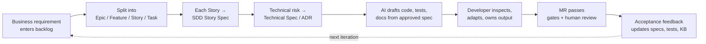
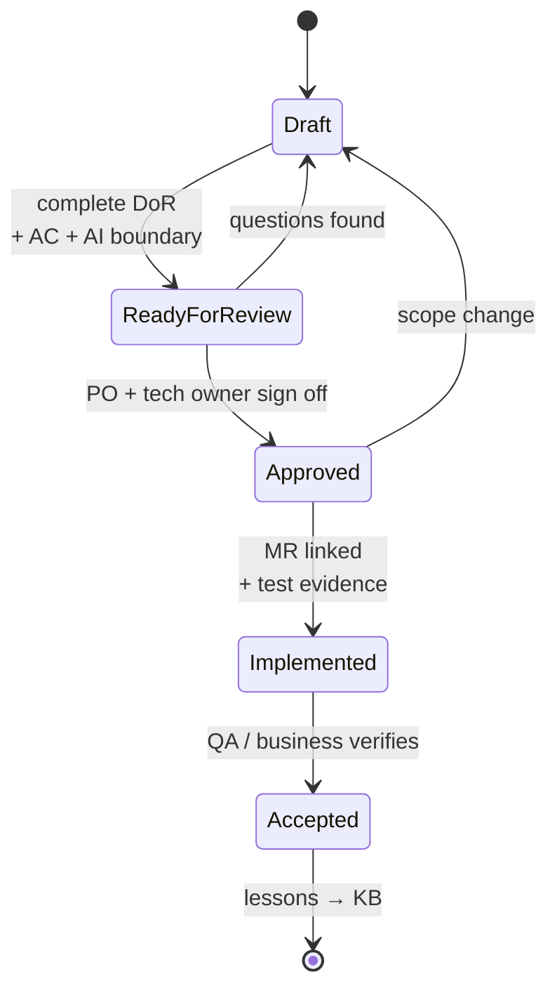

# SDD Methodology

Chinese version: [../zh/knowledge/02-sdd方法论.md](../zh/knowledge/02-sdd方法论.md)

## Definition

SDD means Spec-Driven Development.

AI-assisted development must start from a reviewed specification. Developers do
not begin with free-form prompts or direct code generation.

## End-to-End Flow

1. Business requirement enters the backlog.
2. Product owner and team split it into Epic, Feature, User Story, and Task.
3. Each Story receives an SDD Story Spec.
4. Technical risks receive a Technical Spec or ADR.
5. AI uses the approved spec to draft code, tests, documentation, and review checklists.
6. Developers inspect, adapt, and own the output.
7. Merge request passes automated quality gates and human review.
8. Acceptance results are fed back into specs, tests, and the knowledge base.

## Definition of Ready

A Story is ready only when it has:

- Business goal.
- User role.
- Preconditions.
- Main flow.
- Alternative and exception flows.
- Acceptance criteria in Given/When/Then format.
- API contract or data field description.
- Non-functional requirements for permission, audit, performance, compatibility, and security.
- AI context boundary that states which documents, APIs, code, and tests may be used.

## Definition of Done

A Story is done only when:

- Code passes compilation, static analysis, unit tests, integration tests, and security scanning.
- Merge request states how AI was used.
- SDD Spec, test spec, and API documentation are updated.
- Critical business logic has human review records.
- Artifacts are traceable to requirement, spec version, code change, test result, and release version.

## SDD Artifact Lifecycle

Draft:

- Created by product owner, business analyst, developer, or AI assistant.
- May contain unresolved questions.

Ready for review:

- Contains complete DoR information.
- Has explicit acceptance criteria and AI context boundary.

Approved:

- Reviewed by product owner and technical owner.
- Can be used as AI input.

Implemented:

- Linked to merge request and test evidence.

Accepted:

- Verified by QA or business representative.
- Lessons learned are added to the knowledge base.

## AI Usage Rules

Allowed:

- Drafting SDD specs from approved business notes.
- Generating first-pass code from approved specs.
- Generating unit tests, contract tests, and edge-case lists.
- Summarizing defect patterns and review findings.
- Drafting documentation and release notes.

Restricted:

- Generating production-impacting code without human review.
- Using unapproved customer data in prompts.
- Using private production logs without desensitization.
- Changing architectural decisions without an ADR.
- Bypassing CI/CD or merge request review.

## Key Takeaways

- SDD shifts development from code-first to spec-first; AI reads from the spec instead of inventing intent.
- Definition of Ready and Definition of Done are not bureaucracy — they are what makes AI output reviewable by people who were not present when it was generated.
- The spec lifecycle (Draft → Ready → Approved → Implemented → Accepted) is what gives every later layer something stable to refer to.
- AI usage rules name what the spec layer permits and forbids — production-impacting code without human review, unmasked customer data, undocumented architecture changes are out of bounds.

## Next

- [Execution Stack](03-execution-stack.md) — once specs exist, the four-layer stack (SDD + Superpowers + Harness + CI/Review) is the mental model that organises everything else.

