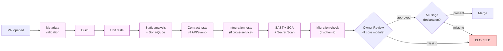

# Quality Gates

Chinese version: [../zh/knowledge/05-质量门禁.md](../zh/knowledge/05-质量门禁.md)

## Merge Policy

AI-generated or AI-assisted code must not enter the main branch directly.

For internal teams, AI-assisted merge requests follow the Superpowers-based workflow level defined in [Superpowers Adoption](../practice/03-superpowers-adoption.md).

For outsourced work, the supplier's internal workflow is not governed here. Acceptance is based on required deliverables, test evidence, quality gates, and internal owner approval when the work is merged into internal repositories.

Every merge request must pass:

- Compilation or build check.
- Unit tests.
- Integration or contract tests when an interface changes.
- Static analysis.
- SonarQube Quality Gate.
- SAST.
- SCA.
- Secret Scan.
- Database migration check when schema changes.
- Owner approval when core modules change.
- AI usage declaration.

## Human Review Checklist

Reviewers check:

- The implementation matches the approved SDD Spec.
- The solution does not introduce hidden scope.
- Boundary conditions are covered.
- Error handling is explicit.
- Permissions and audit logs are correct.
- Sensitive data is not exposed.
- Tests verify business behavior, not only happy path behavior.
- AI-generated code is understandable and maintainable.

## Quality Gate Exceptions

Exceptions are allowed only when:

- The risk is documented.
- The module owner approves.
- The delivery owner accepts delivery impact.
- A follow-up issue has an owner and due date.

Exceptions are not allowed for:

- Secret leakage.
- Critical security vulnerability.
- Broken build.
- Missing owner approval for core module changes.
- Missing traceability to a requirement or approved spec.

## Outsourced Team Rules

The outsourced team is not required to follow the internal Superpowers workflow or internal AI usage process.

Acceptance rules:

- Must deliver against the approved SDD Spec and acceptance criteria.
- Must provide agreed test evidence, deployment notes, rollback notes, and change notes.
- Must pass agreed build, test, code quality, and security gates before acceptance or internal merge.
- Cannot be the final approver for core modules.
- Cannot change quality gate configuration.
- Cannot access production data unless explicitly approved and masked.

## Key Takeaways

- The merge gate is layer 4 of the [Execution Stack](03-execution-stack.md) — it is the safety net regardless of which source produced the code (internal, AI-assisted, or supplier).
- Some failures are exception-eligible (with risk, owner, and due date); others — secret leakage, broken build, missing core-module Owner Review, missing spec traceability — are not.
- Supplier work is gated by the same merge controls but is not required to use the internal AI workflow to produce the evidence.
- Human review and automated gates complement each other; neither replaces the other.

## Next

- [Testing Strategy](06-testing-strategy.md) — what tests must exist so the gate has something meaningful to check, and how AI changes the test economics.
