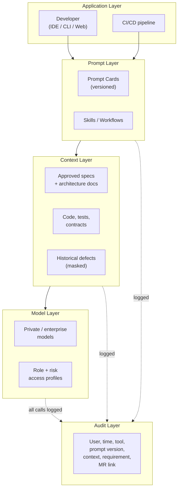

# Toolchain

Chinese version: [../zh/knowledge/07-工具链.md](../zh/knowledge/07-工具链.md)

## Toolchain Principles

- Enterprise-private by default.
- Auditability before convenience.
- Standard interfaces before tool preference.
- Automation turns governance into default behavior.
- Tool choices must support the internal Superpowers-based workflow and deliverable-based outsourced acceptance.

## Recommended Stack

Requirements and iteration:

- Jira, ONES, or ZenTao.
- Required capabilities: Epic, Feature, Story, Task, workflow, custom fields, dashboards, and export APIs.

Knowledge base and specifications:

- Confluence, Notion Enterprise, Feishu Wiki, or Markdown in Git.
- Required capabilities: version history, access control, template support, and backlinks to requirements and merge requests.

Code and CI/CD:

- GitLab Self-Managed is the preferred default.
- Use branch protection, merge request approvals, CI templates, protected variables, and audit logs.
- GitLab Duo Self-Hosted may be evaluated as an enterprise-private AI option.

Internal AI-SDD workflow:

- Superpowers is the default workflow kernel for internal teams.
- Use it to standardize brainstorming, planning, TDD, review, and verification.
- Do not require outsourced teams to use Superpowers unless it is explicitly written into a supplier contract.

Code quality:

- SonarQube Server.
- Use Clean as You Code and Quality Gate policies for new code.

API contracts:

- OpenAPI 3.1 for synchronous service APIs.
- JSON Schema for events and asynchronous messages.

Developer portal:

- Backstage or equivalent internal developer portal.
- Use it for service catalog, ownership, documentation, APIs, runtime links, and dependency maps.

Security and supply chain:

- SAST, SCA, Secret Scan, container image scan, SBOM, and dependency risk review.
- Use OWASP SAMM as a maturity reference.
- Use OpenSSF Scorecard concepts for open source dependency evaluation.

## AI Platform Architecture

Model layer:

- Private or enterprise-managed models for code generation, test generation, document summarization, and defect analysis.
- Separate model access profiles by role and risk.

Context layer:

- Retrieval source includes only approved requirements, architecture docs, API contracts, code standards, historical defects, and test assets.
- Production data and customer information must be masked before indexing.

Prompt layer:

- Standard Prompt Cards are versioned for internal teams.
- Prompt Cards define input type, output structure, forbidden content, and review checklist.
- Outsourced teams are not required to use internal Prompt Cards; their deliverables are assessed by acceptance artifacts and quality evidence.

Audit layer:

- Record user, time, tool, prompt card version, referenced context, related requirement ID, and related merge request.
- Audit records must be queryable for internal defect analysis and process improvement.

## Key Takeaways

- The toolchain is cross-cutting — it hosts every layer of the [Execution Stack](03-execution-stack.md) rather than being a layer of its own.
- Enterprise-private by default and audit-before-convenience are the design constraints that distinguish this stack from a default developer setup.
- The AI platform sits on four sub-layers (model, context, prompt, audit) so failures can be diagnosed at the right layer instead of "the AI didn't work."
- Tool choices must support tool-neutral SDD templates and tool-neutral MR evidence — teams may pick different tools as long as the artifacts and gates match.

## Next

- [Agent Tools](08-agent-tools.md) — within this toolchain, what Claude Code, Codex, and Cursor each do well, and which capabilities (skills, MCP, plugins, hooks, subagents) need governance.
