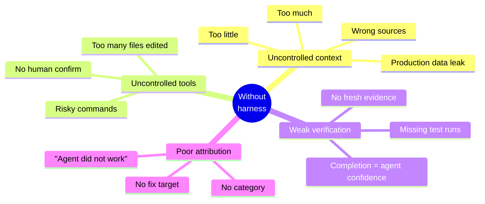
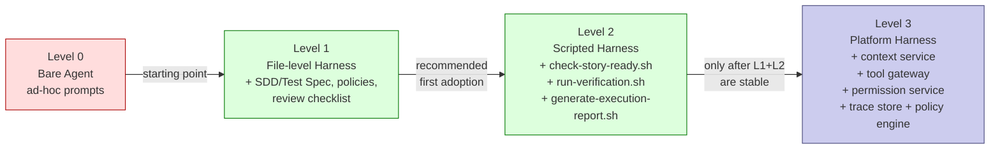

# Harness Engineering

Chinese version: [../zh/knowledge/09-harness工程.md](../zh/knowledge/09-harness工程.md)

## Purpose

This doc goes deep on the third layer of the [Execution Stack](03-execution-stack.md) — the harness. The stack diagram and the relationship between SDD, Superpowers, Harness, and CI/Review are in doc 03; here we focus on what the harness layer actually contains, the problems it solves on its own, the maturity model for adopting it, and the minimum standard internal teams must meet.

If you have not read [Execution Stack](03-execution-stack.md), read that first — this doc assumes the four-layer model and the bottom-up diagnosis pattern are already familiar.

A harness, in this project, is the controlled runtime environment around an AI agent: explicit context boundary, allowed tools, permissions, task state, verification commands, logging, review hooks, and audit. It is broader than a test harness and more concrete than prompt engineering.

## Problems Harness Engineering Solves

### Uncontrolled Context

Without a harness, a developer may give an AI agent too much context, too little context, or the wrong context.

Harness policy defines:

- Required task artifacts.
- Allowed context sources.
- Forbidden context sources.
- Required domain, architecture, API, and test references.
- How missing context should be handled.

### Uncontrolled Tools And Permissions

Without a harness, an AI agent may modify too many files, run risky commands, or rely on unavailable environments.

Harness policy defines:

- Read-only phases.
- Editable paths.
- Forbidden paths.
- Allowed shell commands.
- Commands requiring human confirmation.
- Forbidden production data and credentials.

### Weak Verification

Without a harness, completion may be based on agent confidence instead of evidence.

Harness policy defines:

- Required test commands.
- Static analysis and security scans.
- Contract tests.
- Manual acceptance checks.
- Required execution report fields.

### Poor Failure Attribution

Without a harness, a failed AI run is often summarized as "the agent did not work."

Harness reporting separates:

- Spec ambiguity.
- Wrong or missing context.
- Permission/tooling limitation.
- Environment failure.
- Test failure.
- Agent implementation error.
- Review or acceptance gap.

## Current Coverage In This Governance Kit

The current governance kit already covers Level 1 Harness concepts:

- SDD Story Spec defines task intent, acceptance criteria, and AI context boundary.
- Prompt Card defines approved context, forbidden content, and output format.
- Technical Spec defines architecture, permission, rollback, and observability constraints.
- Test Spec defines test evidence.
- Merge request template records AI usage, approved context, risks, rollback, and test evidence.
- Quality gates define required verification and stop-the-line conditions.
- CODEOWNERS defines ownership and human approval.
- Weekly review templates collect AI failure and quality information.

What is still missing without the new harness layer:

- A single team-level AI engineering constitution.
- Explicit allowed tools and forbidden operations.
- Scriptable Story readiness checks.
- Scriptable verification.
- Structured agent execution reports.
- Traceable run records for improvement and audit.

## Maturity Levels

### Level 0: Bare Agent

Developers use AI tools directly with ad hoc prompts.

Characteristics:

- Context is selected manually.
- Verification is developer-dependent.
- Logs are incomplete.
- Failure attribution is weak.

This is not considered a controlled harness.

### Level 1: File-Level Harness

The team uses standard files and templates to constrain AI execution.

Required assets:

- SDD Story Spec.
- Technical Spec.
- Test Spec.
- Prompt Card.
- AI engineering constitution.
- Context policy.
- Tool policy.
- Testing policy.
- Review checklist.

This is the recommended first adoption level.

### Level 2: Scripted Harness

The team turns repeated checks into scripts.

Recommended scripts:

- `check-story-ready.sh`
- `run-verification.sh`
- `generate-execution-report.sh`

Capabilities:

- Check required Story fields.
- Check required linked artifacts.
- Run standard verification commands.
- Generate execution evidence.
- Make missing evidence visible before merge review.

### Level 3: Platform Harness

The organization builds or adopts a platform-level agent runtime.

Components:

- Agent orchestrator.
- Context service.
- Tool gateway.
- Permission service.
- Memory or knowledge base.
- Evaluation service.
- Trace store.
- Policy engine.
- Human approval workflow.
- CI/CD integration.

This level is useful only after Level 1 and Level 2 practices are stable.

## Recommended Rollout

Phase 1:

- Adopt the `/ai/` policies.
- Require AI context boundaries in SDD Story Specs.
- Require execution evidence in merge requests.
- Use Superpowers as the default internal execution discipline.

Phase 2:

- Add `/ai-harness/` prompt templates and policies.
- Use the execution report template for Tier B and Tier C work.
- Run story readiness and verification scripts manually.

Phase 3:

- Integrate readiness checks and execution reports into CI.
- Store reports as merge request artifacts.
- Use failure attribution in weekly AI-SDD review.

Phase 4:

- Consider platform-level context, tool, permission, and trace services.

## Minimum Harness Standard For Internal Teams

Before AI execution:

- Story card is clear.
- Acceptance criteria are testable.
- AI context boundary is explicit.
- Allowed and forbidden context is known.
- Editable scope is known.
- Verification commands are known.

During AI execution:

- Agent works on one bounded task.
- Agent uses approved context only.
- Agent does not change forbidden paths.
- Agent records assumptions and questions.

After AI execution:

- Tests and quality gates are run.
- Failures and fixes are recorded.
- Human review points are identified.
- Execution report is attached for Tier B and Tier C work.

## Completion Rule

An AI-assisted task is not complete when the agent says it is complete.

It is complete only when:

- The implementation matches the approved spec.
- Required artifacts are updated.
- Required verification passes.
- Required review is complete.
- Execution evidence is recorded.
- Remaining risks are visible and accepted.

## Key Takeaways

- The harness is the third layer of the execution stack — it does not replace SDD, Superpowers, or CI/Review, but each of those is weaker without it.
- A harness controls context, tools, permissions, verification, and reporting; missing any one of them is the typical failure mode it prevents.
- Level 1 (file-level) and Level 2 (scripted) cover most internal needs; Level 3 (platform) is only worth building after Levels 1 and 2 are stable.
- "Complete" is a property of evidence, not of agent confidence.

## Next

- [Metrics](10-metrics.md) — how to measure whether the four-layer stack is actually improving delivery efficiency, quality, and consistency over time.
