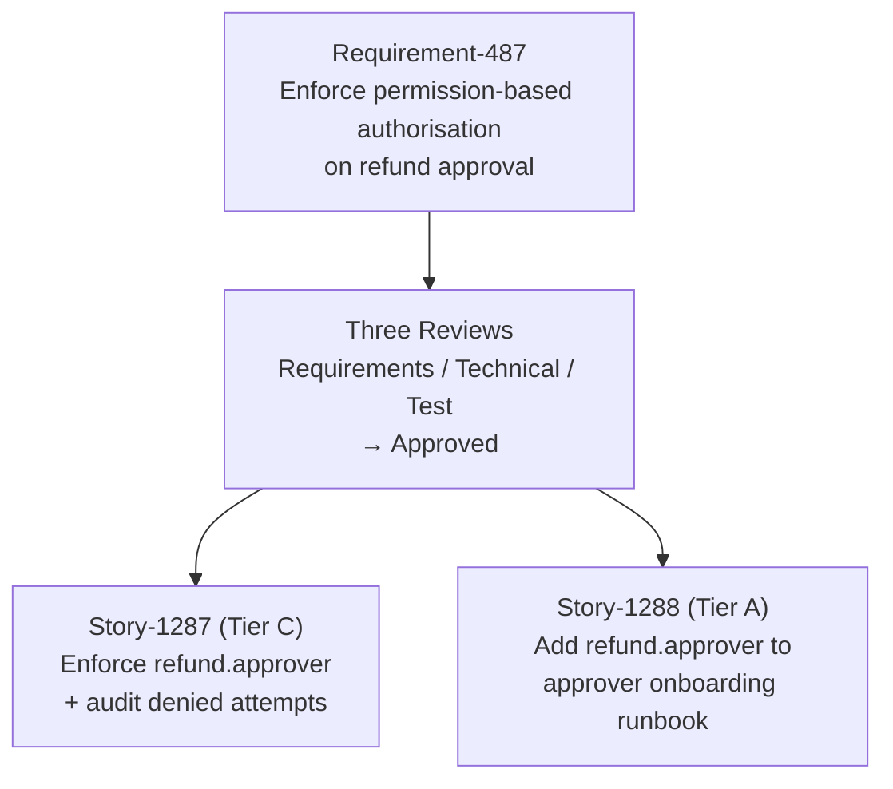
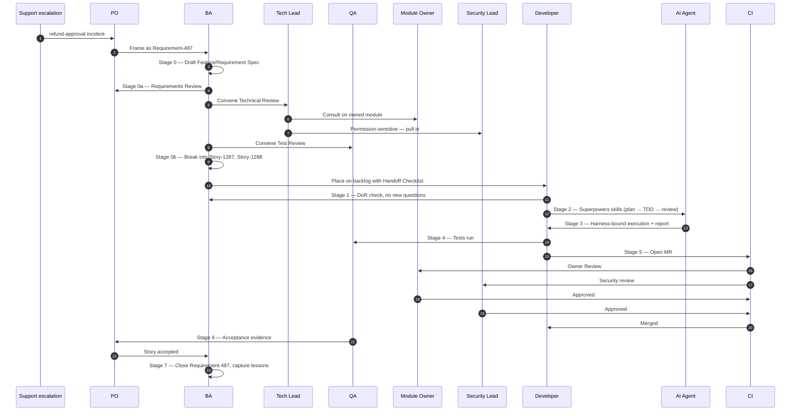

# Capstone: From Concepts To Delivery

Chinese version: [../zh/knowledge/11-概念到交付.md](../zh/knowledge/11-概念到交付.md)

## Purpose

The previous ten docs explained the AI-SDD governance model one piece at a time. This doc puts them in motion by walking a single, realistic Story through the entire stack — Operating Model, SDD, Execution Stack, Quality Gates, Testing, Toolchain, Agent Tools, Harness, Metrics — and shows where each concept fires.

If after reading this you cannot see how every doc you just read maps to one or more steps below, that doc is the one to re-read.

After the walkthrough, this doc hands the reader off to the Practice path, where the same concepts are operationalised by role and stage.

## The Story Used In This Walkthrough

**Story-1287: Restrict the "approve refund" API to users with the `refund.approver` permission.**

Why this Story is a good test case:

- It is a single bounded change, not a project.
- It touches an existing API (contracts), a permission model (security), an audit log (observability), and a database column read (data). That is wide enough to engage most of the layers without being overwhelming.
- It has an obvious wrong answer ("just add an `if` somewhere") that the governance model is designed to prevent.

This Story is hypothetical. None of the team names, IDs, or thresholds below are claims about real artifacts — they illustrate where the model fires.

The end-to-end actor handoff across stages:

## Stage 0: A Requirement Arrives (BA Intake)

A customer-support escalation surfaces a real incident: a junior agent approved a refund they should not have had authority to approve. The PO captures this as a business need and hands it to the BA as **Requirement-487: Enforce permission-based authorisation on refund approval**.

**What the model says happens:**

- [Operating Model](04-operating-model.md): the Requirement lands with the BA accountable for the Payments domain. The BA assigns Requirement-487, identifies the originating stakeholder (support escalation owner), and queues it.
- [BA Guide](../practice/09-ba-guide.md) Steps 1-2: BA captures the raw ask without paraphrasing, then drafts the [Feature / Requirement Spec](../../../templates/feature-spec.md) — business goal, users, scope, non-scope, business rules, data/interface impact, NFRs for permission and audit.

**What would have gone wrong without this layer:**

The escalation would be discussed in chat, a developer would be told "add a permission check", and the resulting code would reflect the developer's guess about the rule rather than the business intent.

## Stage 0a: Three Reviews Gate The Requirement

Before Requirement-487 can be broken into Stories, it must pass three reviews. The BA leads the [Requirement Review Record](../../../templates/requirement-review-record.md) end-to-end.

**What the model says happens:**

- **Requirements Review (需求评审)** — PO, BA, support escalation owner. Confirms *what*: only users with the `refund.approver` permission may approve refunds; denied attempts must be auditable; existing approvers must keep working. Confirms non-scope: this Requirement does not change how the permission is granted, only how it is checked. Outcome: **Pass**.
- **Technical Review (技术评审)** — Tech Lead chairs, BA + Module Owner (refund module) + Security Lead attend. Confirms *how*: change touches `src/refunds/` controller, existing permission middleware, audit logger; OpenAPI for `/refunds/{id}/approve` needs a 403 response shape; error code registry needs `REFUND_APPROVE_FORBIDDEN`. Security Lead requires audit log to capture user ID, timestamp, attempted action, outcome. Outcome: **Pass with conditions** (audit log fields are non-negotiable; ADR not required because no architecture change).
- **Test Review (测试评审)** — QA chairs, BA + Tech Lead attend. Confirms *testability*: AC's are in Given/When/Then form and testable as written. Required test layers: unit (permission check), permission test (denied + allowed), audit log test, contract test (new 403 response). UAT scope: business representative tries one denied and one approved scenario in staging. Outcome: **Pass**.
- Overall gate decision: **Approved**.

**What would have gone wrong without this layer:**

Implementation would start with the BA's interpretation of "add a permission check" and the team would discover during MR review that the audit log shape was wrong, the OpenAPI was not updated, the permission name was different from what compliance expected, and the QA team had no testable AC. Each of these would have been a Story-level rework cycle instead of a Requirement-level decision.

## Stage 0b: Story Breakdown And Backlog Placement

With the Requirement approved, the BA breaks it into Stories (Steps 6-7 of the [BA Guide](../practice/09-ba-guide.md)).

**What the model says happens:**

- For this Requirement, the breakdown is one primary Story plus one follow-up:
  - **Story-1287**: Enforce `refund.approver` permission on POST `/refunds/{id}/approve` with audit-logged denial. (Tier C)
  - **Story-1288**: Add the `refund.approver` permission to the existing approver onboarding runbook. (Tier A, follow-up)
- BA completes the [BA Handoff Checklist](../../../templates/ba-handoff-checklist.md) for Story-1287:
  - Provenance: parent Requirement-487 and its Review Record linked.
  - Story Card: complete with Given/When/Then.
  - AI Context Boundary: allowed = refund controller, permission middleware, audit logger, OpenAPI, existing refund tests. Forbidden = production logs, customer data, unrelated modules.
  - Linked artifacts: SDD Story Spec, Technical Spec (because Tier C), Test Spec, OpenAPI delta, Error Code Registry entry.
  - Tier C confirmed; Module Owner (Payments Tech Lead) notified.
- BA runs the AI-readiness self-test: all five questions answered "yes". Story-1287 enters the backlog with `priority: high` and `dependency: none`.
- Sprint Planning picks Story-1287 into the next iteration; Delivery Owner signs off because of Tier C; Module Owner is aware.

**What would have gone wrong without this layer:**

Story-1287 would have been placed on the backlog with the AC's still ambiguous, no AI Context Boundary, no traceability to a parent Requirement. The developer picking it up later (human or AI agent) would have to ask the BA the same questions the BA already answered with reviewers — except those answers were never written down.

## Stage 1: Developer Picks Up The Ready Story (DoR + Tier Confirm)

The developer pulls Story-1287 from the sprint queue.

**What the model says happens:**

- Developer reads the Story Card, [SDD Story Spec](../../../templates/sdd-story-spec.md), parent Requirement Review Record, and the AI Context Boundary already established by the BA.
- Developer's own DoR check (last line of defence per [Developer Guide](../practice/04-developer-guide.md) Step 1): all five AI-readiness questions answer "yes". No new questions for the BA.
- Tier confirmation: BA tagged this as Tier C; developer agrees — permission semantics + API contract change. Per [Superpowers Adoption](../practice/03-superpowers-adoption.md), Tier C means full SDD Story Spec, Technical Spec, full test coverage including permission and audit tests, Owner Review, full quality gate, agent execution report attached to MR.
- Developer skims [Reading Guide](00-reading-guide.md) and confirms the four-layer stack is the right mental frame; this is not a "just add an if" Story.

**What would have gone wrong without this layer:**

Without the developer-side DoR check, even a well-prepared Story could land with a stale link or a permission name that drifted between the Review Record and the SDD Story Spec. The developer-side check is the last opportunity to catch handoff drift before the agent starts modifying code.

## Stage 2: Execution (Superpowers, Layer 2)

The developer engages Superpowers skills in sequence — this is the [Execution Stack](03-execution-stack.md)'s layer 2 in action.

**What the model says happens:**

- `brainstorming` — confirm acceptance criteria are testable, confirm the AI Context Boundary is complete, confirm there are no implicit assumptions about who calls this API today.
- `writing-plans` — produce an implementation plan: which files to edit, which tests to write first, which OpenAPI section to update, which audit-log assertion to add, what to verify at the end.
- `test-driven-development` — write the failing permission test first. Confirm it fails for the right reason (the endpoint does not yet check permissions). Then write the failing audit-log test. Then implement.
- `subagent-driven-development` (optional for Tier C) — a separate agent context reviews the spec compliance before the code-quality review.
- `requesting-code-review` — the developer requests review with a clear summary of what changed, what tests were added, and what was deliberately not changed.
- `verification-before-completion` — no completion claim until tests, static analysis, and the contract test pass.

**What would have gone wrong without this layer:**

The developer would have asked the agent to "implement the permission check," accepted the first plausible diff, and discovered during PR review that the agent had also "helpfully" refactored the audit logger in a way that broke the audit format consumed by the compliance dashboard.

## Stage 3: Controlled Runtime (Harness, Layer 3)

The agent executes inside the harness defined in [Harness Engineering](09-harness-engineering.md) and the [`/ai/`](../../../ai/) and [`/ai-harness/`](../../../ai-harness/) policies.

**What the model says happens:**

- Context (per [`ai/context-policy.md`](../../../ai/context-policy.md) and [`ai-harness/policies/context-policy.yaml`](../../../ai-harness/policies/context-policy.yaml)): only the approved files in the AI Context Boundary are loaded; production logs are blocked.
- Tools (per [`ai/allowed-tools.md`](../../../ai/allowed-tools.md) and [`ai-harness/policies/permissions.yaml`](../../../ai-harness/policies/permissions.yaml)): the agent may read files, edit files inside `src/refunds/`, run unit tests, run the contract test. It may not run database migrations, change CI configuration, or modify files outside scope without human confirmation.
- Verification (per [`ai-harness/policies/verification-policy.yaml`](../../../ai-harness/policies/verification-policy.yaml)): build, unit tests, static analysis, secret scan must pass; contract tests must pass because the API changed; permission tests and audit log validation are required because permissions changed.
- The developer runs `ai-harness/scripts/check-story-ready.sh` against the Story spec at the start, and `ai-harness/scripts/generate-execution-report.sh` at the end. The execution report lists context used, files changed, tests added, verification run, remaining risks.

**What would have gone wrong without this layer:**

The agent would have read whatever was easy to grep, run whatever commands seemed useful, and completed when its self-evaluation said "done." Failure attribution after a defect would be the unsatisfying "the agent didn't work."

## Stage 4: Tests (Cross-Cutting)

Test choices are guided by [Testing Strategy](06-testing-strategy.md) and the [Testing Policy](../../../ai/testing-policy.md).

**What the model says happens:**

- Unit test for the permission check (asserts business behavior, fails for a plausible wrong implementation — e.g. checking the wrong permission name).
- Permission test covering the denied case and the allowed case.
- Audit log test asserting the denied attempt is logged with the user ID and timestamp.
- Contract test for the new 403 response shape.
- No new E2E test — the existing refund-approval E2E already exercises the happy path; the boundary cases belong in lower layers.
- The reviewer checks AI-generated tests against the review checklist in doc 06 — would the test fail for a plausible wrong implementation? Are mocks hiding real behavior?

**What would have gone wrong without this layer:**

The AI would have generated a single high-coverage test that mocked the permission service and asserted it was called. The test would pass even if the call was made with the wrong permission name.

## Stage 5: The Merge Gate (Layer 4)

The MR opens using the [AI-SDD MR template](../../../.gitlab/merge_request_templates/ai-sdd.md). It runs through [Quality Gates](05-quality-gates.md) and the [CI Gate Policy](../../../quality-gates/ci-gate-policy.md).

**What the model says happens:**

- Pipeline: validate metadata → build → unit test → static analysis → contract test → integration test → security scan → package.
- The MR is rejected automatically if: the build fails, unit tests fail, the contract test fails because the OpenAPI was not updated to match, the secret scan finds anything, SonarQube Quality Gate fails, the AI usage declaration is missing.
- The MR cannot merge without Owner Review from the Payments tech lead (CODEOWNERS for `src/refunds/`) plus security review (triggered by the permission change per [`ai/security-policy.md`](../../../ai/security-policy.md)).
- The reviewer works through the [Review Checklist](../../../ai/review-checklist.md): no invented business rules, permission check is correct, audit log captures the right fields, tests verify observable behavior, no sensitive data exposed.

**What would have gone wrong without this layer:**

A merged refund-approval change with no owner sign-off and no security review — exactly the class of change that justifies having the gate in the first place.

## Stage 6: Acceptance Evidence (Story-Level)

The Story moves through acceptance using the [story-acceptance-record](../../../templates/story-acceptance-record.md). [Metrics](10-metrics.md) capture what happened.

**What the model says happens:**

- Story Cycle Time and Spec-Ready-to-MR-Ready Time are recorded for the iteration trend.
- MR First-Pass Rate increases because the gate-blocking work was caught earlier.
- AI Code Adoption Rate is recorded — how much of the AI-proposed code survived review.
- If a defect later escapes, [Defect Attribution](../../../templates/defect-attribution.md) walks the [Execution Stack](03-execution-stack.md) bottom-up: did CI miss it? Did the harness allow bad context? Did Superpowers discipline lapse? Did the spec have a gap?
- The Weekly AI-SDD Review takes the attribution and feeds improvements into specs, prompts, harness policies, and test suites.

**What would have gone wrong without this layer:**

Each Story would be done when it merged. The team would have no data to tell whether the model was actually helping, no signal that one stage of the stack was leaking, and no record of why.

## Stage 7: BA Closes The Requirement (Feedback Loop)

Story-1287 is accepted. Story-1288 (the follow-up to update the approver onboarding runbook) is also accepted. Both Stories trace back to Requirement-487.

**What the model says happens:**

- Per [BA Guide](../practice/09-ba-guide.md) Step 10-11: BA updates Requirement-487 with links to both Story Acceptance Records and marks it `Status: Accepted`.
- UAT outcomes from the business representative are recorded as [UAT Evidence](../../../templates/uat-evidence.md).
- Feedback classification: the support team reports the original incident pattern has stopped — recorded as a no-op (positive signal). One auditor asks whether denied attempts can be queried by user — captured as a separate [Change Request](../../../templates/change-request.md) for a future iteration, not bolted onto this Requirement.
- A lesson learned is captured: this Requirement's three reviews caught the audit log shape issue early; the team marks "permission-change Requirements require Security Lead in Technical Review by default" as a [Knowledge Base Update](../../../templates/knowledge-base-update.md).
- AI Champion turns the failure mode "AI mocks the permission service and asserts the call, instead of testing the actual permission name" into an updated [Prompt Card](../../../templates/prompt-card.md) for permission-change Stories.

**What would have gone wrong without this layer:**

Requirement-487 would sit "in flight" forever. The lesson about Security Lead participation would stay tribal knowledge with one BA. The next permission-change Requirement would discover the same audit-log-shape issue in MR review instead of in the Technical Review.

## What This Walkthrough Showed

| Doc | Stage Where It Fired |
| --- | --- |
| 01 AI-SDD Overview | Stage 0 — framed why this Requirement is governed at all |
| 02 SDD Methodology | Stages 0-0b — Requirement Spec, AC's, DoR; Stage 1 — developer DoR check |
| 03 Execution Stack | Stages 2-5 — the four-layer model that organises every execution stage |
| 04 Operating Model | Stage 0 — BA accountability, ownership, security consultation |
| 05 Quality Gates | Stage 5 — gate pipeline, Owner Review, exception rules |
| 06 Testing Strategy | Stage 4 — layer choice, AI-specific test risks, review checklist |
| 07 Toolchain | Stages 2-6 — Jira, GitLab, SonarQube, CI runners that host the work |
| 08 Agent Tools | Stages 2-3 — which agent surface, which skills, which tool permissions |
| 09 Harness Engineering | Stage 3 — context, permissions, verification, execution report |
| 10 Metrics | Stage 6 — what was measured, how feedback flows back |
| Practice/02 Artifact Map | Stages 0-7 — what artifact each stage produces |
| Practice/08 Role × Stage Matrix | Stages 0-7 — who produces what at each stage |
| Practice/09 BA Guide | Stages 0, 0a, 0b, 7 — BA's deep workflow |
| Practice/04 Developer Guide | Stages 1, 2, 4-6 — developer's deep workflow |

If any row above feels unclear, doc on the left is the one to revisit before moving to Practice.

## Where Knowledge Hands Off To Practice

[Practice](../practice/) takes the same concepts and operationalises them by role and stage. Natural next reads:

1. [Team AI SDLC](../practice/01-team-ai-sdlc.md) — the same four layers wired into a team's actual SDLC.
2. [Implementation Playbook](../practice/05-implementation-playbook.md) — Week 0, kickoff, review cadence, minimum repo setup.
3. [Superpowers Adoption](../practice/03-superpowers-adoption.md) — Tier A/B/C rules and adoption boundaries.
4. [Developer Guide](../practice/04-developer-guide.md) — what a developer does day-to-day after a Story is ready.
5. [AI Context Artifact Map](../practice/02-ai-context-artifact-map.md) — what artifacts each stage must produce so the next AI-assisted stage can proceed safely.
6. [Priorities And Roadmap](../practice/06-priorities-and-roadmap.md) — what to do first when adopting this model.
7. [Rollout And Acceptance](../practice/07-rollout-and-acceptance.md) — the 12-week rollout model and acceptance scenarios.

## Key Takeaways

- One Story exercises the entire stack — the docs are not parallel options but composing layers.
- Each layer prevents a specific failure mode; skipping a layer turns it into a latent defect.
- The Defect Attribution template and the bottom-up walk of the Execution Stack make failures into improvement input, not blame.
- Knowledge teaches the model; Practice operationalises it by role, stage, and rollout.

## Next

- [Glossary](12-glossary.md) — reference for any term you want to nail down — and then jump into the [Practice path](../practice/).
