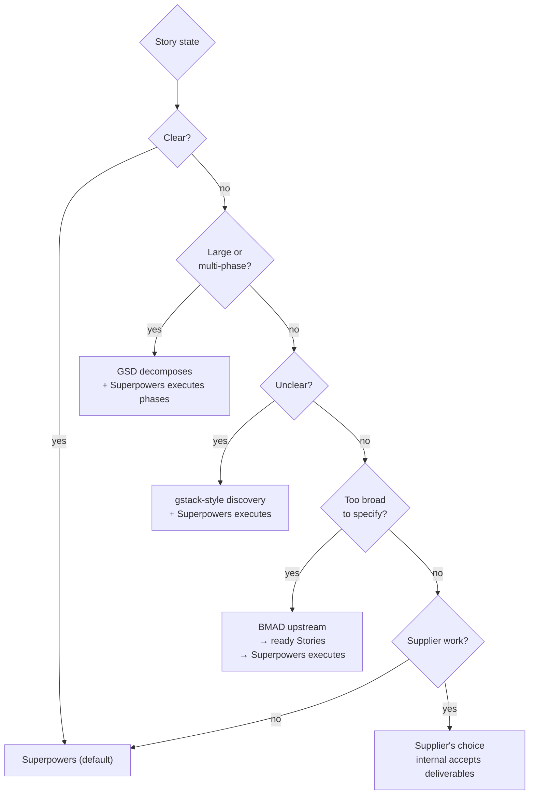

# Team AI SDLC

Chinese version: [../zh/practice/01-团队级ai-sdlc.md](../zh/practice/01-团队级ai-sdlc.md)

## Purpose

This doc shows how the [four-layer Execution Stack](../knowledge/03-execution-stack.md) lands inside a team's real SDLC stages, and which AI-assisted execution framework — Superpowers, GSD, gstack, or BMAD — to reach for at each stage. It does not introduce a new layer model; it maps the existing one onto how delivery actually flows.

SDLC means Software Development Life Cycle: the full lifecycle of software work from idea and requirements through design, implementation, testing, release, operation, and improvement.

If you have not read [Execution Stack](../knowledge/03-execution-stack.md), do that first — this doc assumes the four layers (SDD / Superpowers / Harness / CI/Review) and the bottom-up diagnosis pattern are familiar.

## The Stack On The SDLC

A team SDLC has roughly these stages: requirements → architecture → story breakdown → story ready → development → review and merge → integration → release → operation → feedback. The execution stack does not replace any stage; it specifies how AI participates in each one.

```text
SDLC stage              Layer that owns it           Practice doc that operationalises it
─────────────────────   ──────────────────────────   ─────────────────────────────────────
Requirements            SDD (1)                       02 Artifact Map S0-S2
Architecture            SDD (1)                       02 Artifact Map S1
Story breakdown         SDD (1)                       02 Artifact Map S2
Story ready             SDD (1)                       02 Artifact Map S3, 03 Tier rules
Development             Superpowers (2) + Harness (3) 03 Tier rules, 04 Developer Guide
Review and merge        CI/Review (4)                 05 Quality Gates (knowledge), 04 Step 6-8
Integration             CI/Review (4)                 02 Artifact Map S6
Release                 CI/Review (4) + cross-cutting 02 Artifact Map S6, 05 Implementation Playbook
Operation               Cross-cutting                 10 Metrics (knowledge)
Feedback                Cross-cutting                 10 Metrics (knowledge), 06 Roadmap
```

The Operating Model (knowledge/04), Testing Strategy (knowledge/06), Toolchain (knowledge/07), and Metrics (knowledge/10) are cross-cutting — they apply across every stage rather than to one.

## Where Superpowers, GSD, And gstack Each Fit

Superpowers is the **default** internal developer workflow once a Story card is ready (this is established in the Execution Stack as layer 2). GSD and gstack are **specialised tools** for situations where Superpowers alone is not enough. BMAD is referenced for the most ambiguous, high-stakes upstream work.

This section gives you proper definitions of GSD and gstack — they are not assumed elsewhere in the handbook — plus a decision rule for when to use which.

### Superpowers (Default)

What it is: a composable skills framework and software development methodology for coding agents. Skills include `brainstorming`, `writing-plans`, `test-driven-development`, `subagent-driven-development`, `requesting-code-review`, `receiving-code-review`, `systematic-debugging`, `verification-before-completion`.

Best fit: daily Story delivery once the Story card is ready. Existing repos, teams with Git/PR/tests, mixed-seniority developers. This is the layer 2 default.

Where it appears: [Superpowers Adoption](03-superpowers-adoption.md) for Tier rules; [Developer Guide](04-developer-guide.md) for the daily eight-step flow.

Reference: https://github.com/obra/superpowers

### GSD — Get Shit Done

What it is: a context engineering and spec-driven long-task execution system. GSD's contribution is **persistent project state** — requirements, roadmap, phase context, and task state are kept in structured files so a multi-session, multi-phase AI workflow does not lose track of where it is. Independent tasks can be executed with fresh context to avoid context rot.

Best fit: a feature too large for one Story-sized session, multi-phase work, work that must survive context window resets, or independent tasks that benefit from being executed with fresh executor context.

How to use in this handbook: GSD-style practices wrap Superpowers, they do not replace it. GSD owns phase state and decomposition; Superpowers owns execution discipline within a phase. The combined pattern is "GSD decomposes and preserves state → Superpowers executes each phase's tasks."

Enterprise caveat: a long-running execution engine must not bypass architecture, security, dependency, or owner review. Run GSD-style execution inside the same gates as any other internal work.

Reference: https://github.com/gsd-build/get-shit-done

### gstack — Role-Based Delivery Loop

What it is: a role-based delivery workflow that adds virtual product, architecture, QA, and release perspectives to AI-assisted work. Its loop includes product framing, plan pressure-testing, engineering review, browser QA, release checks, and retrospective.

Best fit: the Story is not actually ready and needs product clarification; a web product needs real browser QA; a small team wants a lightweight virtual delivery team; pre-merge review and release discipline are weak.

How to use in this handbook: gstack-style **practices** are useful upstream of Superpowers (to make a Story ready) or alongside CI/Review (browser QA, release checklist). The role personas do not replace real owners, security review, or CI/CD. Treat gstack commands as review aids, not approval authorities.

Reference: https://gstack.lol/

### BMAD — Escalation Path

What it is: Breakthrough Method of Agile AI-driven Development. An AI-assisted agile framework with stronger product, architecture, and review roles.

Best fit: the Story is so ambiguous, cross-domain, or high-risk that even gstack-style discovery is not enough. BMAD is **not** the default developer workflow here; it is an escalation considered before a Story card is handed to development when scope is too broad to specify.

Reference: https://bmad.fr/en/bmad-method

### Decision Rule



## Tool Comparison

| Framework | Abstraction | Core problem it solves | Best fit | Enterprise role |
| --- | --- | --- | --- | --- |
| Superpowers | AI coding and workflow skills | Execute ready work with engineering discipline | Daily Story delivery | Default for internal Tier B/C |
| GSD | Context engineering and long-task execution | Avoid context rot across multi-phase AI work | Large features, multi-phase | Wrap with the same gates as default work |
| gstack | Role-based virtual delivery loop | Add product, architecture, QA, release pressure | Web apps, early-stage teams, weak discovery | Selective use upstream of Superpowers and alongside CI/Review |
| BMAD | Agile AI-driven discovery and planning | Make ambiguous, broad work specifiable | Cross-domain or research-style work | Pre-Story escalation only |

## Default Team Workflow

This is the day-to-day flow once frameworks are chosen. Each step has a more detailed treatment in another practice doc.


## Adoption Policy By Story Type

### Daily Story Development

Default to Superpowers, weighted by [Tier A/B/C](03-superpowers-adoption.md). The full daily flow is in [Developer Guide](04-developer-guide.md).

### Complex Or Multi-Phase Stories

Use GSD-style phase state plus Superpowers. GSD owns: long context, requirements and roadmap state, phase planning, task state, fresh executor context. Superpowers owns: TDD, task implementation, review, branch finishing.

### Unclear Stories

Use gstack-style discovery before development: product clarification, design review, architecture and test review. Then return to Superpowers for implementation.

### Cross-Domain Or Research-Style Stories

Consider BMAD as an upstream escalation to produce ready Stories. Do not let BMAD-style discovery bypass Owner Review or quality gates.

## Where Each Practice Doc Comes In

| Doc | When to read it |
| --- | --- |
| [02 AI Context Artifact Map](02-ai-context-artifact-map.md) | Whenever you need to know what artifact a stage or tier requires. The canonical reference. |
| [03 Superpowers Adoption](03-superpowers-adoption.md) | Setting Tier rules; clarifying which Superpowers skills are required at which tier. |
| [04 Developer Guide](04-developer-guide.md) | Daily Story execution — the eight-step flow. |
| [05 Implementation Playbook](05-implementation-playbook.md) | Week 0, kickoff, RACI, repository setup, supplier review cadence. |
| [06 Priorities And Roadmap](06-priorities-and-roadmap.md) | Deciding what to adopt first; planning P0/P1/P2 work. |
| [07 Rollout And Acceptance](07-rollout-and-acceptance.md) | Verifying the rollout actually produced the behavior change you wanted. |

## Sources

- [Superpowers — subagent-driven-development skill](https://github.com/obra/superpowers/blob/main/skills/subagent-driven-development/SKILL.md)
- [Superpowers repository](https://github.com/obra/superpowers)
- [GSD — Get Shit Done](https://github.com/gsd-build/get-shit-done)
- [gstack](https://gstack.lol/)
- [BMAD method](https://bmad.fr/en/bmad-method)

## Key Takeaways

- The four-layer execution stack from knowledge is not re-invented here; it maps directly onto SDLC stages.
- Superpowers is the default at layer 2; GSD wraps it for long work; gstack supports it upstream and at release; BMAD is an upstream escalation.
- Doc 02 is the canonical artifact reference — every other doc points there for "what do I need at this stage?"
- The default team workflow is one diagram; each step has a more detailed home in another practice doc.

## Next

- [AI Context Artifact Map](02-ai-context-artifact-map.md) — the central reference for which artifact each delivery stage must produce.
