# AI Context Artifact Map

Chinese version: [../zh/practice/05-ai上下文工件地图.md](../zh/practice/05-ai上下文工件地图.md)

## Purpose

AI-assisted delivery needs more than good prompts. Each delivery stage must leave behind enough structured context for the next stage. Otherwise, AI agents are forced to guess business rules, architecture boundaries, test expectations, release risks, or acceptance criteria.

This map answers two practical questions:

1. What artifacts must each stage produce so the next AI-assisted stage can proceed safely?
2. Which artifacts are mandatory, conditional, or optional so the process stays usable?

## Artifact Levels

| Level | Meaning | Use When |
| --- | --- | --- |
| Must-have | Required for the stage to proceed in a controlled AI-SDD workflow. | The stage exists in the delivery flow. |
| Conditional | Required only when a trigger is present. | Architecture, API, data, security, integration, release, supplier, or UAT impact exists. |
| Optional | Useful for scale, audit, onboarding, or complex coordination, but not required every time. | The team needs more structure or the work is large enough to justify it. |

Practical rule:

- Tier A should use the smallest useful set.
- Tier B should use Story-level specs, tests, implementation plan, and evidence.
- Tier C should use the full applicable set, including technical, security, owner, release, and rollback artifacts.

## End-To-End Stage Map

```mermaid
flowchart LR
    S0["0. Project / Iteration Preparation<br/>Must: Iteration or Project Brief, AI Policies<br/>Conditional: Service Catalog, Team Agreement"]
    S1["1. Architecture And Technical Boundary Design<br/>Must: Architecture Context for affected area<br/>Conditional: ADR, API/Event/Data/Error contracts"]
    S2["2. Epic / Feature / Story Breakdown<br/>Must: Story Breakdown<br/>Conditional: Epic Brief, Feature Spec, Dependency Map"]
    S3["3. Story Ready For Development<br/>Must: Story Card, SDD Story Spec, AI Context Boundary<br/>Conditional: Technical Spec, Test Spec, Prompt Card"]
    S4["4. Story Development And MR<br/>Must: Implementation Plan, Code, Tests, MR Evidence<br/>Conditional: Agent Report, Updated Contracts"]
    S5["5. Story Acceptance<br/>Must: Acceptance Evidence<br/>Conditional: Defect Attribution, Story Acceptance Record"]
    S6["6. System Integration And Release Preparation<br/>Must: Quality Gate Evidence<br/>Conditional: Integration Plan, Release Notes, Deployment, Rollback"]
    S7["7. User Acceptance And Feedback Loop<br/>Must: Acceptance Decision<br/>Conditional: UAT Plan, UAT Evidence, Change Requests"]

    S0 --> S1 --> S2 --> S3 --> S4 --> S5 --> S6 --> S7
    S7 -. "feedback into next iteration" .-> S0
```

## Context Package Model

| Context Package | Produced By | Consumed By | Purpose |
| --- | --- | --- | --- |
| Project Context Package | Delivery owner, architect, team leads, security, QA | Architecture design, Story breakdown, AI governance setup | Gives AI and humans the project boundary, delivery rules, ownership, and policy constraints. |
| Architecture Context Package | Architect, Tech Lead, Module Owner | Story breakdown, Technical Spec, implementation planning | Gives AI structural boundaries, allowed dependencies, contracts, and technical constraints. |
| Requirement Breakdown Package | Product owner, BA, architect, team | Story readiness and planning | Turns business intent into implementable, prioritized, dependency-aware Stories. |
| Story Context Package | Product owner, BA, developer, QA, Tech Lead | AI code development | Gives AI the complete bounded context for one Story. |
| Implementation Evidence Package | Developer, AI agent, reviewer, CI | Story acceptance and merge review | Shows what changed, what was tested, what AI did, and what evidence exists. |
| Story Acceptance Package | QA, product owner, business representative | Release planning, metrics, next iteration | Confirms the Story behavior is accepted and captures rework or lessons learned. |
| Release Readiness Package | Tech Lead, QA, DevOps, security, release owner | System integration, deployment, UAT | Proves integrated work is releasable and recoverable. |
| UAT And Feedback Package | Business users, product owner, QA, delivery owner | Next iteration planning and knowledge base | Captures real user acceptance, defects, change requests, and feedback. |

## Stage Artifact Catalog

### 0. Project / Iteration Preparation

Goal:

- Establish the delivery boundary, team rules, AI policies, and ownership baseline.

| Artifact | Level | Trigger / Notes | Asset |
| --- | --- | --- | --- |
| Project Brief | Must-have for new projects | Required when starting a new project, product line, or major initiative. | [Project Brief](../../../templates/project-brief.md) |
| Iteration Brief | Must-have for governed iterations | Required when iteration scope is used as AI context. | [Iteration Brief](../../../templates/iteration-brief.md) |
| Scope / Non-Scope | Must-have | Can be inside Project Brief or Iteration Brief. | [Project Brief](../../../templates/project-brief.md) |
| AI Engineering Constitution | Must-have | Required for internal AI-assisted delivery. | [AI Engineering Constitution](../../../ai/engineering-constitution.md) |
| AI Context Policy | Must-have | Required before AI uses project or code context. | [AI Context Policy](../../../ai/context-policy.md) |
| Allowed Tools Policy | Must-have | Required before agents can run tools or commands. | [Allowed Tools](../../../ai/allowed-tools.md) |
| Security Policy | Must-have | Required for public or enterprise repositories. | [Security Policy](../../../ai/security-policy.md) |
| Testing Policy | Must-have | Required before AI-generated tests are accepted. | [Testing Policy](../../../ai/testing-policy.md) |
| Service Catalog / Ownership Registry | Conditional | Required when multiple services, teams, or owners are involved. | [Backstage Catalog Template](../../../templates/backstage-catalog-info.yaml) |
| Team Working Agreement | Conditional | Required for new teams, mixed teams, suppliers, or changed working model. | [Team Working Agreement](../../../templates/team-working-agreement.md) |

Minimum AI handoff:

- AI can identify scope, non-scope, approved context, forbidden context, tools, owners, and verification expectations.

### 1. Architecture And Technical Boundary Design

Goal:

- Define the architecture boundaries that AI must respect during Story-level implementation.

| Artifact | Level | Trigger / Notes | Asset |
| --- | --- | --- | --- |
| Architecture Overview | Must-have for new systems or major areas | Optional for a small change inside a well-documented existing module. | [Architecture Overview](../../../templates/architecture-overview.md) |
| Architecture Constraints | Must-have for governed teams | Can be lightweight but must define dependency, layering, data, and API rules. | [Architecture Constraints](../../../templates/architecture-constraints.md) |
| ADR | Conditional | Required for architecture decisions, major tradeoffs, platform choices, or irreversible decisions. | [ADR](../../../templates/adr.md) |
| Technical Spec | Conditional | Required for Tier B/C work with technical impact. | [Technical Spec](../../../templates/technical-spec.md) |
| OpenAPI Contract | Conditional | Required when synchronous service APIs are added or changed. | [OpenAPI](../../../templates/openapi.yaml) |
| Event Schema | Conditional | Required when asynchronous events are added or changed. | [Event Schema](../../../templates/event-schema.json) |
| Data Dictionary | Conditional | Required when cross-team data objects or fields are added or changed. | [Data Dictionary](../../../templates/data-dictionary.md) |
| Error Code Registry | Conditional | Required when user-facing or cross-service error semantics change. | [Error Code Registry](../../../templates/error-code-registry.md) |
| Permission Model | Conditional | Required when authentication, authorization, sensitive data, or audit behavior changes. | [Permission Model](../../../templates/permission-model.md) |
| Observability Plan | Conditional | Required for new services, critical flows, or production-risk changes. | [Observability Plan](../../../templates/observability-plan.md) |

Minimum AI handoff:

- AI can tell which modules, services, data stores, APIs, events, permissions, and architectural constraints are relevant to the next Story.

### 2. Epic / Feature / Story Breakdown

Goal:

- Convert business goals into Stories that are small enough to implement and clear enough for AI-assisted development.

| Artifact | Level | Trigger / Notes | Asset |
| --- | --- | --- | --- |
| Story Breakdown | Must-have | Required before multiple Stories are handed to development. | [Story Breakdown](../../../templates/story-breakdown.md) |
| Story Package Checklist | Must-have | Required before declaring a Story ready. | [Story Package Checklist](../../../templates/story-package-checklist.md) |
| Epic Brief | Conditional | Required for large business goals or multi-feature work. | [Epic Brief](../../../templates/epic-brief.md) |
| Feature Spec | Conditional | Required when one capability spans multiple Stories, teams, or user flows. | [Feature Spec](../../../templates/feature-spec.md) |
| Dependency Map | Conditional | Required when Stories, teams, services, environments, or suppliers depend on each other. | [Dependency Map](../../../templates/dependency-map.md) |
| Risk List | Conditional | Required for Tier C, supplier, release-risk, data, security, or integration-heavy work. | [Risk List](../../../templates/risk-list.md) |
| Acceptance Strategy | Conditional | Required when acceptance spans Story, integration, UAT, or release levels. | [Acceptance Strategy](../../../templates/acceptance-strategy.md) |

Minimum AI handoff:

- AI can understand how a Story relates to the larger goal, what depends on it, what it must not include, and what acceptance evidence will be required.

### 3. Story Ready For Development

Goal:

- Provide the full bounded context needed for AI-assisted code development.

| Artifact | Level | Trigger / Notes | Asset |
| --- | --- | --- | --- |
| Story Card | Must-have | Required for every Story. | [Story Card](../../../templates/story-card.md) |
| SDD Story Spec | Must-have for Tier B/C | Tier A can use a lightweight issue description if acceptance criteria are clear. | [SDD Story Spec](../../../templates/sdd-story-spec.md) |
| AI Context Boundary | Must-have when AI is used | Can live in Story Card, SDD Story Spec, or Story Context Package. | [Story Context Package](../../../templates/story-context-package.md) |
| Module Owner | Must-have for owned modules | Can be captured in Story Card, SDD Spec, or CODEOWNERS. | [CODEOWNERS](../../../templates/CODEOWNERS) |
| Workflow Tier Decision | Must-have | Tier A/B/C determines process weight. | [Superpowers Adoption](./03-superpowers-adoption.md) |
| Story Context Package | Conditional | Required when context is spread across many documents or AI work is Tier B/C. | [Story Context Package](../../../templates/story-context-package.md) |
| Technical Spec | Conditional | Required when technical design, architecture, API, data, permission, or integration impact exists. | [Technical Spec](../../../templates/technical-spec.md) |
| Test Spec | Conditional | Required for Tier B/C and non-trivial behavior; optional for tiny Tier A changes. | [Test Spec](../../../templates/test-spec.md) |
| Prompt Card | Conditional | Required for repeatable internal AI tasks or high-risk prompt usage. | [Prompt Card](../../../templates/prompt-card.md) |
| API / Event / Data / Error Artifacts | Conditional | Required when these artifacts change. | [OpenAPI](../../../templates/openapi.yaml), [Event Schema](../../../templates/event-schema.json), [Data Dictionary](../../../templates/data-dictionary.md), [Error Code Registry](../../../templates/error-code-registry.md) |

Minimum AI handoff:

- AI can implement the Story without inventing business rules, fields, APIs, permissions, error codes, or test expectations.

### 4. Story Development And MR

Goal:

- Convert approved Story context into code, tests, contracts, and reviewable evidence.

| Artifact | Level | Trigger / Notes | Asset |
| --- | --- | --- | --- |
| Implementation Plan | Must-have for Tier B/C | Tier A can use a short checklist in the MR. | [Implementation Plan](../../../templates/implementation-plan.md) |
| Updated Code | Must-have | Required for implementation work. | Repository source code |
| Updated Tests | Must-have for behavior change | Required when behavior changes; not required for documentation-only work. | [Test Spec](../../../templates/test-spec.md) |
| MR Evidence | Must-have | Required for merge review. | [AI-SDD Merge Request Template](../../../.gitlab/merge_request_templates/ai-sdd.md) |
| Verification Evidence | Must-have | Local or CI evidence must be linked or summarized. | [Verification Script](../../../ai-harness/scripts/run-verification.sh) |
| Updated Contracts / Documentation | Conditional | Required when API, event, data, error, deployment, or user-facing behavior changes. | Relevant templates |
| Agent Execution Report | Conditional | Required for Tier B/C AI-assisted work; optional for small Tier A work. | [Agent Execution Report](../../../templates/agent-execution-report.md) |
| Review Findings | Conditional | Required when review feedback is not sufficiently captured in the MR tool or when formal review evidence is needed. | [Review Findings](../../../templates/review-findings.md) |

Minimum AI handoff:

- A reviewer or another AI agent can see exactly what changed, why it changed, which tests prove it, which contracts changed, and which risks remain.

### 5. Story Acceptance

Goal:

- Confirm that the Story behavior is accepted and capture evidence for release planning and future AI context.

| Artifact | Level | Trigger / Notes | Asset |
| --- | --- | --- | --- |
| Acceptance Evidence | Must-have | Required before a Story is accepted. | [Acceptance Evidence](../../../templates/acceptance-evidence.md) |
| Test Evidence | Must-have | Can be CI report, test report, screenshot, log, or manual verification record. | [Test Spec](../../../templates/test-spec.md) |
| Story Acceptance Record | Conditional | Required for regulated, supplier, high-risk, or business-signoff Stories. | [Story Acceptance Record](../../../templates/story-acceptance-record.md) |
| Defect Attribution | Conditional | Required when a defect, rework, escaped issue, or major AI correction occurs. | [Defect Attribution](../../../templates/defect-attribution.md) |
| Lessons Learned / Prompt Update | Optional | Useful when AI output required significant correction or new business knowledge was discovered. | [Knowledge Base Update](../../../templates/knowledge-base-update.md), [Prompt Card](../../../templates/prompt-card.md) |
| Weekly Review Entry | Optional | Useful for metrics, failure patterns, and governance review. | [Weekly AI-SDD Review](../../../templates/weekly-ai-sdd-review.md) |

Minimum AI handoff:

- Future AI work can know whether the Story was accepted, what evidence proved it, and what defects or corrections should influence later work.

### 6. System Integration And Release Preparation

Goal:

- Combine accepted Stories safely and prepare the integrated system for release or user acceptance.

| Artifact | Level | Trigger / Notes | Asset |
| --- | --- | --- | --- |
| Quality Gate Report | Must-have for release candidates | Required before release or formal integration acceptance. | [Quality Gate Report](../../../templates/quality-gate-report.md) |
| CI Gate Evidence | Must-have | Required when CI/CD exists. | [CI Gate Policy](../../../quality-gates/ci-gate-policy.md) |
| Integration Plan | Conditional | Required when multiple Stories, services, teams, suppliers, or environments are integrated. | [Integration Plan](../../../templates/integration-plan.md) |
| Integration / Contract Test Evidence | Conditional | Required when cross-service or API/event behavior is involved. | [Quality Gate Checklist](../../../quality-gates/checklist.md) |
| Release Notes | Conditional | Required when user-visible, operational, API, or release-scope changes exist. | [Release Notes](../../../templates/release-notes.md) |
| Deployment Notes | Conditional | Required when deployment steps, configuration, environments, or operations are non-trivial. | [Deployment Notes](../../../templates/deployment-notes.md) |
| Rollback Plan | Conditional | Required for production-impacting changes. | [Rollback Plan](../../../templates/rollback-plan.md) |
| Migration Plan | Conditional | Required when schema or data migration exists. | [Migration Plan](../../../templates/migration-plan.md) |
| Observability Checklist | Conditional | Required for new services, critical flows, or production-risk changes. | [Observability Checklist](../../../templates/observability-checklist.md) |
| Security Scan Evidence | Conditional | Required when the security gate is active or the change is production-impacting. | [Quality Gate Checklist](../../../quality-gates/checklist.md) |

Minimum AI handoff:

- AI or reviewers can understand which Stories are integrated, what cross-system risks exist, how the system will be deployed, how it can be rolled back, and what evidence proves release readiness.

### 7. User Acceptance And Feedback Loop

Goal:

- Capture business user acceptance and feed real-world learning back into the next iteration.

| Artifact | Level | Trigger / Notes | Asset |
| --- | --- | --- | --- |
| Acceptance Decision | Must-have when UAT or business signoff is required | Can be captured in UAT Evidence or Release Acceptance Record. | [Release Acceptance Record](../../../templates/release-acceptance-record.md) |
| UAT Plan | Conditional | Required when business users perform formal acceptance. | [UAT Plan](../../../templates/uat-plan.md) |
| UAT Evidence | Conditional | Required when UAT is performed. | [UAT Evidence](../../../templates/uat-evidence.md) |
| UAT Defect List | Conditional | Required when UAT finds defects. | [Defect Attribution](../../../templates/defect-attribution.md) |
| Change Request List | Conditional | Required when UAT or users introduce scope changes. | [Change Request](../../../templates/change-request.md) |
| Knowledge Base Update | Conditional | Required when new business rules, support notes, defect patterns, or prompt lessons are discovered. | [Knowledge Base Update](../../../templates/knowledge-base-update.md) |
| Metrics Update | Optional | Useful for governance review and continuous improvement. | [Metrics](../knowledge/09-metrics.md), [Weekly AI-SDD Review](../../../templates/weekly-ai-sdd-review.md) |

Minimum AI handoff:

- Next-iteration AI work can use accepted user feedback, known defects, new change requests, and updated business rules without relying on meeting memory.

## Minimum Artifact Set By Work Type

### Tier A: Lightweight Change

Use when the change is low-risk and localized.

Must-have:

- Story Card or lightweight issue description.
- Acceptance Criteria.
- Focused verification evidence.
- MR with AI usage declaration, if AI is used.

Conditional:

- AI Context Boundary, if AI is used.
- Test update, if behavior changes.
- Updated documentation or contract, if affected.

Usually skip:

- Technical Spec.
- Full Test Spec.
- Agent Execution Report.
- Story Acceptance Record.

### Tier B: Standard Story

Use for normal business features, meaningful defects, API changes, database changes, or cross-module behavior.

Must-have:

- Story Card.
- SDD Story Spec.
- AI Context Boundary.
- Implementation Plan.
- Test evidence.
- MR evidence.
- Verification evidence.
- Acceptance evidence.

Conditional:

- Test Spec, when behavior is non-trivial.
- Technical Spec, when technical impact exists.
- Agent Execution Report, if AI-assisted.
- Updated contracts or documentation, if changed.
- Defect Attribution, if rework or defects occur.

### Tier C: High-Risk Change

Use for core, production-impacting, architecture, permission, data, security, or supplier-sensitive work.

Must-have:

- Story Card.
- SDD Story Spec.
- Technical Spec.
- AI Context Boundary.
- Test Spec.
- Implementation Plan.
- Agent Execution Report, if AI-assisted.
- Owner Review evidence.
- Full quality gate evidence.
- Acceptance evidence.

Conditional:

- ADR, when architecture or major tradeoffs are involved.
- API, event, data, permission, and error-code artifacts, when relevant.
- Rollback or recovery notes, when production impact exists.
- Security scan evidence, when security gate is active.
- Story Acceptance Record, when business signoff or audit is required.

### Integration / Release

Must-have:

- Quality Gate Report.
- CI Gate Evidence, when CI/CD exists.

Conditional:

- Integration Plan, when multiple changes are integrated.
- Integration or contract test evidence, when cross-system behavior exists.
- Release Notes, when release scope is visible to users, operators, or downstream teams.
- Deployment Notes, when deployment is non-trivial.
- Rollback Plan, when production impact exists.
- Migration Plan, when data or schema changes exist.
- Observability Checklist, when production monitoring matters.

### UAT

Must-have:

- Acceptance Decision, when UAT or business signoff is required.

Conditional:

- UAT Plan, when formal UAT is performed.
- UAT Evidence, when UAT is performed.
- Defect Attribution, when defects are found.
- Change Request, when scope changes are requested.
- Knowledge Base Update, when accepted business knowledge changes.

## Practical Rule

Before an AI agent starts the next stage, ask:

1. Does the agent know the goal?
2. Does the agent know the scope and non-scope?
3. Does the agent know the architecture and data boundaries?
4. Does the agent know the acceptance criteria?
5. Does the agent know the verification command or evidence requirement?
6. Does the agent know which files, APIs, events, and documents it may use?
7. Does the agent know which risks need human review?

If the answer is no, the previous stage has not produced enough context.
