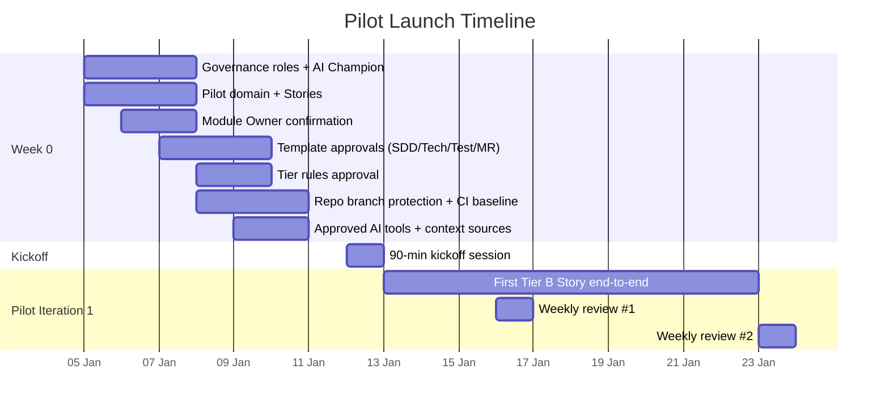
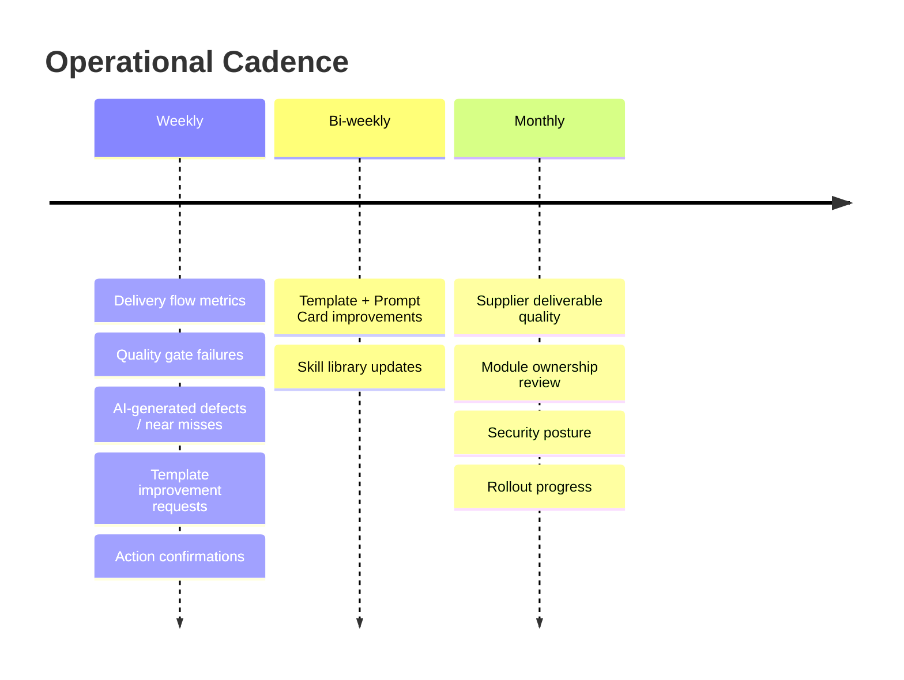

# Implementation Playbook

Chinese version: [../zh/practice/05-实施playbook.md](../zh/practice/05-实施playbook.md)

## Week 0 Preparation

Before the pilot starts, complete these actions:

- Appoint the AI-SDD governance committee.
- Appoint one AI Champion per participating internal team.
- Identify the pilot domain and pilot Stories.
- Confirm module owners for pilot modules.
- Approve the initial SDD, Technical Spec, Test Spec, Prompt Card, and MR templates.
- Approve Superpowers workflow tiers for lightweight, standard, and high-risk changes.
- Configure repository branch protection and merge request approval rules.
- Configure required CI/CD quality gates.
- Confirm which AI tools and context sources are approved.

## Kickoff Agenda

Use this 90-minute agenda for the pilot kickoff:

1. Delivery owner explains goals and boundaries.
2. Architect explains SDD and technical governance.
3. QA lead explains test evidence and quality gates.
4. Security lead explains AI data boundaries and audit rules.
5. AI Champions demonstrate one full internal Story from spec to merge request using Superpowers.
6. Team leads confirm pilot Stories and owners.

## Pilot Story Package

Every pilot Story package contains:

- SDD Story Spec.
- Technical Spec when architecture, API, data, permission, or integration is affected.
- Test Spec.
- API contract or event schema when applicable.
- Prompt Card.
- Merge request template.
- Acceptance checklist.

For outsourced delivery, the required package contains the approved SDD Spec, interface contract, test evidence, deployment notes, rollback notes, and acceptance checklist. It does not require Prompt Cards or Superpowers records.

## Weekly AI-SDD Review Agenda

Use this agenda every week:

1. Review delivery flow metrics.
2. Review quality gate failures.
3. Review AI-generated defects or near misses.
4. Review outsourced deliverable quality when applicable.
5. Review template issues and improvement requests.
6. Confirm actions, owners, and due dates.

## Supplier Review Agenda

Use this agenda monthly for the outsourced team:

- Artifact completeness.
- Acceptance pass rate.
- Defect and rework rate after delivery review.
- Owner review findings.
- Quality gate pass rate.
- Delivery note, rollback note, and change note completeness.
- Improvement actions for the next month.

## Minimum Repository Setup

Recommended files for each application repository:

- `README.md`
- `docs/specs/`
- `docs/adrs/`
- `docs/api/`
- `docs/data-dictionary.md`
- `docs/error-code-registry.md`
- `.gitlab/merge_request_templates/ai-sdd.md`
- `CODEOWNERS`
- CI/CD pipeline definition

## RACI Matrix

Columns now include **BA** (Business Analyst) and **PO** (Product Owner) so the upstream Requirement → three-reviews → Story flow has explicit accountability. New rows cover the Requirement-level activities.

| Activity | Delivery Owner | PO | Architect | Tech Lead | QA Lead | Security Lead | BA | AI Champion | Module Owner | Outsourced Lead |
| --- | --- | --- | --- | --- | --- | --- | --- | --- | --- | --- |
| Approve governance policy | A | C | R | C | C | C | C | C | C | C |
| Approve SDD template | A | C | R | C | C | C | R | R | C | C |
| Approve Requirement (Requirements Review) | C | A | C | C | C | C | R | C | C | C |
| Approve Requirement (Technical Review) | C | C | C | A | C | C | R | C | R | C |
| Approve Requirement (Test Review) | C | C | C | C | A | C | R | C | C | C |
| Approve Story breakdown + backlog placement | C | C | C | C | C | C | A | C | C | C |
| Approve Sprint scope | A | R | C | R | C | C | C | C | C | C |
| Approve Story Spec | C | C | C | A | C | C | R | R | R | R |
| Approve architecture decision | C | C | A | R | C | C | C | C | R | C |
| Approve test strategy | C | C | C | R | A | C | C | C | C | C |
| Approve security exception | A | C | C | C | C | A | C | C | C | C |
| Approve core module change | C | C | C | R | C | C | C | C | A | R |
| Story acceptance (business outcome) | C | A | C | C | R | C | R | C | R | C |
| Approve release readiness | A | C | R | R | R | R | C | C | R | C |
| Close Requirement after UAT | C | A | C | C | R | C | R | C | C | C |
| Review weekly metrics | A | C | R | R | R | R | R | R | C | R |

Legend:

- R: Responsible.
- A: Accountable.
- C: Consulted.

## Key Takeaways

- Week 0 turns the abstract governance model into named owners, approved templates, and configured repositories — without it, the daily workflow has nothing to lean on.
- The kickoff agenda is intentionally a single demonstration of one Story from spec to MR — the goal is shared mental model, not a long lecture.
- Weekly and monthly cadences (AI-SDD review, supplier review) are the operational heartbeat that turns failure cases into process improvements.
- RACI exists to settle "who actually decides" — disagreements about ownership become arbitration topics in [Operating Model](../knowledge/04-operating-model.md).

## Next

- [Priorities And Roadmap](06-priorities-and-roadmap.md) — once the playbook is operational, the roadmap sequences P0/P1/P2 work across the 5-phase rollout.
