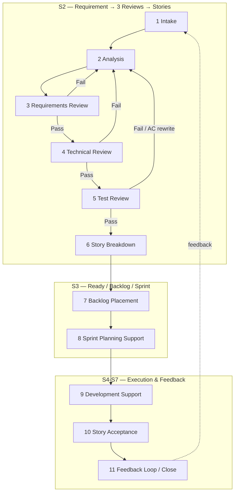
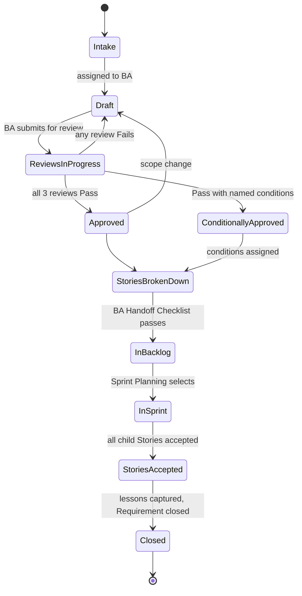
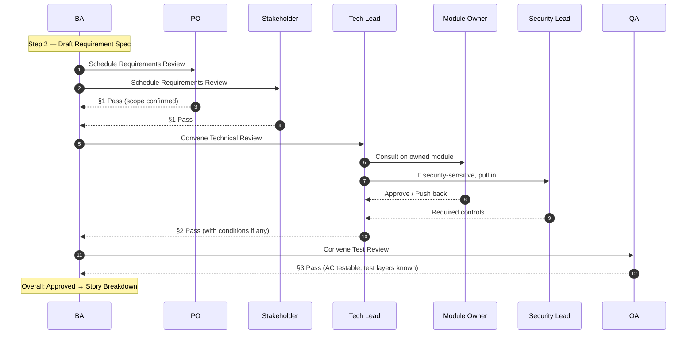

# BA Guide

Chinese version: [../zh/practice/09-ba指南.md](../zh/practice/09-ba指南.md)

## Purpose

This is the BA's deep workflow guide — the parallel of [Developer Guide](04-developer-guide.md) for the Business Analyst role. It covers the full 11-step BA workflow from raw business request to feedback-loop closure, with the artifacts and AI-readiness conditions each step must produce.

If you are not the BA, you may still need this doc to know what the BA owes you. See the [Role × Stage Matrix](08-role-stage-matrix.md) for who-does-what at each stage; this doc dives into the BA row in depth.

## Where The BA Fits

The BA's center of gravity is at **layer 1 (SDD)** of the [Execution Stack](../knowledge/03-execution-stack.md) — turning business intent into reviewable specifications. But BA work continues across the whole lifecycle: answering developer questions, linking Story acceptance back to the parent Requirement, capturing feedback for the next iteration.

In the [Role × Stage Matrix](08-role-stage-matrix.md), BA is active in seven of eight stages (S0 through S7, idle only in S1 architecture design). The two stages where BA **owns end-to-end** are:

- **S2 — Requirement → Three Reviews → Story Breakdown**
- **S3 — Story Ready → Backlog → Sprint Selection**

This guide gives the deep micro-flow for both, plus how BA participates in the other stages.

## Terminology Note

In this handbook:

- **Requirement** (需求) — a Feature-sized business unit raised by the client or business stakeholder, captured in [Feature Spec](../../../templates/feature-spec.md) (which carries an alias note for this usage).
- **Three Reviews** — the gating reviews on each Requirement: **Requirements Review** (need 评审), **Technical Review** (技术评审), **Test Review** (测试评审). Combined evidence in [Requirement Review Record](../../../templates/requirement-review-record.md).
- **Story** — what falls out of breaking down a Requirement; goes to the backlog with the [BA Handoff Checklist](../../../templates/ba-handoff-checklist.md) signed off.

A Requirement is roughly **one Feature ≈ many Stories**. The three reviews gate the *Requirement*, not individual Stories.

## The BA's 11-Step Workflow

The flow at a glance:

Each step below has: **Inputs**, **Steps**, **Outputs**, **AI-readiness** (what must be true about the output for downstream AI-assisted work to proceed safely), **Pitfalls**.

### Step 1: Requirement Intake

**Inputs:**
- Business request (ticket, conversation, stakeholder email, escalation).
- Originating stakeholder identity and role.
- Project / Iteration Brief (scope context).

**Steps:**
1. Capture the raw ask without paraphrasing.
2. Assign a Requirement ID.
3. Identify the actual originating stakeholder (not just whoever forwarded it).
4. Note urgency, deadline, escalation source.
5. Place into the BA queue with a clear "raw / not analysed" tag.

**Outputs:**
- New Requirement entry in BA queue with: ID, raw ask, originator, intake date, urgency note.

**AI-readiness:**
- Requirement ID is the spine that everything downstream will link back to — make sure it is unique and visible from day zero.

**Pitfalls:**
- Reframing the ask before capturing it (you lose the original wording, which matters in stakeholder disputes).
- Assigning yourself the Requirement before deciding it is even in scope — leave intake separate from analysis.

### Step 2: Requirement Analysis

**Inputs:**
- Raw Requirement from Step 1.
- Project / Iteration Brief.
- Existing related Feature Specs, Architecture Constraints, prior Requirements that may overlap.

**Steps:**
1. Draft the [Feature Spec / Requirement Spec](../../../templates/feature-spec.md):
   - Business Goal: one sentence.
   - Users and Use Cases: who, doing what, expecting what outcome.
   - Functional Scope: in / out lists.
   - Business Rules: explicit rule table.
   - User Flows: at least the main flow as Mermaid or numbered list.
   - Data and Interface Impact: data objects, APIs, events, integrations, error codes.
   - Non-Functional Requirements: permission, audit, performance, compatibility, security, observability.
   - Story Breakdown (initial sketch — to be confirmed after reviews).
   - Acceptance Strategy: automated, manual, UAT-required, integration-required.
2. Identify obvious dependencies (other teams, suppliers, environments).
3. Mark questions you cannot answer yourself — keep them visible as questions, not as assumptions.
4. Send to Tech Lead + QA + PO for review-readiness check (a pre-review sanity pass).

**Outputs:**
- Draft Feature Spec with `Status: Ready For Review`.
- List of open questions to surface in the Requirements Review.

**AI-readiness:**
- The Feature Spec must name actual users, actual data objects, actual APIs — not "the relevant ones" or "the affected systems". An AI agent reading it later cannot resolve "the affected systems" to anything concrete.
- Non-Functional Requirements must be specific (e.g., "audit log must capture user ID, timestamp, attempted action, outcome") not generic ("auditable").

**Pitfalls:**
- Filling in your own answers to unclear business questions instead of marking them as questions.
- Burying assumptions in prose (e.g., "users probably want X") — assumptions go in their own labelled list so reviewers can challenge them.

### Step 3: Requirements Review (需求评审)

**Inputs:**
- Draft Feature Spec from Step 2.
- Open questions list.
- Stakeholders' availability.

**Steps:**
1. Schedule the review. Required attendees: PO, BA (chair), originating stakeholder. Consulted: Delivery Owner.
2. Walk the room through the Feature Spec.
3. Capture every question and resolution in Section 1 of the [Requirement Review Record](../../../templates/requirement-review-record.md).
4. Drive to explicit decisions on: confirmed scope, confirmed non-scope, success criteria, constraints, assumptions.
5. Decide the outcome:
   - **Pass** — proceed to Technical Review.
   - **Pass with conditions** — proceed but conditions become non-negotiable.
   - **Fail** — return to Step 2 (Analysis) for rework.

**Outputs:**
- Section 1 of the Review Record completed with all four columns of the discussion log filled in, confirmed scope/non-scope/success criteria, action items, and outcome.

**AI-readiness:**
- "Confirmed scope" must be a list of capabilities, not a paragraph. AI agents reading downstream Stories need to compare against discrete scope items.
- Every "Pass with conditions" condition must have an owner and a way to verify completion — otherwise the condition is decoration.

**Pitfalls:**
- Treating the review as a presentation rather than a working session — if no one challenges anything, the spec was either trivial or the wrong people are in the room.
- Letting "we'll figure it out later" responses pass — capture them as action items with owners and dates.

### Step 4: Technical Review (技术评审) — Co-led With Tech Lead

**Inputs:**
- Section 1 outcome (must be Pass or Pass with conditions).
- Feature Spec.
- Architecture Constraints for affected modules.
- ADRs that may be impacted.

**Steps:**
1. The Tech Lead chairs; BA attends and ensures business intent is preserved through technical re-framing.
2. Required attendees: Tech Lead (chair), BA, Module Owner(s) of affected modules. Required if security-sensitive: Security Lead. Consulted: Developer representative.
3. Walk the technical impact: affected modules, APIs, events, data models, permissions, external integrations.
4. Identify ADRs needed; if architecture decisions are pending, the Requirement cannot complete this review.
5. Estimate complexity and top risks; agree mitigations.
6. Capture all of this in Section 2 of the Review Record.
7. Decide outcome: Pass / Pass with conditions / Fail (return for redesign).

**Outputs:**
- Section 2 of the Review Record completed.
- ADR draft(s) if applicable.
- Updated Feature Spec if technical scope changes pushed back into the spec.

**AI-readiness:**
- Technical impact list must name actual file paths or module names, not categories. An AI agent will be expected to locate these.
- Risk mitigations must be actions, not aspirations ("we will add a circuit breaker in the X module" not "we will be careful about cascading failures").

**Pitfalls:**
- BA stepping back and letting the conversation drift away from business intent — your job is to interpret the business need when the room starts arguing about implementation.
- Skipping Security Lead participation when auth/data/payment/audit touches are present.

### Step 5: Test Review (测试评审) — Co-led With QA

**Inputs:**
- Sections 1 and 2 of the Review Record.
- Existing Test Spec patterns for affected modules.
- Existing Acceptance Strategy templates.

**Steps:**
1. QA chairs; BA attends to push back on AC ambiguity.
2. Required attendees: QA Lead (chair), BA, Tech Lead. Required if security-sensitive: Security Lead.
3. Confirm AC's are in Given/When/Then form and are testable as written.
4. Identify required test layers: unit / component / contract / integration / E2E.
5. Identify regression coverage, permission tests, audit-log tests.
6. Confirm test environment and data needs (with masking plan if customer data is involved).
7. Define UAT scope.
8. Capture all of this in Section 3 of the Review Record.
9. Decide outcome: Pass / Pass with conditions / Fail (return for AC rewrite).

**Outputs:**
- Section 3 of the Review Record completed.
- AC rewrite back-channel to Step 2 if AC's were not testable.

**AI-readiness:**
- "Testable as written" means an AI agent generating tests later can produce assertions from the AC text without inventing details.
- Required test layers being explicit means the agent knows what tests to write, not just "add tests".

**Pitfalls:**
- Accepting AC's that QA can interpret but a developer cannot test directly.
- Skipping the "AI-generated test risk" check — if the test approach relies on heavy mocking, flag it now, not at MR review.

### Step 6: Story Breakdown

**Inputs:**
- All three review sections Passed (or Passed with conditions).
- Approved Feature Spec.

**Steps:**
1. Re-read the Feature Spec's Story Breakdown sketch.
2. With Tech Lead and QA, break the Requirement into Stories that:
   - Each deliver an independently verifiable behavior (or are explicitly sequencing-dependent with a documented reason).
   - Are sized to fit one developer session for Tier A, one sprint for Tier B/C.
   - Have a single Module Owner (or a clear primary).
3. For each Story:
   - Create a [Story Card](../../../templates/story-card.md) with goal, role, AC, parent Requirement link.
   - Assign Tier (A / B / C) with rationale.
   - Identify Module Owner.
   - List initial dependencies.
4. Record traceability in the Review Record's Traceability table.

**Outputs:**
- Initial Story Cards for each broken-out Story.
- Traceability table in the Review Record linking every Story to the parent Requirement.

**AI-readiness:**
- Every Story has a back-link to the parent Requirement and the Review Record — so an agent picking up a Story can trace upstream context.
- Story sizing matches Tier — a Tier A Story that turns out to need an ADR is a Tier C Story mis-classified.

**Pitfalls:**
- Splitting a Story across two Module Owners with no primary — that Story will languish because no one feels accountable.
- "Tech-decomposition" Stories ("create the table", "add the route") that are not independently business-valuable — these belong inside one business-valued Story, not as siblings.

### Step 7: Backlog Placement

**Inputs:**
- Initial Story Cards from Step 6.

**Steps:**
1. For each Story, complete the [BA Handoff Checklist](../../../templates/ba-handoff-checklist.md):
   - Provenance (parent Requirement traceability).
   - Story Card completeness (goal, role, flows, AC).
   - AI Context Boundary (allowed/forbidden context, editable/forbidden scope, verification commands).
   - Linked artifacts (SDD Story Spec, Technical Spec, Test Spec, contracts, etc. per Tier).
   - Dependencies and sequencing.
   - Open questions = empty.
2. Write or update the [SDD Story Spec](../../../templates/sdd-story-spec.md) for Tier B/C.
3. Get signoffs:
   - BA signoff (always).
   - Tech Lead signoff (Tier B/C).
   - QA signoff (Tier B/C).
   - Module Owner awareness (Tier C).
4. Place the Story on the backlog with priority label and dependency label.
5. Run the AI-readiness self-test from the checklist; if any answer is "no", park the Story instead of placing it.

**Outputs:**
- Story on backlog with handoff checklist linked.
- SDD Story Spec linked.

**AI-readiness:**
- The checklist's AI-readiness self-test passes — this is the contractual condition for "Story is ready for AI-assisted execution".

**Pitfalls:**
- Treating the checklist as a paperwork step — its purpose is to *fail closed*. Any unresolved question stays on the parent Requirement, never gets quietly dropped onto a Story.
- Placing a Story on the backlog "for visibility" before it is actually ready — backlog presence implies readiness.

### Step 8: Sprint Planning Support

**Inputs:**
- Backlog with ready Stories.
- PO's priority order.
- Team capacity from Delivery Owner.

**Steps:**
1. Walk Sprint Planning through Stories candidate for inclusion.
2. Answer dependency / scope questions on the fly; if a question requires going back to the parent Requirement, that Story is **not** ready for this sprint.
3. Confirm Tier C inclusions have Module Owner and Delivery Owner signoff.
4. Once the sprint is committed, freeze the in-sprint Story set; mid-sprint changes follow the [Change Request](../../../templates/change-request.md) flow.

**Outputs:**
- Committed sprint scope recorded in [Iteration Brief](../../../templates/iteration-brief.md).
- Any Stories pulled back to backlog with reason.

**AI-readiness:**
- The committed sprint scope is the authoritative "what's in this sprint" source for agents and humans — make sure it is in a single canonical place.

**Pitfalls:**
- Saying "yes" to a Story mid-sprint that wasn't ready at planning — this is how Requirement-level questions end up debated in Story comments.

### Step 9: Development Support

**Inputs:**
- Developer questions during S4.

**Steps:**
1. Triage questions:
   - Story-level clarification → answer on the Story, update SDD Story Spec.
   - Requirement-level clarification → update the parent Requirement and Review Record; cascade to all child Stories; flag the change in the BA queue.
   - Out-of-scope ask → reject; suggest Change Request.
2. Update artifacts, not chat. Anything that should survive into the next agent session must be in a file.
3. If a clarification reveals a Review-Record-level gap (e.g., AC's were not actually testable), trigger a targeted re-review — do not just patch the Story.

**Outputs:**
- Updated Story Cards / SDD Story Specs with timestamped clarifications.
- Updated Requirement and Review Record if scope shifted.

**AI-readiness:**
- Clarifications are written down in the same artifacts the agent reads — they survive across agent sessions.
- Any scope shift on the parent Requirement is propagated to all child Stories, not silently kept on the BA's head.

**Pitfalls:**
- Answering questions in Slack and not updating the spec — the next developer (or AI agent) won't see it.
- Letting one Story's clarification quietly change the implicit scope of sibling Stories.

### Step 10: Story Acceptance — Link Back To Requirement

**Inputs:**
- Story Acceptance Records as Stories complete.

**Steps:**
1. For each accepted Story, update the parent Requirement with: link to Story Acceptance Record, date, any noted issues.
2. When all child Stories of a Requirement are accepted, mark the Requirement as `Status: Accepted` (or Conditionally Accepted if conditions remain).
3. If a Story is rejected, decide:
   - Story-level rework (most common) → back to S4.
   - Requirement-level rework (rare but real) → propose Requirement update and trigger partial re-review.
4. Participate in business acceptance with PO when appropriate.

**Outputs:**
- Updated parent Requirement status.
- Acceptance evidence linked at both Story and Requirement levels.

**AI-readiness:**
- Requirement-level status reflects the accumulated Story acceptance — a future agent or stakeholder can ask "did Requirement X actually ship?" and get a real answer.

**Pitfalls:**
- Marking a Requirement Accepted when one Story is still in rework.
- Conflating "Story merged" with "Story accepted" — acceptance comes from PO/QA/business, not from the merge.

### Step 11: Feedback Loop — Close Requirement

**Inputs:**
- UAT outcomes from S7.
- Production incidents that trace back to this Requirement.
- Stakeholder feedback after delivery.

**Steps:**
1. Collect feedback explicitly — do not wait for it to arrive in casual conversation.
2. For each piece of feedback, classify:
   - **Defect** → log defect, attribute via [Defect Attribution](../../../templates/defect-attribution.md), trigger fix Story.
   - **Change Request** → file a [Change Request](../../../templates/change-request.md); it becomes a new (or amended) Requirement next iteration.
   - **Knowledge Base Update** → file a [Knowledge Base Update](../../../templates/knowledge-base-update.md) when accepted business knowledge changes.
   - **Praise / no-op** → record briefly; no further action.
3. Close out the Requirement: status, lessons learned, link to follow-up Requirements if any.
4. Surface BA-process improvements (e.g., a recurring class of AC ambiguity) at [Weekly AI-SDD Review](../../../templates/weekly-ai-sdd-review.md).

**Outputs:**
- Closed Requirement with lessons learned and follow-up links.
- Change Requests / Knowledge Base Updates filed.
- BA-process improvement items in weekly review.

**AI-readiness:**
- Closed Requirements with lessons learned become structured upstream context for the next iteration's BA work — failure modes are caught at intake instead of at MR.

**Pitfalls:**
- Letting Requirements stay "in flight" forever because nobody formally closes them — over time the queue becomes meaningless.
- Treating defects as "the dev team's problem" rather than feeding them back through Defect Attribution to find which BA-stage gap let them through.

## Requirement Lifecycle (State View)

Reading the 11 steps as state transitions makes the gate semantics non-negotiable:

## The Three Reviews (Actor Sequence)

## Required Artifacts By BA Step

| Step | Required artifacts | Tier difference |
| --- | --- | --- |
| 1 Intake | BA queue entry | Same for all |
| 2 Analysis | [Feature Spec](../../../templates/feature-spec.md) draft | Tier A: lightweight version; Tier C: full + ADR pre-flagging |
| 3 Req Review | [Review Record](../../../templates/requirement-review-record.md) §1 | Same for all |
| 4 Tech Review | [Review Record](../../../templates/requirement-review-record.md) §2, optional [ADR](../../../templates/adr.md) | Tier C: ADR required when arch impact present |
| 5 Test Review | [Review Record](../../../templates/requirement-review-record.md) §3 | Tier C: Security Lead required if sensitive |
| 6 Story Breakdown | [Story Card](../../../templates/story-card.md) × N, traceability table | Same for all |
| 7 Backlog Placement | [BA Handoff Checklist](../../../templates/ba-handoff-checklist.md), [SDD Story Spec](../../../templates/sdd-story-spec.md) (Tier B/C) | Tier B/C requires SDD Story Spec |
| 8 Sprint Planning | [Iteration Brief](../../../templates/iteration-brief.md) update | Same for all |
| 9 Dev Support | Updated Story Cards / SDD Story Specs / Requirement | Same for all |
| 10 Story Acceptance | Updated Requirement, Story Acceptance Records | Same for all |
| 11 Feedback Loop | [Change Request](../../../templates/change-request.md), [Knowledge Base Update](../../../templates/knowledge-base-update.md), [Defect Attribution](../../../templates/defect-attribution.md), updated Requirement | Same for all |

## Minimum BA Checklist Per Requirement

Before claiming a Requirement is ready to break into Stories:

- [ ] Feature Spec is Approved (or Conditionally Approved).
- [ ] All three review sections are completed with explicit Pass / Pass-with-conditions outcomes.
- [ ] Every "condition" has an owner and verification mechanism.
- [ ] Open questions list is empty.
- [ ] At least one Tech Lead and one QA have signed Section 2 / Section 3.
- [ ] Module Owner(s) of affected modules are aware.

Before placing the resulting Stories on the backlog:

- [ ] BA Handoff Checklist passes for every Story.
- [ ] AI-readiness self-test passes for every Story.
- [ ] Tier classification recorded per Story.
- [ ] Traceability table in the Review Record links every Story.

Before closing a Requirement:

- [ ] All child Stories are accepted (or explicitly de-scoped).
- [ ] UAT outcome captured (when UAT performed).
- [ ] Feedback classified and routed (defect / change request / KB update).
- [ ] Lessons learned recorded.

## How BA Work Supports AI

Every BA output is designed so the next AI-assisted step does not have to guess:

- The Feature Spec becomes upstream context for every Story produced from it.
- The Review Record becomes the audit trail an agent can reference when reviewers ask "where did this scope come from?"
- The Handoff Checklist's AI-readiness self-test is the precondition for letting an AI agent execute the Story.
- Clarifications during development are recorded in artifacts the agent reads, not in chat the agent never sees.
- Feedback at the end becomes structured input — Change Requests and Defect Attributions — that the next iteration's BA work picks up.

The pattern: **BA output is a file the agent can read.** Anything that exists only in the BA's head or in chat is invisible to downstream AI work.

## How BA Fits The Execution Stack

| Stack Layer | BA's role |
| --- | --- |
| 1 SDD | Primary — BA owns the spec layer (Feature Spec, SDD Story Spec inputs, AC). |
| 2 Superpowers | Secondary — BA supports the developer's `brainstorming` (DoR check) skill by ensuring Stories are actually ready. |
| 3 Harness | Indirect — BA defines the AI Context Boundary that the harness enforces. |
| 4 CI / Review | Indirect — BA participates in Story acceptance and links acceptance back to Requirements. |

When something breaks at layer 2-4 and Defect Attribution traces it to "spec ambiguity" or "missing context", that is a BA-process signal — the layer-1 input was not strong enough.

## Sources

- [Feature Spec template](../../../templates/feature-spec.md)
- [Requirement Review Record template](../../../templates/requirement-review-record.md)
- [BA Handoff Checklist template](../../../templates/ba-handoff-checklist.md)
- [SDD Story Spec template](../../../templates/sdd-story-spec.md)
- [Role × Stage Matrix](08-role-stage-matrix.md)
- [SDD Methodology](../knowledge/02-sdd-methodology.md)

## Key Takeaways

- BA owns S2 and S3 end-to-end; everywhere else in the matrix BA is a supporting role with concrete outputs that survive into artifacts.
- The Feature Spec is the BA's central artifact; the Review Record is the gate evidence; the Handoff Checklist is the precondition for AI-assisted Story execution.
- "AI-readiness" is the BA's responsibility — every output must be something an agent can read and use without re-asking the BA.
- Feedback in Step 11 is not optional; un-closed Requirements pollute the queue and lose the learning loop.

## Next

- [Implementation Playbook](05-implementation-playbook.md) — where the BA's workflow connects to the program's Week-0, RACI, and weekly review cadence.
