# AI 上下文工件地图

English version: [../16-ai-context-artifact-map.md](../16-ai-context-artifact-map.md)

## 目的

AI 辅助交付不只需要好的 prompt。每个交付阶段都必须留下足够结构化的上下文，供下一阶段使用。否则 AI agent 会被迫猜业务规则、架构边界、测试期望、发布风险或验收标准。

本文回答两个实际问题：

1. 每个阶段要产出哪些工件，下一阶段才能安全使用 AI？
2. 哪些工件是必须的、条件触发的、可选的，避免流程过重而不可落地？

## 工件等级

| 等级 | 含义 | 何时使用 |
| --- | --- | --- |
| 必需（Must-have） | 阶段推进所必需的最低工件。 | 该阶段真实存在于交付流程中。 |
| 条件触发（Conditional） | 只有触发条件存在时才需要。 | 涉及架构、API、数据、安全、集成、发布、供应商或 UAT 影响。 |
| 可选（Optional） | 对规模化、审计、培训或复杂协作有帮助，但不是每次都需要。 | 团队需要更多结构，或工作足够大。 |

实用规则：

- Tier A 使用最小可用集合。
- Tier B 使用 Story 级规格、测试、实现计划和证据。
- Tier C 使用完整适用集合，包括技术、安全、Owner、发布和回滚工件。

## 端到端阶段图

```mermaid
flowchart LR
    S0["0. 项目 / 迭代准备<br/>必需: Iteration or Project Brief, AI Policies<br/>条件触发: Service Catalog, Team Agreement"]
    S1["1. 架构与技术边界设计<br/>必需: affected area 的 Architecture Context<br/>条件触发: ADR, API/Event/Data/Error contracts"]
    S2["2. Epic / Feature / Story 拆分<br/>必需: Story Breakdown<br/>条件触发: Epic Brief, Feature Spec, Dependency Map"]
    S3["3. Story Ready For Development<br/>必需: Story Card, SDD Story Spec, AI Context Boundary<br/>条件触发: Technical Spec, Test Spec, Prompt Card"]
    S4["4. Story 开发与 MR<br/>必需: Implementation Plan, Code, Tests, MR Evidence<br/>条件触发: Agent Report, Updated Contracts"]
    S5["5. Story 验收<br/>必需: Acceptance Evidence<br/>条件触发: Defect Attribution, Story Acceptance Record"]
    S6["6. 系统集成与发布准备<br/>必需: Quality Gate Evidence<br/>条件触发: Integration Plan, Release Notes, Deployment, Rollback"]
    S7["7. 用户验收与反馈回流<br/>必需: Acceptance Decision<br/>条件触发: UAT Plan, UAT Evidence, Change Requests"]

    S0 --> S1 --> S2 --> S3 --> S4 --> S5 --> S6 --> S7
    S7 -. "反馈进入下一迭代" .-> S0
```

## 上下文包模型

| 上下文包 | 产出者 | 使用者 | 目的 |
| --- | --- | --- | --- |
| Project Context Package | Delivery Owner、架构师、Team Lead、安全、QA | 架构设计、Story 拆分、AI 治理设置 | 给 AI 和人提供项目边界、交付规则、ownership 和政策约束。 |
| Architecture Context Package | 架构师、Tech Lead、Module Owner | Story 拆分、Technical Spec、实现计划 | 给 AI 提供结构边界、允许依赖、契约和技术约束。 |
| Requirement Breakdown Package | Product Owner、BA、架构师、团队 | Story readiness 和计划 | 将业务意图转为可实现、有优先级、依赖明确的 Stories。 |
| Story Context Package | Product Owner、BA、开发、QA、Tech Lead | AI 代码开发 | 给 AI 提供单个 Story 的完整有界上下文。 |
| Implementation Evidence Package | 开发、AI agent、Reviewer、CI | Story 验收和合入评审 | 说明改了什么、测试了什么、AI 做了什么、证据在哪里。 |
| Story Acceptance Package | QA、Product Owner、业务代表 | 发布计划、指标、下一迭代 | 确认 Story 行为已被接受，并捕获返工和经验。 |
| Release Readiness Package | Tech Lead、QA、DevOps、安全、Release Owner | 系统集成、部署、UAT | 证明集成后的工作可发布、可恢复。 |
| UAT And Feedback Package | 业务用户、Product Owner、QA、Delivery Owner | 下一迭代计划和知识库 | 捕获真实用户验收、缺陷、变更请求和反馈。 |

## 阶段工件目录

### 0. 项目 / 迭代准备

目标：

- 建立交付边界、团队规则、AI 政策和 ownership baseline。

| 工件 | 等级 | 触发条件 / 说明 | 资产 |
| --- | --- | --- | --- |
| Project Brief | 新项目 Must-have | 启动新项目、产品线或重大 initiative 时需要。 | [Project Brief](../../../templates/project-brief.md) |
| Iteration Brief | 治理型迭代 Must-have | 当迭代范围会作为 AI 上下文时需要。 | [Iteration Brief](../../../templates/iteration-brief.md) |
| Scope / Non-Scope | Must-have | 可放在 Project Brief 或 Iteration Brief 中。 | [Project Brief](../../../templates/project-brief.md) |
| AI Engineering Constitution | Must-have | 内部 AI 辅助交付前需要。 | [AI Engineering Constitution](../../../ai/engineering-constitution.md) |
| AI Context Policy | Must-have | AI 使用项目或代码上下文前需要。 | [AI Context Policy](../../../ai/context-policy.md) |
| Allowed Tools Policy | Must-have | Agent 能运行工具或命令前需要。 | [Allowed Tools](../../../ai/allowed-tools.md) |
| Security Policy | Must-have | 企业或公开仓库都需要。 | [Security Policy](../../../ai/security-policy.md) |
| Testing Policy | Must-have | 接受 AI 生成测试前需要。 | [Testing Policy](../../../ai/testing-policy.md) |
| Service Catalog / Ownership Registry | Conditional | 多服务、多团队或多 owner 时需要。 | [Backstage Catalog Template](../../../templates/backstage-catalog-info.yaml) |
| Team Working Agreement | Conditional | 新团队、混合团队、供应商参与或协作方式变化时需要。 | [Team Working Agreement](../../../templates/team-working-agreement.md) |

最小 AI 交接：

- AI 能识别 scope、non-scope、approved context、forbidden context、tools、owners 和 verification expectations。

### 1. 架构与技术边界设计

目标：

- 定义 AI 在 Story 级实现中必须遵守的架构边界。

| 工件 | 等级 | 触发条件 / 说明 | 资产 |
| --- | --- | --- | --- |
| Architecture Overview | 新系统或重大领域 Must-have | 小变更且模块已有充分文档时可不新增。 | [Architecture Overview](../../../templates/architecture-overview.md) |
| Architecture Constraints | 治理型团队 Must-have | 可以轻量，但必须定义依赖、分层、数据和 API 规则。 | [Architecture Constraints](../../../templates/architecture-constraints.md) |
| ADR | Conditional | 架构决策、重大 tradeoff、平台选择或不可逆决策时需要。 | [ADR](../../../templates/adr.md) |
| Technical Spec | Conditional | Tier B/C 且有技术影响时需要。 | [Technical Spec](../../../templates/technical-spec.md) |
| OpenAPI Contract | Conditional | 同步服务 API 新增或变更时需要。 | [OpenAPI](../../../templates/openapi.yaml) |
| Event Schema | Conditional | 异步事件新增或变更时需要。 | [Event Schema](../../../templates/event-schema.json) |
| Data Dictionary | Conditional | 跨团队数据对象或字段新增、变更时需要。 | [Data Dictionary](../../../templates/data-dictionary.md) |
| Error Code Registry | Conditional | 用户可见或跨服务错误语义变化时需要。 | [Error Code Registry](../../../templates/error-code-registry.md) |
| Permission Model | Conditional | 认证、授权、敏感数据或审计行为变化时需要。 | [Permission Model](../../../templates/permission-model.md) |
| Observability Plan | Conditional | 新服务、关键流程或生产风险变更时需要。 | [Observability Plan](../../../templates/observability-plan.md) |

最小 AI 交接：

- AI 能判断哪些模块、服务、数据存储、API、事件、权限和架构约束与下一个 Story 相关。

### 2. Epic / Feature / Story 拆分

目标：

- 将业务目标拆成足够小、足够清楚、可以 AI 辅助开发的 Stories。

| 工件 | 等级 | 触发条件 / 说明 | 资产 |
| --- | --- | --- | --- |
| Story Breakdown | Must-have | 多个 Story 交给开发前需要。 | [Story Breakdown](../../../templates/story-breakdown.md) |
| Story Package Checklist | Must-have | 声明 Story ready 前需要。 | [Story Package Checklist](../../../templates/story-package-checklist.md) |
| Epic Brief | Conditional | 大业务目标或多 feature 工作时需要。 | [Epic Brief](../../../templates/epic-brief.md) |
| Feature Spec | Conditional | 一个能力跨多个 Story、团队或用户流程时需要。 | [Feature Spec](../../../templates/feature-spec.md) |
| Dependency Map | Conditional | Story、团队、服务、环境或供应商之间有依赖时需要。 | [Dependency Map](../../../templates/dependency-map.md) |
| Risk List | Conditional | Tier C、供应商、发布风险、数据、安全或重集成工作需要。 | [Risk List](../../../templates/risk-list.md) |
| Acceptance Strategy | Conditional | 验收跨 Story、integration、UAT 或 release 层级时需要。 | [Acceptance Strategy](../../../templates/acceptance-strategy.md) |

最小 AI 交接：

- AI 能理解 Story 与更大目标的关系、依赖、不可包含的范围，以及需要什么验收证据。

### 3. Story Ready For Development

目标：

- 提供 AI 辅助代码开发所需的完整有界上下文。

| 工件 | 等级 | 触发条件 / 说明 | 资产 |
| --- | --- | --- | --- |
| Story Card | Must-have | 每个 Story 都需要。 | [Story Card](../../../templates/story-card.md) |
| SDD Story Spec | Tier B/C Must-have | Tier A 可使用验收标准清晰的 lightweight issue。 | [SDD Story Spec](../../../templates/sdd-story-spec.md) |
| AI Context Boundary | 使用 AI 时 Must-have | 可放在 Story Card、SDD Story Spec 或 Story Context Package 中。 | [Story Context Package](../../../templates/story-context-package.md) |
| Module Owner | owned module Must-have | 可记录在 Story Card、SDD Spec 或 CODEOWNERS 中。 | [CODEOWNERS](../../../templates/CODEOWNERS) |
| Workflow Tier Decision | Must-have | Tier A/B/C 决定流程重量。 | [Superpowers Adoption](./08-superpowers-adoption.md) |
| Story Context Package | Conditional | 上下文分散在多个文档或 AI 工作为 Tier B/C 时需要。 | [Story Context Package](../../../templates/story-context-package.md) |
| Technical Spec | Conditional | 涉及技术设计、架构、API、数据、权限或集成影响时需要。 | [Technical Spec](../../../templates/technical-spec.md) |
| Test Spec | Conditional | Tier B/C 和非平凡行为需要；很小的 Tier A 变更可选。 | [Test Spec](../../../templates/test-spec.md) |
| Prompt Card | Conditional | 可复用内部 AI 任务或高风险 prompt 使用时需要。 | [Prompt Card](../../../templates/prompt-card.md) |
| API / Event / Data / Error Artifacts | Conditional | 这些工件变化时需要。 | [OpenAPI](../../../templates/openapi.yaml)、[Event Schema](../../../templates/event-schema.json)、[Data Dictionary](../../../templates/data-dictionary.md)、[Error Code Registry](../../../templates/error-code-registry.md) |

最小 AI 交接：

- AI 可以实现 Story，而不需要发明业务规则、字段、API、权限、错误码或测试期望。

### 4. Story 开发与 MR

目标：

- 将批准的 Story 上下文转为代码、测试、契约和可评审证据。

| 工件 | 等级 | 触发条件 / 说明 | 资产 |
| --- | --- | --- | --- |
| Implementation Plan | Tier B/C Must-have | Tier A 可用 MR 中的短 checklist。 | [Implementation Plan](../../../templates/implementation-plan.md) |
| Updated Code | Must-have | 实现工作必需。 | Repository source code |
| Updated Tests | 行为变更 Must-have | 行为变化时需要；纯文档变更不需要。 | [Test Spec](../../../templates/test-spec.md) |
| MR Evidence | Must-have | 合入评审必需。 | [AI-SDD Merge Request Template](../../../.gitlab/merge_request_templates/ai-sdd.md) |
| Verification Evidence | Must-have | 需要链接或总结本地/CI 证据。 | [Verification Script](../../../ai-harness/scripts/run-verification.sh) |
| Updated Contracts / Documentation | Conditional | API、event、data、error、deployment 或用户可见行为变化时需要。 | Relevant templates |
| Agent Execution Report | Conditional | Tier B/C AI 辅助工作需要；小型 Tier A 可选。 | [Agent Execution Report](../../../templates/agent-execution-report.md) |
| Review Findings | Conditional | MR 工具不能充分保留 review feedback，或需要正式 review 证据时需要。 | [Review Findings](../../../templates/review-findings.md) |

最小 AI 交接：

- Reviewer 或另一个 AI agent 能看清楚改了什么、为什么改、哪些测试证明它、哪些契约变化、还剩哪些风险。

### 5. Story 验收

目标：

- 确认 Story 行为已被接受，并为发布计划和未来 AI 上下文捕获证据。

| 工件 | 等级 | 触发条件 / 说明 | 资产 |
| --- | --- | --- | --- |
| Acceptance Evidence | Must-have | Story accepted 前需要。 | [Acceptance Evidence](../../../templates/acceptance-evidence.md) |
| Test Evidence | Must-have | 可以是 CI report、test report、screenshot、log 或 manual verification record。 | [Test Spec](../../../templates/test-spec.md) |
| Story Acceptance Record | Conditional | 受监管、供应商、高风险或业务签字 Story 需要。 | [Story Acceptance Record](../../../templates/story-acceptance-record.md) |
| Defect Attribution | Conditional | 出现 defect、rework、escaped issue 或重大 AI 修正时需要。 | [Defect Attribution](../../../templates/defect-attribution.md) |
| Lessons Learned / Prompt Update | Optional | AI 输出需要明显修正或发现新业务知识时有用。 | [Knowledge Base Update](../../../templates/knowledge-base-update.md)、[Prompt Card](../../../templates/prompt-card.md) |
| Weekly Review Entry | Optional | 对指标、失败模式和治理复盘有用。 | [Weekly AI-SDD Review](../../../templates/weekly-ai-sdd-review.md) |

最小 AI 交接：

- 未来 AI 工作能知道 Story 是否已验收、由什么证据证明、哪些缺陷或修正应影响后续工作。

### 6. 系统集成与发布准备

目标：

- 安全地组合已验收 Stories，并为发布或用户验收做准备。

| 工件 | 等级 | 触发条件 / 说明 | 资产 |
| --- | --- | --- | --- |
| Quality Gate Report | Release candidate Must-have | 发布或正式集成验收前需要。 | [Quality Gate Report](../../../templates/quality-gate-report.md) |
| CI Gate Evidence | Must-have | 有 CI/CD 时需要。 | [CI Gate Policy](../../../quality-gates/ci-gate-policy.md) |
| Integration Plan | Conditional | 多个变更、服务、团队、供应商或环境集成时需要。 | [Integration Plan](../../../templates/integration-plan.md) |
| Integration / Contract Test Evidence | Conditional | 涉及跨服务、API 或 event 行为时需要。 | [Quality Gate Checklist](../../../quality-gates/checklist.md) |
| Release Notes | Conditional | 变更对用户、运维或下游团队可见时需要。 | [Release Notes](../../../templates/release-notes.md) |
| Deployment Notes | Conditional | 部署步骤、配置、环境或运维非平凡时需要。 | [Deployment Notes](../../../templates/deployment-notes.md) |
| Rollback Plan | Conditional | 生产影响变更需要。 | [Rollback Plan](../../../templates/rollback-plan.md) |
| Migration Plan | Conditional | 存在 schema 或数据迁移时需要。 | [Migration Plan](../../../templates/migration-plan.md) |
| Observability Checklist | Conditional | 新服务、关键流程或生产风险变更需要。 | [Observability Checklist](../../../templates/observability-checklist.md) |
| Security Scan Evidence | Conditional | 安全门禁启用或变更影响生产时需要。 | [Quality Gate Checklist](../../../quality-gates/checklist.md) |

最小 AI 交接：

- AI 或 Reviewer 能理解哪些 Stories 被集成、跨系统风险是什么、如何部署、如何回滚，以及哪些证据证明 release readiness。

### 7. 用户验收与反馈回流

目标：

- 捕获业务用户验收结果，并将真实学习回流到下一迭代。

| 工件 | 等级 | 触发条件 / 说明 | 资产 |
| --- | --- | --- | --- |
| Acceptance Decision | UAT 或业务签字时 Must-have | 可记录在 UAT Evidence 或 Release Acceptance Record 中。 | [Release Acceptance Record](../../../templates/release-acceptance-record.md) |
| UAT Plan | Conditional | 进行正式 UAT 时需要。 | [UAT Plan](../../../templates/uat-plan.md) |
| UAT Evidence | Conditional | 执行 UAT 时需要。 | [UAT Evidence](../../../templates/uat-evidence.md) |
| UAT Defect List | Conditional | UAT 发现缺陷时需要。 | [Defect Attribution](../../../templates/defect-attribution.md) |
| Change Request List | Conditional | UAT 或用户提出范围变更时需要。 | [Change Request](../../../templates/change-request.md) |
| Knowledge Base Update | Conditional | 发现新业务规则、支持说明、缺陷模式或 prompt lessons 时需要。 | [Knowledge Base Update](../../../templates/knowledge-base-update.md) |
| Metrics Update | Optional | 对治理复盘和持续改进有用。 | [Metrics](../05-metrics.md)、[Weekly AI-SDD Review](../../../templates/weekly-ai-sdd-review.md) |

最小 AI 交接：

- 下一迭代 AI 工作可以使用已验收用户反馈、已知缺陷、新变更请求和更新后的业务规则，而不是依赖会议记忆。

## 按工作类型的最小工件集合

### Tier A：轻量变更

适用于低风险、局部变更。

必需：

- Story Card 或 lightweight issue description。
- Acceptance Criteria。
- Focused verification evidence。
- 使用 AI 时 MR 包含 AI usage declaration。

条件触发：

- 使用 AI 时提供 AI Context Boundary。
- 行为变化时更新 test。
- 受影响时更新 documentation 或 contract。

通常跳过：

- Technical Spec。
- 完整 Test Spec。
- Agent Execution Report。
- Story Acceptance Record。

### Tier B：标准 Story

适用于普通业务功能、重要缺陷、API 变更、数据库变更或跨模块行为。

必需：

- Story Card。
- SDD Story Spec。
- AI Context Boundary。
- Implementation Plan。
- Test evidence。
- MR evidence。
- Verification evidence。
- Acceptance evidence。

条件触发：

- 行为非平凡时提供 Test Spec。
- 有技术影响时提供 Technical Spec。
- AI 辅助时提供 Agent Execution Report。
- 合同或文档变化时更新相关工件。
- 出现返工或缺陷时提供 Defect Attribution。

### Tier C：高风险变更

适用于核心、生产影响、架构、权限、数据、安全或供应商敏感工作。

必需：

- Story Card。
- SDD Story Spec。
- Technical Spec。
- AI Context Boundary。
- Test Spec。
- Implementation Plan。
- AI 辅助时提供 Agent Execution Report。
- Owner Review evidence。
- Full quality gate evidence。
- Acceptance evidence。

条件触发：

- 涉及架构或重大 tradeoff 时提供 ADR。
- 相关时提供 API、event、data、permission 和 error-code artifacts。
- 有生产影响时提供 Rollback 或 recovery notes。
- 安全门禁启用时提供 Security scan evidence。
- 需要业务签字或审计时提供 Story Acceptance Record。

### Integration / Release

必需：

- Quality Gate Report。
- 有 CI/CD 时提供 CI Gate Evidence。

条件触发：

- 多个变更集成时提供 Integration Plan。
- 存在跨系统行为时提供 Integration 或 contract test evidence。
- 变更对用户、运维或下游团队可见时提供 Release Notes。
- 部署非平凡时提供 Deployment Notes。
- 有生产影响时提供 Rollback Plan。
- 有数据或 schema 变更时提供 Migration Plan。
- 生产监控重要时提供 Observability Checklist。

### UAT

必需：

- 需要 UAT 或业务签字时提供 Acceptance Decision。

条件触发：

- 正式 UAT 时提供 UAT Plan。
- 执行 UAT 时提供 UAT Evidence。
- 发现缺陷时提供 Defect Attribution。
- 提出范围变更时提供 Change Request。
- 业务知识变化时提供 Knowledge Base Update。

## 实用规则

在 AI agent 开始下一阶段前，先问：

1. Agent 是否知道目标？
2. Agent 是否知道 scope 和 non-scope？
3. Agent 是否知道架构和数据边界？
4. Agent 是否知道 acceptance criteria？
5. Agent 是否知道 verification command 或 evidence requirement？
6. Agent 是否知道可使用哪些文件、API、事件和文档？
7. Agent 是否知道哪些风险需要 human review？

如果答案是否定的，上一阶段就还没有产出足够上下文。
