# AI 上下文工件地图

English version: [../16-ai-context-artifact-map.md](../16-ai-context-artifact-map.md)

## 目的

AI 辅助交付不只需要好的 prompt。每个交付阶段都必须留下足够结构化的上下文，供下一阶段使用。否则 AI agent 会被迫猜业务规则、架构边界、测试期望、发布风险或验收标准。

本文回答一个实际问题：

> 每个阶段要产出哪些文档和证据，下一阶段才能安全使用 AI？

## 端到端阶段图

```mermaid
flowchart LR
    S0["0. 项目 / 迭代准备<br/>Project Context Package<br/>- Project or Iteration Brief<br/>- Scope / Non-Scope<br/>- AI / Security / Testing Policies<br/>- Service Catalog / Owners"]
    S1["1. 架构与技术边界设计<br/>Architecture Context Package<br/>- Architecture Overview<br/>- Architecture Constraints<br/>- ADRs<br/>- API / Event / Data / Error Contracts"]
    S2["2. Epic / Feature / Story 拆分<br/>Requirement Breakdown Package<br/>- Epic Brief<br/>- Feature Spec<br/>- Story Map<br/>- Dependency Map<br/>- Risk List"]
    S3["3. Story Ready For Development<br/>Story Context Package<br/>- Story Card<br/>- SDD Story Spec<br/>- Technical Spec<br/>- Test Spec<br/>- Prompt Card<br/>- AI Context Boundary"]
    S4["4. Story 开发与 MR<br/>Implementation Evidence Package<br/>- Implementation Plan<br/>- Code And Tests<br/>- Agent Execution Report<br/>- Updated Contracts<br/>- MR Evidence"]
    S5["5. Story 验收<br/>Story Acceptance Package<br/>- Acceptance Evidence<br/>- Updated Test Spec<br/>- Defect / Rework Record<br/>- Lessons Learned"]
    S6["6. 系统集成与发布准备<br/>Release Readiness Package<br/>- Integration Plan<br/>- Integration Test Evidence<br/>- Release Notes<br/>- Deployment Notes<br/>- Rollback / Migration Plan"]
    S7["7. 用户验收与反馈回流<br/>UAT And Feedback Package<br/>- UAT Plan<br/>- UAT Evidence<br/>- Release Acceptance Record<br/>- Change Requests<br/>- Knowledge Base Updates"]

    S0 --> S1 --> S2 --> S3 --> S4 --> S5 --> S6 --> S7
    S7 -. "反馈进入下一迭代" .-> S0
```

## 上下文包模型

| 上下文包 | 产出者 | 使用者 | 目的 |
| --- | --- | --- | --- |
| Project Context Package | Delivery Owner、架构师、Team Lead、安全、QA | 架构设计、Story 拆分、AI 治理设置 | 给 AI 和人提供项目边界、交付规则、ownership 和政策约束。 |
| Architecture Context Package | 架构师、Tech Lead、Module Owner | Story 拆分、Technical Spec、实现计划 | 给 AI 提供结构边界、允许依赖、契约和技术约束。 |
| Requirement Breakdown Package | Product Owner、BA、架构师、团队 | Story readiness 和计划 | 将业务意图转为可实现、有优先级、依赖明确的 Stories。 |
| Story Context Package | Product Owner、BA、开发、QA、Tech Lead | AI 代码开发 | 给 AI 提供单个 Story 的完整有界上下文。 |
| Implementation Evidence Package | 开发、AI agent、Reviewer、CI | Story 验收和合入评审 | 说明改了什么、测试了什么、AI 做了什么、证据在哪里。 |
| Story Acceptance Package | QA、Product Owner、业务代表 | 发布计划、指标、下一迭代 | 确认 Story 行为已被接受，并捕获返工和经验。 |
| Release Readiness Package | Tech Lead、QA、DevOps、安全、Release Owner | 系统集成、部署、UAT | 证明集成后的工作可发布、可恢复。 |
| UAT And Feedback Package | 业务用户、Product Owner、QA、Delivery Owner | 下一迭代计划和知识库 | 捕获真实用户验收、缺陷、变更请求和反馈。 |

## 各阶段必需工件

### 0. 项目 / 迭代准备

目标：

- 建立交付边界、团队规则、AI 政策和 ownership baseline。

必需工件：

- Project or Iteration Brief。
- Scope / Non-Scope。
- Team Working Agreement。
- AI Engineering Constitution。
- AI Context Policy。
- Allowed Tools Policy。
- Security Policy。
- Testing Policy。
- Service Catalog 或 ownership registry。

已有资产：

- [AI Engineering Constitution](../../../ai/engineering-constitution.md)
- [AI Context Policy](../../../ai/context-policy.md)
- [Allowed Tools](../../../ai/allowed-tools.md)
- [Security Policy](../../../ai/security-policy.md)
- [Testing Policy](../../../ai/testing-policy.md)
- [Backstage Catalog Template](../../../templates/backstage-catalog-info.yaml)

模板缺口：

- Project Brief template。
- Iteration Brief template。
- Team Working Agreement template。

AI readiness check：

- AI 能识别项目 scope、non-scope、approved context、forbidden context、tools、owners 和 verification expectations。

### 1. 架构与技术边界设计

目标：

- 定义 AI 在 Story 级实现中必须遵守的架构边界。

必需工件：

- Architecture Overview。
- Architecture Constraints。
- 重要决策的 ADR。
- 重大技术方案的 Technical Spec。
- API contracts。
- Event schemas。
- Data dictionary。
- Error code registry。
- Security and permission model。
- Observability expectations。

已有资产：

- [ADR Template](../../../templates/adr.md)
- [Technical Spec](../../../templates/technical-spec.md)
- [OpenAPI Template](../../../templates/openapi.yaml)
- [Event Schema](../../../templates/event-schema.json)
- [Data Dictionary](../../../templates/data-dictionary.md)
- [Error Code Registry](../../../templates/error-code-registry.md)

模板缺口：

- Architecture Overview template。
- Architecture Constraints template。
- Permission Model template。
- Observability Plan template。

AI readiness check：

- AI 能判断哪些模块、服务、数据存储、API、事件、权限和架构约束与下一个 Story 相关。

### 2. Epic / Feature / Story 拆分

目标：

- 将业务目标拆成足够小、足够清楚、可以 AI 辅助开发的 Stories。

必需工件：

- Epic Brief。
- Feature Spec。
- Story Map 或 Story Breakdown。
- Dependency Map。
- Risk List。
- Acceptance Strategy。
- Initial Story Package Checklist。

已有资产：

- [Story Package Checklist](../../../templates/story-package-checklist.md)

模板缺口：

- Epic Brief template。
- Feature Spec template。
- Story Breakdown template。
- Dependency Map template。
- Risk List template。
- Acceptance Strategy template。

AI readiness check：

- AI 能理解 Story 与更大目标的关系、依赖、不可包含的范围，以及需要什么验收证据。

### 3. Story Ready For Development

目标：

- 提供 AI 辅助代码开发所需的完整有界上下文。

必需工件：

- Story Card。
- SDD Story Spec。
- 有技术影响时的 Technical Spec。
- Test Spec。
- 内部 AI 辅助工作使用 Prompt Card。
- API、event、data、error-code 工件，若发生变化。
- AI Context Boundary。
- Module Owner。
- Workflow Tier decision。

已有资产：

- [SDD Story Spec](../../../templates/sdd-story-spec.md)
- [Technical Spec](../../../templates/technical-spec.md)
- [Test Spec](../../../templates/test-spec.md)
- [Prompt Card](../../../templates/prompt-card.md)
- [Story Package Checklist](../../../templates/story-package-checklist.md)

模板缺口：

- 如果 issue tracker 没有 Story Card 模板，需要补一个。
- Story Context Package checklist，用一个地方聚合所有必需链接。

AI readiness check：

- AI 可以实现 Story，而不需要发明业务规则、字段、API、权限、错误码或测试期望。

### 4. Story 开发与 MR

目标：

- 将批准的 Story 上下文转为代码、测试、契约和可评审证据。

必需工件：

- Implementation Plan。
- Updated code。
- Updated tests。
- Updated contracts and documentation。
- Tier B/C AI 辅助工作使用 Agent Execution Report。
- 带 AI usage declaration 的 MR。
- Review findings。
- Verification evidence。

已有资产：

- [Agent Execution Report](../../../templates/agent-execution-report.md)
- [AI-SDD Merge Request Template](../../../.gitlab/merge_request_templates/ai-sdd.md)
- [Verification Script](../../../ai-harness/scripts/run-verification.sh)
- [Execution Report Script](../../../ai-harness/scripts/generate-execution-report.sh)

模板缺口：

- Implementation Plan template。
- 如果 MR 工具不能完整保留 review comments，需要 Review Findings template。

AI readiness check：

- Reviewer 或另一个 AI agent 能看清楚改了什么、为什么改、哪些测试证明它、哪些契约变化、还剩哪些风险。

### 5. Story 验收

目标：

- 确认 Story 行为已被接受，并为发布计划和未来 AI 上下文捕获证据。

必需工件：

- Acceptance Evidence。
- 带实际结果的 Updated Test Spec。
- Defect or Rework Record。
- Story Accepted Record。
- Lessons Learned。
- 如果 AI 输出需要大量修正，提交 Prompt Card improvements。

已有资产：

- [Test Spec](../../../templates/test-spec.md)
- [Story Package Checklist](../../../templates/story-package-checklist.md)
- [Weekly AI-SDD Review](../../../templates/weekly-ai-sdd-review.md)

模板缺口：

- Acceptance Evidence template。
- Story Acceptance Record template。
- Defect Attribution template。

AI readiness check：

- 未来 AI 工作能知道 Story 是否已验收、由什么证据证明、哪些缺陷或修正应影响后续工作。

### 6. 系统集成与发布准备

目标：

- 安全地组合已验收 Stories，并为发布或用户验收做准备。

必需工件：

- Integration Plan。
- Integration Test Spec 或 evidence。
- Contract Compatibility Report。
- Release Candidate Notes。
- Deployment Notes。
- Rollback Plan。
- 存在数据或 schema 变化时的 Migration Plan。
- Observability Checklist。
- Security Scan Evidence。
- Quality Gate Report。

已有资产：

- [Quality Gate Checklist](../../../quality-gates/checklist.md)
- [CI Gate Policy](../../../quality-gates/ci-gate-policy.md)
- [Technical Spec](../../../templates/technical-spec.md)

模板缺口：

- Integration Plan template。
- Release Notes template。
- Deployment Notes template。
- Rollback Plan template。
- Migration Plan template。
- Observability Checklist template。
- Quality Gate Report template。

AI readiness check：

- AI 或 Reviewer 能理解哪些 Stories 被集成、跨系统风险是什么、如何部署、如何回滚，以及哪些证据证明 release readiness。

### 7. 用户验收与反馈回流

目标：

- 捕获业务用户验收结果，并将真实学习回流到下一迭代。

必需工件：

- UAT Plan。
- UAT Test Cases。
- UAT Evidence。
- UAT Defect List。
- Change Request List。
- Release Acceptance Record。
- Knowledge Base Updates。
- Metrics Update。

已有资产：

- [Metrics](../05-metrics.md)
- [Weekly AI-SDD Review](../../../templates/weekly-ai-sdd-review.md)

模板缺口：

- UAT Plan template。
- UAT Evidence template。
- Release Acceptance Record template。
- Change Request template。
- Knowledge Base Update template。

AI readiness check：

- 下一迭代 AI 工作可以使用已验收用户反馈、已知缺陷、新变更请求和更新后的业务规则，而不是依赖会议记忆。

## 最小工件集合

### Tier A

最小需要：

- Story Card 或 lightweight issue description。
- Acceptance Criteria。
- 使用 AI 时提供 AI Context Boundary。
- Focused verification evidence。
- 使用 AI 时 MR 包含 AI usage declaration。

### Tier B

最小需要：

- Story Card。
- SDD Story Spec。
- Test Spec。
- Implementation Plan。
- AI 辅助时提供 Agent Execution Report。
- MR evidence。
- 如有变化，更新 contracts 或 documentation。
- Verification evidence。
- Acceptance evidence。

### Tier C

最小需要：

- Story Card。
- SDD Story Spec。
- Technical Spec。
- 涉及架构或重大 tradeoff 时提供 ADR。
- Test Spec。
- 内部 AI 辅助工作使用 Prompt Card。
- 相关 API、event、data、permission 和 error-code artifacts。
- Implementation Plan。
- Agent Execution Report。
- Owner Review evidence。
- Full quality gate evidence。
- Rollback 或 recovery notes。
- Acceptance evidence。

### Integration / Release

最小需要：

- Integration Plan。
- Integration 或 contract test evidence。
- Release Notes。
- Deployment Notes。
- Rollback Plan。
- Quality Gate Report。
- Security Scan Evidence。

### UAT

最小需要：

- UAT Plan。
- UAT Evidence。
- UAT Defect List。
- Release Acceptance Record。
- Change Request List。
- Knowledge Base Updates。

## 实用规则

在 AI agent 开始下一阶段前，先问：

1. Agent 是否知道目标？
2. Agent 是否知道 scope 和 non-scope？
3. Agent 是否知道架构和数据边界？
4. Agent 是否知道 acceptance criteria？
5. Agent 是否知道 verification command 或 evidence requirement？
6. Agent 是否知道可使用哪些文件、API、事件和文档？
7. Agent 是否知道哪些风险需要 human review？

如果答案是否定的，上一阶段就还没有产出足够上下文。

