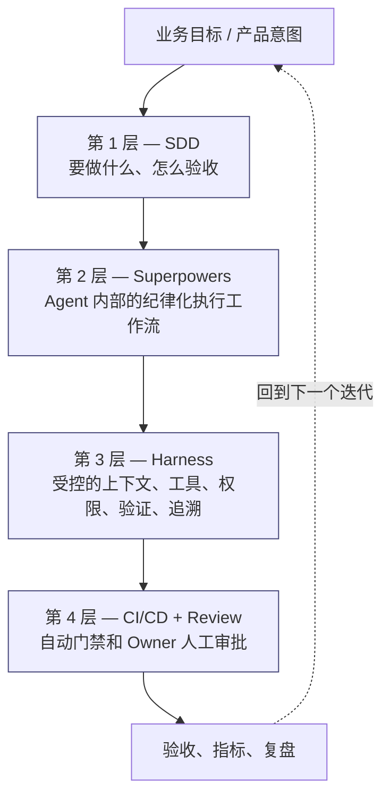
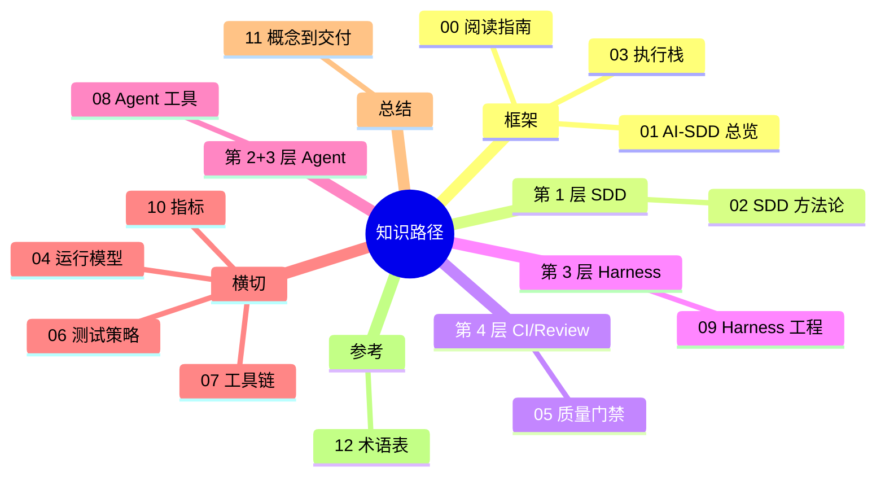

# 阅读指南

英文版：[../../knowledge/00-reading-guide.md](../../knowledge/00-reading-guide.md)

## 目的

这是知识路径的第一篇。读完到第 11 篇时，你会：

- 理解 AI-SDD 治理是什么，以及它要避免哪些问题。
- 掌握一个统一的心智模型——**四层执行栈**——后面十篇都映射到这个模型上。
- 熟悉手册默认使用的核心术语（Tier、SDD、Superpowers、MR、Owner Review、AI Champion、Harness）。
- 准备好从概念（知识路径）进入实际交付（实践路径）。

这篇不替代其他章节，它给后面的内容搭一个框架。

## 四层执行栈

整本手册都基于这一个心智模型。AI 辅助交付被组织成四个协作层，每一层有自己的失败模式和自己的控制点。

每一层回答什么：

| 层 | 回答 | 没有它会怎样 |
| --- | --- | --- |
| SDD | "要实现什么行为？怎么知道它对？" | AI 编造业务规则和边界情况。 |
| Superpowers | "开发者+Agent 怎么从就绪 Story 走到已验证 MR？" | 执行过程隐性、不可评审；测试在代码之后写。 |
| Harness | "Agent 拿到什么上下文、工具、权限？完成怎么证明？" | 上下文失控、危险命令、没证据就声称完成。 |
| CI/CD + Review | "谁批准、什么会阻断合入、什么证明可以发布？" | 缺陷、范围蔓延、无人认领的变更泄漏到生产。 |

四层的完整展开见 [执行栈](03-执行栈.md)。先把这张图记住；后面所有章节都会反复用到它。

## 13 篇文档与执行栈的对应

## 立刻会遇到的核心术语

下列术语从第 01 篇开始就会出现。这里给出一句话定义，完整词条在 [术语表](12-术语表.md)。

- **SDD**——Spec-Driven Development。工作从已评审的规格出发，而不是自由 prompt。
- **Superpowers**——为 Coding Agent 设计的可组合 skill 框架和执行方法论。本手册中，它是 Story ready 之后内部开发者的默认工作流。概念定义见 [执行栈](03-执行栈.md)，落地见 [开发者指南](../practice/04-开发者指南.md)。
- **Harness**——围绕 AI Agent 的受控执行环境：上下文边界、允许工具、权限、验证命令、执行证据。
- **Tier A / B / C**——内部工作按风险分级的工作流权重。Tier A 轻量；Tier B 是标准 Story 流程；Tier C 是高风险/核心/影响生产/安全敏感。定义见 [Superpowers 采用策略](../practice/03-superpowers采用策略.md)。
- **MR**——Merge Request，GitLab 风格的合入请求；等同于 PR。
- **Owner Review**——可问责的 Module Owner 对影响领域行为、契约、权限或生产风险的变更进行审批。
- **AI Champion**——团队中辅导 AI-SDD 使用、维护示例、收集失败案例的成员。

后面遇到不熟的术语，跳到术语表查——它很短，按缩写组织。

## 阅读顺序建议

00 → 03 按顺序读。这四篇建立共享的心智模型和术语。之后的章节大体独立，按需回查：

- **第一次完整阅读（所有人）**：00 → 01 → 02 → 03 → 04 → 05 → 06 → 07 → 08 → 09 → 10 → 11。第 11 篇的总结会让前面十篇"咔"地拼起来。
- **Delivery Owner**：00 → 01 → 03 → 04 → 05 → 10 → 11。
- **架构师 / Tech Lead**：00 → 02 → 03 → 05 → 07 → 08 → 09 → 11。
- **开发者**：00 → 02 → 03 → 06 → 08 → 09 → 11，然后跳到 [开发者指南](../practice/04-开发者指南.md)。
- **BA**：00 → 02 → 04 → 11，然后跳到 [BA 指南](../practice/09-ba指南.md)。BA 工作重心在第 1 层（SDD），所以 02 和 04 最直接相关。
- **PO**：00 → 01 → 02 → 04 → 11，然后读 [BA 指南](../practice/09-ba指南.md) 知道 BA 欠你什么、你欠 BA 什么。
- **QA**：00 → 02 → 05 → 06 → 11，然后跳到 [Testing Policy](../../../ai/testing-policy.md)。
- **安全负责人**：00 → 03 → 05 → 07 → 09 → 11，然后跳到 [Security Policy](../../../ai/security-policy.md)。
- **AI Champion**：00 → 03 → 06 → 08 → 09 → 11，然后跳到 [Superpowers 采用策略](../practice/03-superpowers采用策略.md)。
- **供应商交付负责人**：00 → 01 → 04 → 05 → 11。除非合同约定，内部 Superpowers / Harness 细节（03、08、09）对供应商不是必读。

每一篇结尾都有 **要点回顾** 和 **下一篇** 引导。如果读完一篇感觉"要点不对劲"，先回头重读，再往后走——下一篇会默认你已经掌握了这些要点。

## 知识路径到这里结束，从哪里进入实践

知识教模型；[实践](../practice/) 把模型用在真实交付上。

读完第 11 篇，自然的下一步是：

1. [团队级 AI SDLC](../practice/01-团队级ai-sdlc.md)——同样的四层模型如何接入团队的真实 SDLC。
2. [实施 Playbook](../practice/05-实施playbook.md)——Week 0、启动、复盘节奏、仓库最小配置。
3. [开发者指南](../practice/04-开发者指南.md)——Story ready 之后开发者每天怎么做。

## 要点回顾

- 整本手册建立在一个心智模型上：SDD → Superpowers → Harness → CI/Review。
- 知识路径的编号是学习顺序，不是单纯目录。
- 七个术语就能解锁大部分篇章；其余的术语表里有。
- 知识路径到第 11 篇结束，接下来进入实践路径。

## 下一篇

- [AI-SDD 总览](01-ai-sdd总览.md)——交付背景、默认政策、这套治理要避免什么。
