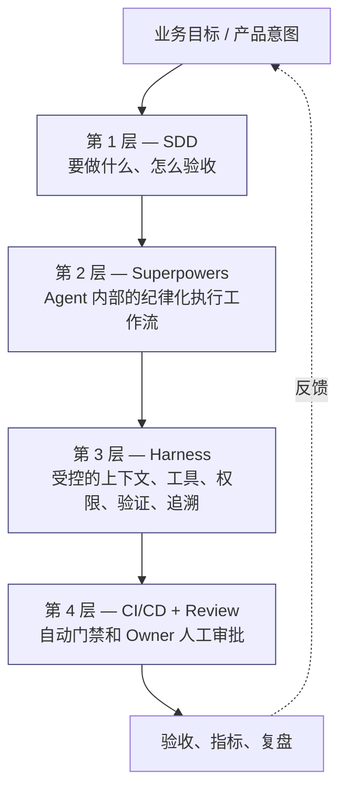
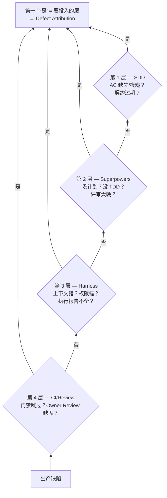

# 执行栈

英文版：[../../knowledge/03-execution-stack.md](../../knowledge/03-execution-stack.md)

## 目的

[阅读指南](00-阅读指南.md) 用一张图引出了四层执行栈。本篇是逐层展开。后面所有章节——运行模型、质量门禁、测试策略、工具链、Agent 工具、Harness 工程、指标——都会落到这四层中的一层或多层。先把这个栈装进脑子，再读后面会顺很多。

读完本篇，你应该能：

- 按顺序说出四层，以及每层回答的那一个问题。
- 看到一份政策或模板，能判断它属于哪一层。
- 理解四层缺一不可，且任何一层都不能替代另一层。

## 栈的结构

接到新工作时**自顶向下**读这个栈；出问题时**自底向上**读——生产缺陷先看 CI/Review 漏没漏，再看 Harness，再看 Superpowers，最后看 SDD，直到找到出问题的那一层。

## 第 1 层：SDD——规格层

**这一层回答的问题：** 要实现什么行为？怎么知道它对？

**为什么这一层在最前面：** 从自由 prompt 起手的 AI 辅助工作会编造业务规则。一份评审过的规格在源头就阻止这件事发生。规格也是让那些不在现场的人也能评审 AI 输出的依据。

**这一层包含什么：**

- Story card、SDD Story Spec、Technical Spec、ADR、Test Spec。
- Given/When/Then 形式的验收准则。
- API 契约（OpenAPI）、事件 schema（JSON Schema）、数据字典条目、错误码注册项。
- AI Context Boundary：Agent 允许看到哪些文档、API、代码、测试。

**没有这一层的失败模式：** AI 从模糊意图生成看起来合理的代码。评审者无法判断输出是否符合真实业务需求，因为没人把需求写下来。

**详细阅读：** [SDD 方法论](02-sdd方法论.md)。

## 第 2 层：Superpowers——执行纪律层

**这一层回答的问题：** 开发者+Agent 怎么从一个就绪 Story 走到一个已验证的 MR？

**什么是 Superpowers：** Superpowers 是为 Coding Agent 设计的可组合 skill 框架和软件开发方法论。它把执行纪律封装成命名 skill：`brainstorming`、`writing-plans`、`test-driven-development`、`subagent-driven-development`、`requesting-code-review`、`receiving-code-review`、`systematic-debugging`、`verification-before-completion`。本手册中，Superpowers 是 Story card ready 之后**内部开发者的默认工作流**。除非合同明确约定，供应商团队不要求使用 Superpowers。

官方仓库：https://github.com/obra/superpowers

**为什么有了好规格还需要这一层：** Story ready 之后的多数缺陷是执行缺陷，不是规格缺陷。开发者还没澄清就开始写代码；AI agent 编造字段和边界；实施计划停留在隐性状态；测试在它本该约束的代码之后才写；评审来得太晚；验证之前就声称完成。

**这一层包含什么：**

- Superpowers skill 库和团队选用的子集。
- Prompt Card：版本化、已评审、把一个执行步骤编码下来的 prompt。
- Tier A / B / C 决策——这个 Story 配什么权重的工作流。
- Agent 改文件之前承诺的计划。
- TDD 循环；可拆分工作的 subagent 分工；显式的代码评审请求。

**没有这一层的失败模式：** AI 没计划就生成看起来能跑的代码、过度 mock、测试不会因错误实现而失败；开发者照单全收评审意见。MR 过了门禁，下一个迭代发现缺陷。

**详细阅读：** [Superpowers 采用策略](../practice/03-superpowers采用策略.md)、[开发者指南](../practice/04-开发者指南.md)、[Agent 工具](08-agent工具.md)。

## 第 3 层：Harness——受控运行时层

**这一层回答的问题：** Agent 拿到什么上下文、工具、权限？它声称完成时，怎么变成证据？

**什么是 Harness：** Harness 是 Agent 周围的执行控制层。它比"测试 harness"更宽，比"prompt engineering"更具体。它定义：执行开始前必须存在哪些工件；Agent 可以读什么不可以读什么；可以改哪些文件、运行哪些命令、哪些需要人工确认；声称完成之前必须通过什么验证；执行报告记录什么。

**为什么有了好规格、好执行纪律还需要这一层：** 没有 harness，每个开发者的控制都会漂移。一个 agent 拿到对的上下文，另一个什么都没有；一个跑了迁移，另一个被挡住；一个 MR 带执行报告，另一个只有一段 transcript。失败归因变成"Agent 不工作"——这没法行动。

**这一层包含什么：**

- AI Engineering Constitution 和 `/ai/` 下的四份政策（context、allowed-tools、security、testing）。
- `/ai-harness/` 下的政策（`context-policy.yaml`、`permissions.yaml`、`verification-policy.yaml`）。
- Harness 脚本：`check-story-ready.sh`、`run-verification.sh`、`generate-execution-report.sh`。
- Tier B/C 工作的 MR 附带的 Agent 执行报告。
- 失败归因分类：规格歧义、上下文缺失/错误、工具/权限问题、环境问题、测试失败、Agent 错误、评审遗漏。

**没有这一层的失败模式：** 仅凭 Agent 的"自信"就声称完成；生产数据泄露到 prompt；MR 通过评审，没人注意到 Agent 改了禁止路径。出问题时，团队分不清是规格、上下文、工具、还是 Agent 的错——所以一样都改进不了。

**详细阅读：** [Harness 工程](09-harness工程.md)、[Agent 工具](08-agent工具.md)。

## 第 4 层：CI/CD + Review——门禁层

**这一层回答的问题：** 谁批准？什么会阻断合入？什么证明这个变更可以发布？

**为什么这一层在最后且不可或缺：** 前三层是关于"生产可信输出"。这一层是关于"不可信的输出不能合入"——无论它来自内部团队、供应商团队、还是纯人工。当供应商不跑内部 Superpowers/Harness 流程时，CI/Review 也是供应商工作被验收的那一层。

**这一层包含什么：**

- CI pipeline 阶段：metadata 校验、构建、单元测试、静态分析、契约测试、集成测试、安全扫描、打包。
- Quality Gate Checklist 和 Stop-the-Line 条件。
- SonarQube、SAST、SCA、Secret Scan、migration check。
- Owner Review 和 CODEOWNERS。
- MR 模板（`/.gitlab/merge_request_templates/ai-sdd.md`）和 AI usage declaration。
- 带显式风险、Owner、过期日期的例外处理。

**没有这一层的失败模式：** 通过了所有内部控制的代码，照样可能带着 secret 合入，或者核心模块没有 Owner 批准，或者新依赖有 critical CVE。前三层是必要的；这一层是兜底的安全网，把前三层漏过的全部拦下。

**详细阅读：** [质量门禁](05-质量门禁.md)、[CI Gate Policy](../../../quality-gates/ci-gate-policy.md)。

## 横在栈之外的元素

并非所有东西都是层。有些是横切元素——它们作用于每一层或整个系统。

| 横切元素 | 作用 | 相关章节 |
| --- | --- | --- |
| 运行模型 | 决定每一层归谁所有，争议怎么仲裁，角色怎么分工。 | [运行模型](04-运行模型.md) |
| 测试策略 | 定义每一层产生什么测试，以及 AI 特定的测试风险怎么对冲。 | [测试策略](06-测试策略.md) |
| 工具链 | 承载这四层的企业工具（Jira、GitLab、SonarQube、Backstage、AI 平台）。 | [工具链](07-工具链.md) |
| 指标 | 反馈回路，告诉你这个栈是否真的在改进交付。 | [指标](10-指标.md) |

## 怎么识别"找错层"

很多出于善意的改进，其实改在了错误的层上。一个快速检验：如果一个提议说不出它改的是哪一层，就追问一下。

- "多加几个评审者"——第 4 层。修不了糟糕的规格（第 1 层）和虚弱的验证（第 3 层）。
- "把 prompt 写好点"——通常第 2 层，有时第 3 层。修不了缺失的验收准则（第 1 层）或缺席的 Owner 批准（第 4 层）。
- "给 Agent 更多上下文"——第 3 层。修不了模糊的规格（第 1 层）。
- "要求回归测试"——第 1 层（Test Spec）+ 第 4 层（门禁强制）。
- "把不稳定测试隔离"——第 4 层是为了保住 main 的信号，但真正的修复在第 2 层（TDD 纪律）和第 3 层（测试 harness 控制）。

改在错误层上的动作，看起来像进步，实则没动到真正的失败模式。

## 自底向上诊断

缺陷泄漏到生产时，**自底向上**走这个栈，找漏过它的那一层：

1. CI/Review：门禁是被跳过还是例外批准了？Owner Review 缺席吗？
2. Harness：上下文错了或缺了吗？Agent 是不是用了错误的权限？执行报告完整吗？
3. Superpowers：写了计划吗？做 TDD 了吗？合入前请求了代码评审吗？
4. SDD：验收准则缺失或模糊吗？API 契约或错误码注册过期了吗？

往上第一个"是"就是下一个迭代要投入改进的层。缺陷归因模板在 [`templates/defect-attribution.md`](../../../templates/defect-attribution.md) 记录这种分析。

## 要点回顾

- 四层——SDD、Superpowers、Harness、CI/Review——各管一个问题、各对应一种失败模式。
- 运行模型、测试、工具链、指标是横切的，不是额外的层。
- 多数"改了没用"的改动，都是改在了错误的层。
- 生产缺陷靠自底向上走栈来诊断，直到某一层承认"是我漏的"。

## 下一篇

- [运行模型](04-运行模型.md)——每一层归谁所有？决策怎么做？争议怎么仲裁？
