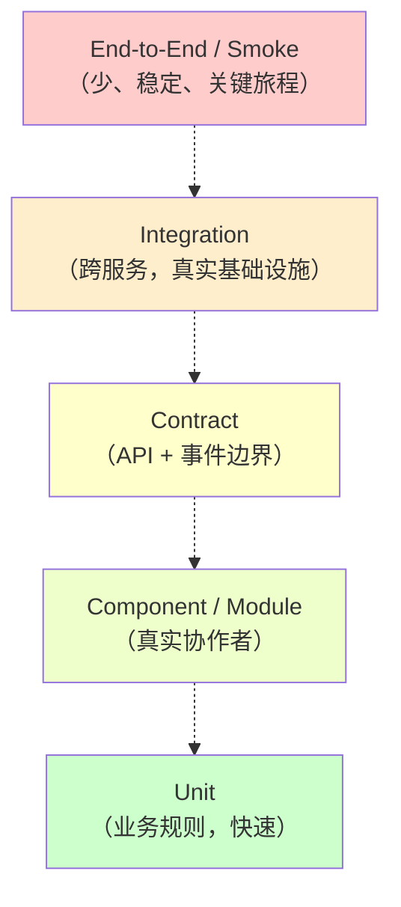
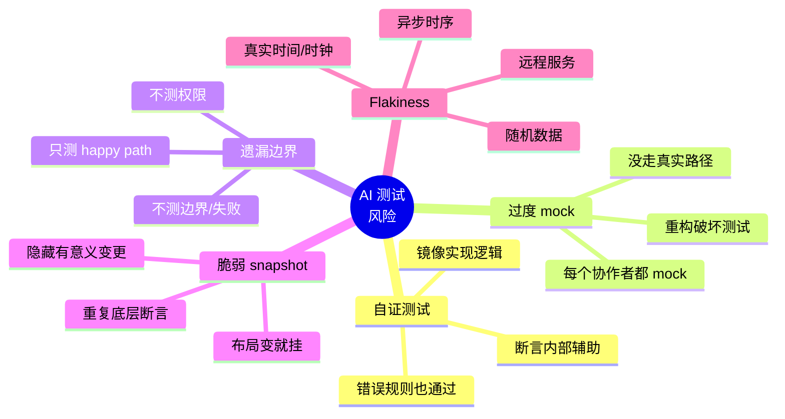

# AI-SDD 测试策略

英文版：[../../knowledge/06-testing-strategy.md](../../knowledge/06-testing-strategy.md)

## 目的

本文总结 Martin Fowler 测试材料中的关键思想，并将其适配到 AI 辅助开发、SDD、Superpowers 和轻量 Harness 工程。

核心观点：

> AI 生成代码的速度可能快于团队安全理解代码的速度。测试必须成为团队对系统的可执行理解，而不仅是编码后的安全网。

测试不是 [执行栈](03-执行栈.md) 中独立的一层——它是横切关注点，服务每一层。规格（第 1 层）声明必须存在哪些测试；Superpowers（第 2 层）安排什么时候写；Harness（第 3 层）控制怎么跑、什么算作完成证据；CI/Review（第 4 层）在必需测试缺失或浅层时阻断合入。

## 如何阅读本篇

本篇比其他章节长，因为测试承载了最多 AI 特定的风险。为了保持可用，分成两部分：

- **学习（"Martin Fowler 测试材料的关键思想"到"必需测试层"各节）**——概念基础。首次阅读时按顺序读。
- **参考（标记为"参考："的节）**——矩阵、清单、门禁政策和推广阶段。首次阅读时扫一眼，真实交付时按需查阅。

如果只读一节，读 **AI 特定的测试风险** 加上 **按 Story 类型的测试要求** 表格——它们覆盖最高杠杆的决策。

## Martin Fowler 测试材料的关键思想

Martin Fowler 的测试指南收录了 self-testing code、TDD、test pyramid、microservice testing、test doubles、non-deterministic tests、coverage、exploratory testing 和 production testing 等文章。

其中几个想法对 AI 辅助开发尤其相关。

## 1. Self-Testing Code 是基础

Self-testing code 表示代码库能通过自动化测试检查自身行为。

对 AI 辅助团队，这很重要，因为 AI 生成代码可能看起来合理但实际错误。Self-testing code 提供快速反馈：

- 新行为是否可用。
- 既有行为是否破坏。
- 团队是否能安全改设计。
- Reviewer 是否能相信证据而不是文字摘要。

测试不只是 QA 活动，也是工程设计、评审和交付的一部分。

## 2. Test Pyramid 是启发，不是法律

Test pyramid 表示团队通常需要大量聚焦、快速的测试，以及少量宽泛、慢、脆弱的测试。

本项目的实际解释：

- 多数业务规则检查放在 unit 或 component tests。
- 服务协作放在 contract 和 integration tests。
- 关键用户旅程用少量 end-to-end tests。
- 避免在每一层重复相同断言。

金字塔是成本和反馈模型，不是固定形状。如果一个更宽的测试既快又稳定且维护成本低，它就有价值。如果一个 unit test 紧耦合实现细节，每次重构都挂，它就没价值。

## 3. Acceptance Tests 证明功能，但不能替代底层测试

Acceptance tests 从用户或业务视角确认功能是否工作。

它们应与 SDD 验收标准 绑定，但不应是唯一自动化测试。如果 acceptance test 暴露缺陷，应在修复前增加更聚焦的 regression test，让缺陷在正确层级被固定。

## 4. Contract Tests 对服务边界很重要

服务化和微服务系统中，许多失败发生在边界：

- API shape mismatch。
- Response field meaning mismatch。
- Event schema drift。
- Consumer expectation 未被 provider tests 捕获。
- Backward compatibility break。

Contract tests 通过让 provider 和 consumer expectations 可执行来降低风险。

大型企业系统的典型适用：

- 核心业务服务。
- 工作流和审批服务。
- 库存或资源服务。
- 计费、费用或结算服务。
- 通知服务。
- 外部企业集成。

## 5. Test Doubles 有用，但过度使用危险

Mocks、stubs、fakes 等 test doubles 能隔离行为并加快测试。

但过度使用会让测试只证明 mock 被调用，而不是系统真正工作。AI 生成测试尤其容易掉进这个失败模式，因为它们常常 mock 过多。

当 test doubles 能减少外部噪声时使用；当它们隐藏重要行为时避免使用。

## 6. Non-Deterministic Tests 必须当缺陷处理

Flaky test 不是无害的。它训练团队忽略红色构建。

常见原因：

- 共享状态。
- 时间依赖逻辑。
- 异步行为。
- 外部服务。
- 资源泄漏。
- 竞态条件。

政策：

- 隔离 flaky tests，避免掩盖真实回归。
- 立即创建修复 ticket。
- 不让隔离测试永久存在。
- 在每周质量评审中记录原因。

## 7. Coverage 是信号，不是目标

Coverage 帮助识别未测试区域，但高覆盖率不证明好测试。

对 AI 辅助开发，这一点至关重要。AI 可以生成高覆盖、但断言浅层、镜像实现细节、或错过真实业务规则的测试。

用 coverage 提问：

- 哪些重要分支未测试？
- 哪些业务规则缺少 regression tests？
- 哪些错误路径和权限场景未覆盖？

不要把 coverage 当作唯一质量指标。

## 8. 测试代码是生产工程工作

测试代码必须干净、可读、可维护。

好的测试：

- 名称清晰。
- 遵循 Arrange / Act / Assert 或 Given / When / Then。
- 断言行为，不断言实现噪声。
- 使用真实数据。
- 避免不必要的 mocking。
- 是确定性的。
- 失败时给出有用信息。

坏的测试：

- 只检查 mock 是否被调用。
- 复制实现逻辑。
- 依赖执行顺序。
- 依赖真实时间、远程服务、不受控的随机数据。
- 在一个测试里断言过多。

## AI 辅助 SDD 的测试策略

AI 改变了开发的经济学：生成代码和测试变便宜，验证正确性成为瓶颈。

因此测试策略强调：

- 测试是可执行的验收标准。
- 测试是 AI 输出的护栏。
- 测试是评审证据。
- 测试是失败归因数据。
- 测试是快速迭代的回归保护。

## 必需测试层

金字塔是成本-反馈启发式，不是固定形状——快速可靠的宽测试也有价值，紧耦合实现的脆弱单元测试没价值。下面每一层都有自己的目的、AI-SDD 规则、评审关注点。

### Unit Tests

目的：

- 验证业务规则和小单元行为。
- 在 TDD 中提供快速反馈。

AI-SDD 规则：

- 对每个行为变更，新增或更新聚焦的 unit tests，除非该行为只能在更高层验证。

评审关注：

- 测试是否断言业务行为？
- 规则错了它会失败吗？
- 它是独立且确定性的吗？

### Component / Module Tests

目的：

- 在合适时用真实协作者验证一个模块。
- 在不付出整个系统成本的前提下捕获接线和交互问题。

AI-SDD 规则：

- 当 unit test 会过度 mock 重要逻辑时使用。

评审关注：

- 测试是否覆盖了有意义的模块行为？
- 它是否避免了不必要的基础设施？

### Contract Tests

目的：

- 跨服务边界验证 API、事件和集成期望。

AI-SDD 规则：

- 当 service API、event schema 或 consumer expectation 变更时必需。

评审关注：

- 请求和响应期望都被捕获了吗？
- 向后兼容风险被测试了吗？
- 错误响应被覆盖了吗？

### Integration Tests

目的：

- 验证与数据库、消息中间件、文件系统或外部服务适配器的真实集成。

AI-SDD 规则：

- 当持久化、事务行为、外部适配器或跨服务流程变更时必需。

评审关注：

- 集成的依赖是真实的或足够真实的吗？
- 测试是确定性的吗？
- 测试数据是隔离的吗？

### End-to-End 与 Smoke Tests

目的：

- 验证最重要的用户旅程和部署健康。

AI-SDD 规则：

- E2E 测试保持少、稳定、聚焦关键路径。
- 不要把 E2E 测试当作业务规则的唯一证据。

评审关注：

- 这个旅程真的关键吗？
- 测试是稳定且可维护的吗？
- 失败能被快速诊断吗？

### Exploratory Testing

目的：

- 发现脚本化测试错过的未知风险。

AI-SDD 规则：

- 对新工作流、模糊 UI、业务密集流程或风险集成使用 exploratory testing。
- 把发现的缺陷反馈到自动化回归测试。

评审关注：

- 发现是否转化为可行动的缺陷或回归测试？

## AI 特定的测试风险

### 风险 1：AI 只生成证明自己实现的测试

症状：

- 测试断言内部辅助调用。
- 测试镜像实现逻辑。
- 即使业务规则错了，测试也通过。

对策：

- 在可行时，从验收标准先写测试再写实现。
- 信任测试前先评审。
- 问：这个测试在一个合理的错误实现下会失败吗？

### 风险 2：AI 过度 mock

症状：

- 每个协作者都被 mock。
- 没有真实业务路径被走通。
- 重构破坏测试但行为没变。

对策：

- 优先用真实领域对象。
- 用 fakes 处理昂贵边界。
- 当 mock 隐藏重要行为时加 component 或 integration tests。

### 风险 3：AI 错过负向和边界场景

症状：

- 只测试 happy path。
- 不测权限失败。
- 缺少 empty、duplicate、expired、invalid、concurrent、partial-failure 场景。

对策：

- 在 Test Spec 中要求边界和失败场景。
- 用评审清单挑战缺失路径。
- 对每个逃逸缺陷加回归测试。

### 风险 4：AI 创建脆弱的 snapshot 或 UI 测试

症状：

- 测试在无害的布局变更下失败。
- 大 snapshot 隐藏有意义的变化。
- UI 测试重复底层断言。

对策：

- 断言用户可见的行为，不断言附带结构。
- UI 测试聚焦关键旅程。
- 把业务逻辑测试推到更低层。

### 风险 5：AI 产生 flaky tests

症状：

- 测试依赖真实时间、随机数据、外部服务或异步时序。

对策：

- 控制时间。
- 设种子。
- 隔离测试数据。
- 用 test doubles 或 contract tests 替代远程服务。
- 快速隔离并修复 flaky tests。

## 按 Story 类型的测试要求

| Story 类型 | 必需测试 | 备注 |
| --- | --- | --- |
| 业务规则变更 | Unit tests；bug 修复加 regression tests | 从验收标准出发 |
| API 变更 | Unit tests、OpenAPI 更新、contract tests | 包括错误响应和兼容性 |
| 事件变更 | Event schema 更新、producer/consumer tests | 包括版本化和可选字段 |
| 数据库变更 | Migration 评审/测试，必要时 integration test | 包括回滚或恢复说明 |
| 权限变更 | Permission tests、audit log 验证 | 包括允许和拒绝场景 |
| 跨服务流程 | Contract tests、integration tests、聚焦 E2E | 避免只靠 UI E2E |
| UI 工作流 | Component/UI tests、有限 E2E、exploratory testing | 断言行为和可访问性 |
| 生产缺陷 | 在最窄有用层级加 regression test | 在修复前或与修复一同 |

---

## 参考：操作规则

下面都是参考材料——清单、门禁接线、推广阶段。意图是在真实交付时查阅，不是首读时背下来。

## 参考：开发者测试设计清单

实现前：

- [ ] 验收标准可测试。
- [ ] 测试层级是有意识地选择的。
- [ ] 边界和失败场景已识别。
- [ ] 必需的契约或 schema 测试已识别。
- [ ] 现有回归测试位置已知。

实现中：

- [ ] 先写或并行写测试。
- [ ] 做 TDD 时确认新测试因预期原因失败。
- [ ] 避免只镜像实现细节的测试。
- [ ] 避免不必要 mock。
- [ ] 保持测试数据隔离和确定性。

合入前：

- [ ] Unit tests 通过。
- [ ] API 或事件变更时 contract tests 通过。
- [ ] 集成变更时 integration tests 通过。
- [ ] 关键流程的 E2E 或 smoke tests 通过。
- [ ] Flaky tests 没有被忽略。
- [ ] 重要行为的覆盖空白被解释。
- [ ] 测试证据在 MR 中链接。

## 参考：AI 生成测试的评审清单

评审者应挑战 AI 生成测试：

- 如果实现用了错误的业务规则，这个测试会失败吗？
- 它断言可观察行为吗？
- 它覆盖负向场景吗？
- 它覆盖边界场景吗？
- 相关时它测试权限和审计行为吗？
- 它避免过度 mock 吗？
- 它避免复制实现逻辑吗？
- 它是确定性的吗？
- 对未来维护者它足够可读吗？

## 参考：测试如何嵌入 Superpowers

在内部 Superpowers 工作流中：

- `brainstorming` 检查验收标准是否可测试。
- `writing-plans` 识别测试文件、测试层级和验证命令。
- `test-driven-development` 为行为变更建立 red-green-refactor 循环。
- `subagent-driven-development` 应要求合规评审先于代码质量评审。
- `requesting-code-review` 应包含测试质量评审，不只是生产代码评审。
- `verification-before-completion` 在声称完成前要求新鲜测试证据。

## 参考：测试如何嵌入 Harness 工程

Harness 工程把测试纳入受控 AI 运行时：

- 上下文政策告诉 Agent 使用哪些规格、测试、契约、代码入口。
- 验证政策告诉 Agent 必须运行哪些检查。
- 执行报告记录跑了哪些测试、什么失败、什么修了、还有什么风险。
- 失败归因区分坏规格、坏上下文、环境失败、Agent 错误、测试虚弱。

## 参考：质量门禁政策

合入门禁在以下情况阻断：

- 构建失败。
- 必需测试失败。
- 必需 contract tests 缺失。
- 严重安全扫描失败。
- Flaky tests 被忽略而不是隔离并跟踪。
- AI 生成测试浅层且不存在有意义的行为证据。
- 生产缺陷修复缺少回归测试，且没有显式例外批准。

## 参考：实际推广

Phase 1：

- 加入更新的 Test Spec 模板。
- 在 MR 中要求测试证据。
- 缺陷修复要求回归测试。
- API 或事件变更要求 contract tests。

Phase 2：

- 加入 flaky test 隔离政策。
- 按缺失测试层级跟踪逃逸缺陷。
- 在每周质量评审中评审 AI 生成测试。

Phase 3：

- 加入自动化测试影响选择。
- 把执行报告存为 MR 工件。
- 用失败归因改进规格、prompts、harness 政策和测试套件。

## 参考资料

- Martin Fowler Testing Guide：https://martinfowler.com/testing/
- Martin Fowler, Test Pyramid：https://martinfowler.com/bliki/TestPyramid.html
- Ham Vocke, The Practical Test Pyramid：https://martinfowler.com/articles/practical-test-pyramid.html
- Martin Fowler, Eradicating Non-Determinism in Tests：https://martinfowler.com/articles/nonDeterminism.html
- Martin Fowler, Test Coverage：https://martinfowler.com/bliki/TestCoverage.html
- Martin Fowler, Testing Strategies in a Microservice Architecture：https://martinfowler.com/articles/microservice-testing/

## 要点回顾

- 测试是横切的：它服务执行栈的每一层，而不是自己单独成层。
- 八个 Fowler 思想是概念基础；五个 AI 特定风险是因为 AI 进了回路才改变的部分。
- 有意识地选测试层级——过度 mock 和浅层测试是 AI 的主要失败模式。
- Coverage 是信号不是目标。要问："在一个合理的错误实现下，这个测试会失败吗？"

## 下一篇

- [工具链](07-工具链.md)——承载四层栈、跑这篇刚刚定义的测试的企业工具。
