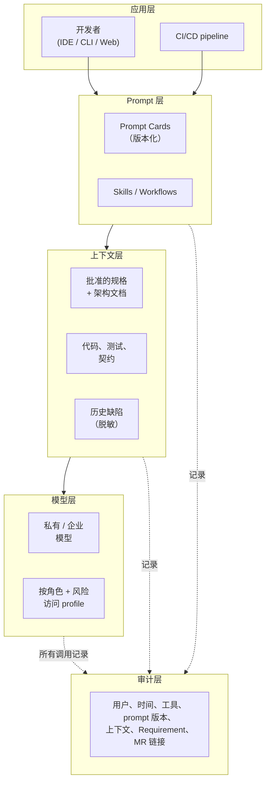

# 工具链

英文版：[../../knowledge/07-toolchain.md](../../knowledge/07-toolchain.md)

## 工具链原则

- 默认企业私有。
- 可审计性优先于便利性。
- 标准接口优先于工具偏好。
- 自动化让治理成为默认行为。
- 工具选择必须支持内部 Superpowers 工作流和基于交付物的供应商验收。

## 推荐栈

需求和迭代：

- Jira、ONES 或 ZenTao。
- 需要 Epic、Feature、Story、Task、工作流、自定义字段、dashboard 和导出 API。

知识库和规格：

- Confluence、Notion Enterprise、Feishu Wiki 或 Git 中的 Markdown。
- 需要版本历史、访问控制、模板支持，以及到需求和 MR 的反向链接。

代码和 CI/CD：

- 默认推荐 GitLab Self-Managed。
- 使用分支保护、MR approvals、CI templates、protected variables 和 audit logs。
- 可评估 GitLab Duo Self-Hosted 作为企业私有 AI 选项。

内部 AI-SDD 工作流：

- Superpowers 是内部团队默认 工作流 kernel。
- 用于标准化 brainstorming、planning、TDD、评审 和 verification。
- 除非供应商合同明确约定，不要求供应商团队使用 Superpowers。

代码质量：

- SonarQube Server。
- 对新代码使用 新代码即清洁 和 质量门禁 policy。

API 契约：

- 同步服务 API 使用 OpenAPI 3.1。
- 事件和异步消息使用 JSON Schema。

Developer Portal：

- Backstage 或同等内部开发者门户。
- 用于 服务目录、负责人hip、documentation、API、runtime links 和 dependency map。

安全和供应链：

- SAST、SCA、Secret Scan、container image scan、SBOM 和 dependency risk 评审。
- 以 OWASP SAMM 作为成熟度参考。
- 以 OpenSSF Scorecard 概念评估开源依赖。

## AI 平台架构

模型层：

- 使用私有或企业托管模型，支持代码生成、测试生成、文档总结和缺陷分析。
- 按角色和风险区分模型访问 profile。

上下文层：

- 检索源只包含批准的需求、架构文档、API 契约、代码标准、历史缺陷和测试资产。
- 生产数据和客户信息在索引前必须脱敏。

Prompt 层：

- 内部团队版本化管理标准 Prompt Card。
- Prompt Card 定义输入类型、输出结构、禁止内容和评审清单。
- 供应商团队不要求使用内部 Prompt Card；其交付物按验收工件和质量证据评估。

审计层：

- 记录用户、时间、工具、Prompt Card 版本、引用上下文、相关需求 ID 和相关 MR。
- 审计记录必须可查询，用于内部缺陷分析和流程改进。

## 要点回顾

- 工具链是横切的——它承载 [执行栈](03-执行栈.md) 的每一层，自己不是单独的一层。
- "默认企业私有"和"审计先于便利"是把这个栈与默认开发者栈区分开的设计约束。
- AI 平台分四个子层（model、context、prompt、audit），失败可以在正确的层定位，而不是"AI 不工作"。
- 工具选择必须支持工具中立的 SDD 模板和工具中立的 MR 证据——团队可以选不同工具，只要工件和门禁一致。

## 下一篇

- [Agent 工具](08-agent工具.md)——在这套工具链内部，Claude Code、Codex、Cursor 各擅长什么；哪些能力（skills、MCP、plugins、hooks、subagents）需要治理。
