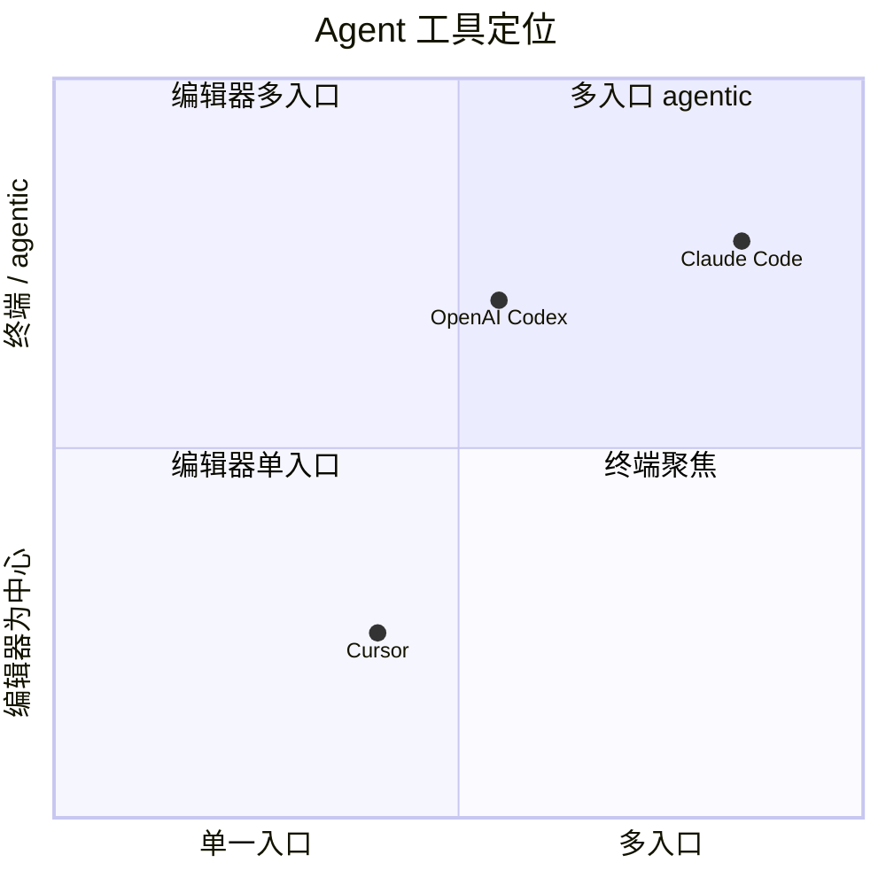
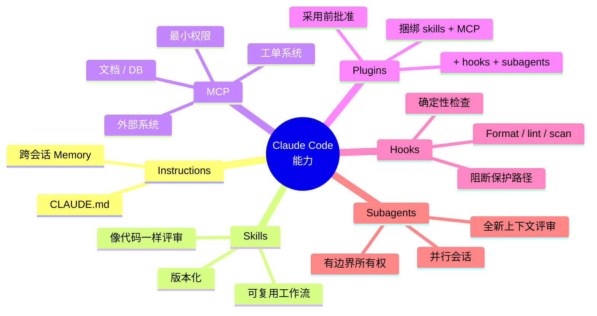

# Agent 工具

英文版：[../../knowledge/08-agent-tools.md](../../knowledge/08-agent-tools.md)

## 目的

AI-SDD 治理需要一套对 agent 工具的实际理解。流程不应该绑定单一厂商，但团队需要知道工具适合放在哪里、擅长什么，以及哪些能力必须纳入政策管理。

本文覆盖三个代表性工具：

- Claude Code。
- OpenAI Codex。
- Cursor。

其中 Claude Code 会展开更多，因为它的 CLI、App、IDE integration、skills、MCP、plugins、memory、hooks 和 subagent 模型，可以作为 agentic software delivery 的参考架构。

## 工具定位

| Tool | 适合场景 | 常见入口 | 治理重点 |
| --- | --- | --- | --- |
| Claude Code | 跨 terminal、app、IDE、web、CI 和集成的 agentic coding 工作流 | CLI、desktop app、web、VS Code、JetBrains、Slack、CI/CD | Context、permissions、memory、skills、MCP、plugins、hooks、verification |
| OpenAI Codex | 本地 terminal coding agent 和 OpenAI coding 工作流 | CLI、IDE、可用时的 web 或 cloud coding 工作流 | Sandbox、approvals、AGENTS.md/project instructions、code 评审、tests |
| Cursor | 日常开发中的 AI-native editor 体验 | Cursor IDE、agent mode、inline edits、project rules | Editor rules、codebase context、multi-file edits、评审 discipline |

推荐政策：

- 把工具视为执行环境，而不是治理模型。
- SDD specs、MR evidence、quality gates 和 Owner Review 保持 tool-neutral。
- 只要产出相同工件和证据，允许团队使用不同工具。
- 跨工具统一 上下文边界、verification 和 评审 expectations。

## Claude Code

Claude Code 是 agentic coding tool，可以读取代码库、编辑文件、运行命令，并与开发工具集成。它支持 terminal、IDE、desktop app 和 browser 等入口。

### CLI

CLI 是本地 agentic engineering 的主要入口。

适合：

- 探索代码库。
- 规划 feature 或 fix。
- 跨模块编辑文件。
- 运行 tests、linters、build commands 和 scripts。
- Stage changes、commit、创建 branch 和准备 PR。
- 将日志或命令输出 pipe 给 agent。
- 在自动化中运行 non-interactive prompts。

治理建议：

- CLI 工作必须放在有边界的任务中。
- 提供 Story、SDD Spec、验收标准 和 verification command。
- Tier B/C 优先使用 explore -> plan -> implement -> verify。
- MR 中必须提供证据，不能只依赖 CLI transcript。
- 对高风险命令使用 allowlists、permission modes 或 sandboxing。

### App、Web 与远程工作

Claude Code 也可以通过 desktop 和 browser 体验运行。这些入口适合 visual diff 评审、多 session 并行、cloud session、long-running task 或跨设备工作。

适合：

- 可视化 评审 diff。
- 并行运行多个 session。
- 从 web 或 mobile 启动长任务。
- 离开本地 terminal 后继续检查 session。
- 在支持时安排 repeated work。

治理建议：

- Remote 或 app session 与本地 agent session 使用相同证据要求。
- 记录 repository、branch、Story 和使用的 context。
- 不给 remote session 超出任务需要的仓库权限。
- 生成变更仍必须通过本地或 CI verification 才能合入。

### IDE Plugins

Claude Code 可集成 VS Code、Cursor 兼容 extension surface 和 JetBrains IDE。IDE 集成适合 inline diffs、selected-code context、editor-native 评审 和留在编辑器中的快速反馈。

适合：

- 聚焦文件编辑。
- 基于 selection 的 refactor。
- 接受前 评审 proposed diffs。
- 导航代码时询问 codebase questions。

治理建议：

- IDE 便利性不能绕过 SDD、tests 或 评审。
- 开发者仍对接受的 edits 负责。
- 大型 multi-file changes 仍需要 plan 和 verification evidence。

## Claude Code 能力

### Instructions And Memory

Claude Code 使用 `CLAUDE.md` 这类 project instructions，也可以跨 session 积累 memory。

`CLAUDE.md` 适合：

- Build commands。
- Test commands。
- Coding conventions。
- Repository etiquette。
- Architecture constraints。
- 广泛适用的 评审 rules。

Memory 适合：

- 工作中发现的 build 或 debugging learnings。
- 从纠正中学到的稳定偏好。
- 应该保留的重复项目模式。

治理建议：

- `CLAUDE.md` 保持短小、可评审。
- 共享项目 instructions 放入 Git。
- 个人或本地 instructions 不放入共享仓库。
- 不把 secrets 或敏感数据放入 memory 或 instruction files。
- 如果 agent 重复错误行为，要 评审 memory。

### Skills

Skills 用于封装可复用 工作流 或领域知识。它们适合那些不应该放进通用 instructions、但又值得标准化的流程。

适合做 skill 的内容：

- SDD Story readiness 评审。
- API contract 评审。
- Security 评审。
- Test strategy 评审。
- Release note generation。
- 供应商交付物评审。

治理建议：

- 用 skills 管理可重复 工作流。
- Skill 要窄而明确。
- 共享 skills 要版本化。
- 像 评审 code 一样 评审 skill 内容，因为它会影响 agent 行为。

### MCP

MCP，即 Model Context Protocol，用于把 AI 工具连接到外部系统和数据源，例如 issue tracker、文档、数据库、监控系统、设计工具和内部服务。

适合：

- 从 ticket system 读取批准需求。
- 获取批准设计文档。
- 查询非生产数据库。
- 检查 observability data。
- 更新 issue 状态或创建 follow-up tasks。

治理建议：

- 将 MCP servers 视为特权工具访问。
- 批准每个 MCP server 可以访问哪些系统。
- 使用 least privilege。
- 除非明确批准且脱敏，不使用生产客户数据。
- 当 MCP 使用影响交付决策或工件时，记录其使用。

### Plugins

Plugins 将 skills、hooks、subagents 和 MCP servers 等能力打包成可安装包。

适合：

- 标准化团队 工作流。
- 分发批准的 评审 skills。
- 打包内部工具集成。
- 共享 hooks 和 subagents。

治理建议：

- 团队级使用前先批准 plugin。
- 企业交付优先使用内部或可信 plugins。
- Review plugin permissions 和 tool access。
- 跟踪 plugin version changes。

### Hooks

Hooks 在 agent 工作流 的指定点运行确定性命令。

适合：

- 文件编辑后运行 formatting。
- 阻止写入 protected folders。
- commit 前运行 lint。
- verification 后生成 execution reports。

治理建议：

- 对必须每次发生的规则使用 hooks。
- Hooks 要快且可预测。
- 昂贵验证放在 CI，除非明确要求本地 hook。
- Hook failure 是工程信号，不只是 agent failure。

### Subagents And Parallel Sessions

Subagents 或 parallel sessions 可隔离 investigation、评审 或可拆分实现任务。

适合：

- 独立 codebase exploration。
- 与实现分离的 security 评审。
- code quality 评审 前的 spec compliance 评审。
- 在互不冲突模块上并行工作。

治理建议：

- 只有任务可分离时使用 subagents。
- 给每个 subagent 有边界的 context 和 负责人hip。
- 并行工作不能绕过 integration 评审。
- 验证 integrated result，而不是只验证单个 agent 输出。

## Claude Code 的 AI-SDD 最佳实践

Tier B/C 默认使用：

1. 给 agent 明确验证方式。
2. 先 explore，再 plan，再 code。
3. 提供具体 context，并指向准确文件或 specs。
4. 持久 instructions 保持简洁。
5. 有意识地配置 permissions 和 tool access。
6. 在批准范围内使用 CLI 工具 对接外部系统。
7. MCP 只连接批准来源。
8. 用 hooks 做确定性检查。
9. 用 skills 管理可复用团队 工作流。
10. 主动管理 context。
11. 及早纠偏。
12. 对 investigation 或可拆分工作使用 subagents。

官方最佳实践：

- [Best practices for Claude Code](https://code.claude.com/docs/en/best-practices)

学习视频：

- [Bilibili 上的 Claude Code 学习视频](https://www.bilibili.com/video/BV1NvRyBzEhq)

## OpenAI Codex

OpenAI Codex 是 coding agent，可以从 terminal 本地运行；根据团队可用产品入口，也可以通过 editor 或 cloud 工作流 使用。

适合：

- 本地代码库探索。
- Feature implementation。
- Bug fixing。
- Test generation。
- Commit 前 code 评审。
- 运行本地 verification commands。

治理建议：

- 在支持时使用 `AGENTS.md` 等 project instructions。
- Sandbox 和 approval settings 要与仓库风险匹配。
- 使用与其他工具相同的 SDD、MR evidence 和 quality gates。
- 任务要窄，并明确 verification commands。
- 不把模型信心当作验证。

参考：

- [OpenAI Codex CLI getting started](https://help.openai.com/en/articles/11096431-openai-codex-ligetting-started)
- [OpenAI Codex GitHub repository](https://github.com/openai/codex)

## Cursor

Cursor 是 AI-native code editor。它适合开发者在编辑器中使用 codebase context、inline edits、agent mode 和 project rules。

适合：

- IDE 内日常 feature work。
- Multi-file edits 和 refactors。
- Inline code generation。
- Codebase questions。
- 应用项目级 coding rules。

治理建议：

- 用 Cursor rules 编码团队约定，但不要把 rules 当作唯一控制。
- SDD specs 和 验收标准 仍应作为编辑器外的权威工件。
- 接受变更必须有 MR evidence 和 CI verification。
- Agent mode 用于有边界的工作，不用于未经 评审 的开放式架构变更。

参考：

- [Cursor concepts](https://docs.cursor.com/get-started/concepts)
- [Cursor Agent overview](https://docs.cursor.com/chat/overview)

## 推荐工具治理

### Must-Have

- Tool-neutral SDD templates。
- Tool-neutral MR evidence requirements。
- 清晰 AI 上下文边界。
- Approved tool list。
- Permission and data-use policy。
- 每个仓库的 verification commands。
- 核心模块 human 评审。

### Should-Have

- 每种支持工具的 project instruction files。
- Claude Code、Codex、Cursor 工作流s 的共享示例。
- Approved MCP server list。
- Approved plugin list。
- 用于确定性本地检查的 hooks。
- Tier B/C 的 execution reports。

### Nice-To-Have

- Tool usage dashboard。
- Central plugin registry。
- Shared skill library。
- 集中访问控制的 MCP gateway。
- Agent run trace store。

## 实用选型指南

- 当任务受益于跨 terminal、app、web、IDE、工具 和 automation 的 agentic 工作流 时，使用 Claude Code。
- 当团队需要 OpenAI 工具体系下的 terminal-native coding agent 和本地验证时，使用 Codex。
- 当开发者主要工作在 editor 中，并需要 inline AI assistance 和 agentic IDE 行为时，使用 Cursor。
- 无论使用哪个工具，都使用相同 SDD、quality、评审 和 evidence rules。

## 要点回顾

- Agent 工具是执行栈第 2-3 层的运行环境，不是治理模型——SDD、MR 证据、门禁、Owner Review 保持工具中立。
- Claude Code、Codex、Cursor 各有自己的最佳入口；按"开发者工作中心在哪"选，不按厂商偏好选。
- 跨会话改变 Agent 行为的能力（memory、skills、MCP、plugins、hooks、subagents）需要治理，因为它们隐性扩展了 harness。
- "已批准工具/MCP/plugin"清单是最便宜的、可以防止能力悄悄漂移的控制。

## 下一篇

- [Harness 工程](09-harness工程.md)——围绕选定的 Agent 工具，怎么按成熟度模型采用受控的上下文、工具、权限、验证和追溯。
