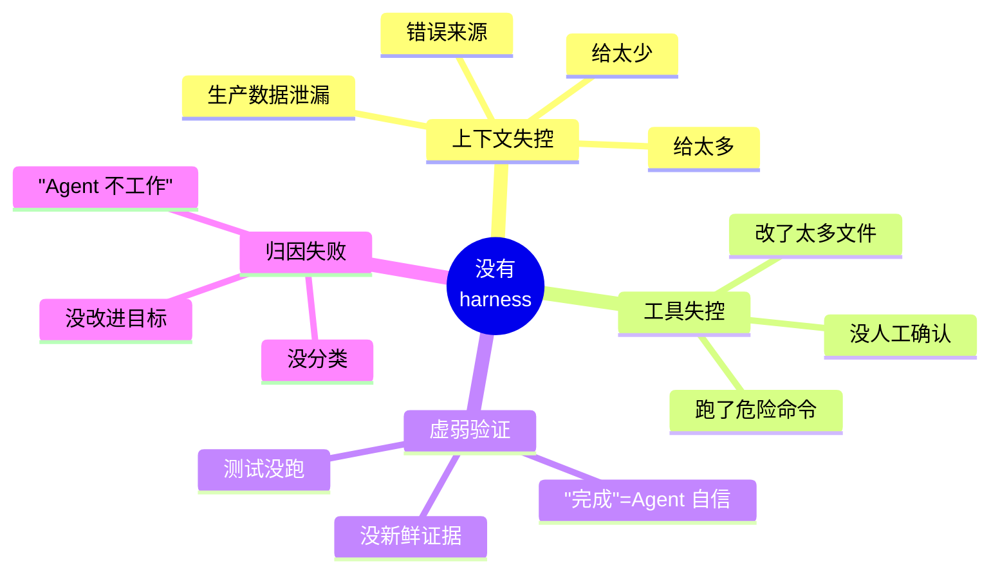
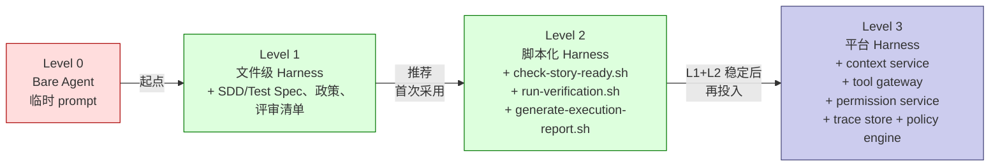

# Harness 工程

英文版：[../../knowledge/09-harness-engineering.md](../../knowledge/09-harness-engineering.md)

## 目的

本篇深入展开 [执行栈](03-执行栈.md) 的第三层——Harness。栈的图示和 SDD、Superpowers、Harness、CI/Review 之间的关系在第 03 篇；本篇聚焦：Harness 这一层实际装什么、它自己解决的问题、采用它的成熟度模型、内部团队必须达到的最小标准。

如果还没读 [执行栈](03-执行栈.md)，请先去读——本篇假设你已经掌握了四层模型和自底向上诊断的方法。

本项目中的 Harness，是 AI Agent 周围的受控运行环境：明确的上下文边界、允许的工具、权限、任务状态、验证命令、日志、评审钩子和审计。它比"测试 harness"更广，比"prompt engineering"更具体。

## 解决的问题

### 上下文失控

没有 harness 时，开发者可能给 AI 太多、太少或错误上下文。

Harness policy 定义：

- 必需任务工件。
- 允许上下文来源。
- 禁止上下文来源。
- 必需领域、架构、API 和测试引用。
- 缺失上下文如何处理。

### 工具和权限失控

没有 harness 时，AI agent 可能修改过多文件、运行高风险命令或依赖不可用环境。

Harness policy 定义：

- 只读阶段。
- 可编辑路径。
- 禁止路径。
- 允许 shell commands。
- 需要人工确认的命令。
- 禁止生产数据和凭据。

### 验证薄弱

没有 harness 时，完成可能基于 agent confidence 而不是证据。

Harness policy 定义：

- 必需测试命令。
- 静态分析和安全扫描。
- 契约测试。
- 人工验收检查。
- 必需 execution report 字段。

### 失败归因差

没有 harness 时，失败常被笼统描述为“agent 不行”。

Harness reporting 区分：

- Spec ambiguity。
- Wrong or missing context。
- Permission/tooling limitation。
- Environment failure。
- Test failure。
- Agent implementation error。
- Review or acceptance gap。

## 当前覆盖

本治理包已覆盖 Level 1 Harness 概念：

- SDD Story 规格 定义任务意图、验收标准和 AI 上下文边界。
- Prompt Card 定义批准上下文、禁止内容和输出格式。
- 技术规格 定义架构、权限、回滚和可观测性约束。
- 测试规格 定义测试证据。
- MR template 记录 AI usage、批准上下文、risks、rollback 和 test evidence。
- Quality gates 定义必需验证和停止线。
- CODEOWNERS 定义 负责人hip 和人工审批。
- Weekly 评审 templates 收集 AI failure 和 quality information。

还缺少：

- 单一团队级 AI engineering constitution。
- 明确 allowed 工具 和 forbidden operations。
- 可脚本化 Story readiness checks。
- 可脚本化 verification。
- 结构化 agent execution reports。
- 可追踪 run records。

## 成熟度等级

Level 0：Bare Agent。

- 开发者直接使用 AI 工具 和临时 prompt。
- 上下文手工选择，验证依赖开发者，日志不完整，失败归因弱。

Level 1：File-Level Harness。

- 团队使用标准文件和模板约束 AI 执行。
- 需要 SDD Story 规格、技术规格、测试规格、Prompt Card、AI policies、context policy、tool policy、testing policy、评审 checklist。

Level 2：Scripted Harness。

- 将重复检查转为脚本。
- 推荐 `check-story-ready.sh`、`run-verification.sh`、`generate-execution-report.sh`。

Level 3：Platform Harness。

- 组织建设或采用平台级 agent runtime。
- 包含 orchestrator、context service、tool gateway、permission service、memory、evaluation、trace store、policy engine、human approval 工作流 和 CI/CD integration。

## 推荐推广

Phase 1：

- 采用 `/ai/` policies。
- 在 SDD Story 规格 中要求 AI 上下文边界。
- 在 MR 中要求 execution evidence。
- 用 Superpowers 作为内部默认执行纪律。

Phase 2：

- 增加 `/ai-harness/` prompt templates 和 policies。
- Tier B/C 使用 execution report template。
- 手工运行 readiness 和 verification scripts。

Phase 3：

- 将 readiness checks 和 execution reports 接入 CI。
- 将 reports 存为 MR artifacts。
- 在 weekly AI-SDD 评审 中使用 failure attribution。

Phase 4：

- 考虑平台级 context、tool、permission 和 trace services。

## 最小标准

AI 执行前：

- Story card 清晰。
- 验收标准可测试。
- AI 上下文边界 明确。
- 允许和禁止上下文明确。
- 可编辑范围明确。
- 验证命令明确。

AI 执行中：

- Agent 处理一个有边界的任务。
- Agent 只使用批准上下文。
- Agent 不修改禁止路径。
- Agent 记录假设和问题。

AI 执行后：

- 测试和质量门禁已运行。
- 失败和修复已记录。
- 人工 评审 点已识别。
- Tier B/C 附 execution report。

完成规则：

AI 辅助任务不是 agent 说完成就完成。只有实现匹配批准 spec、工件已更新、验证通过、评审 完成、证据记录、剩余风险可见并被接受，才算完成。

## 要点回顾

- Harness 是执行栈的第三层——它不替代 SDD、Superpowers 或 CI/Review，但缺了它，每一层都会变弱。
- Harness 控制上下文、工具、权限、验证、报告；这五个里任何一个缺失都是它要防的失败模式。
- Level 1（文件级）和 Level 2（脚本化）覆盖内部团队的大多数需要；Level 3（平台级）只有在 Level 1、2 稳定后才值得建。
- "完成"是证据的属性，不是 Agent 自信的属性。

## 下一篇

- [指标](10-指标.md)——怎么衡量这四层栈是否真的随时间改进了交付的效率、质量和一致性。
