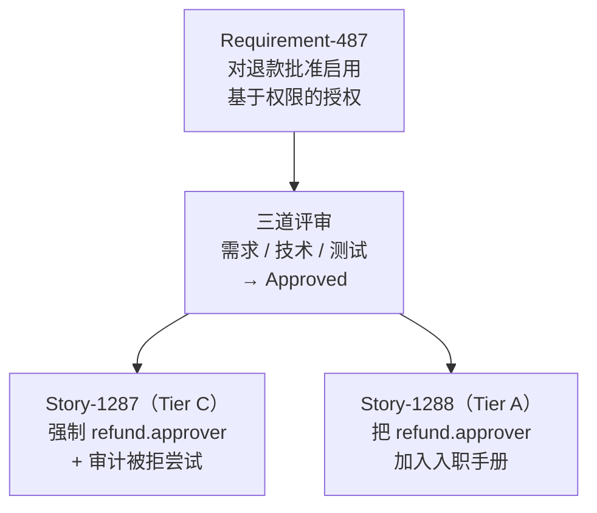
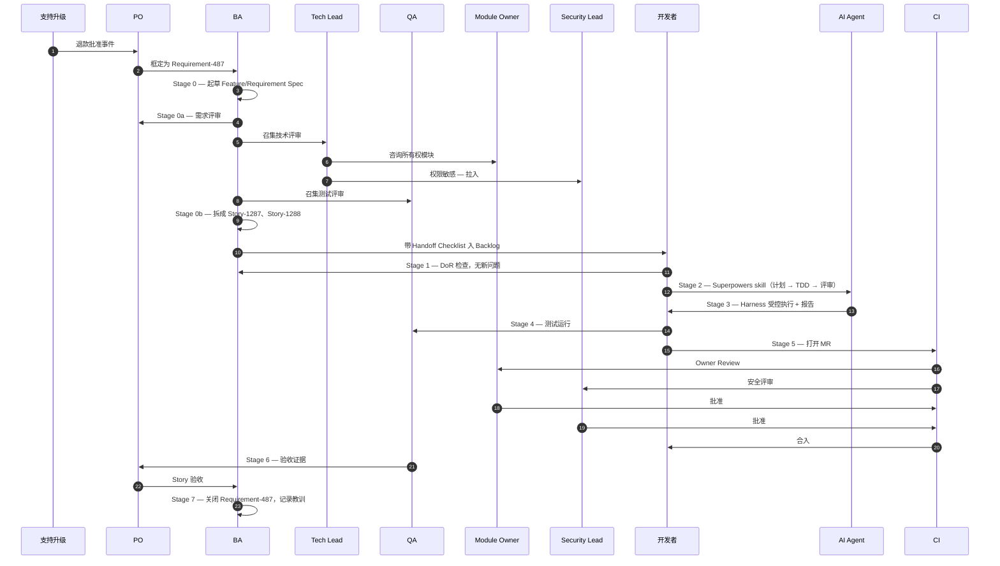

# 总结：从概念到交付

英文版：[../../knowledge/11-capstone.md](../../knowledge/11-capstone.md)

## 目的

前面十篇逐一解释了 AI-SDD 治理模型的各个部分。本篇把它们串起来——用一个真实的 Requirement 走完整个栈：BA 接收、三道评审、Story 拆分、运行模型、SDD、执行栈、质量门禁、测试、工具链、Agent 工具、Harness、指标、反馈闭环——展示每个概念在哪里生效。

读完本篇如果你不能把刚读过的每一篇映射到下面的某个步骤，那一篇就是要回头重读的那一篇。

走查之后，本篇把读者交给实践路径——同样的概念在那里按角色和阶段被落地。

## 用作走查的 Story

**Requirement-487：对退款批准 API 启用基于权限的授权。**

派生出：

- **Story-1287**：在 POST `/refunds/{id}/approve` 上强制 `refund.approver` 权限，被拒尝试写审计日志（Tier C）。
- **Story-1288**：在批准人入职手册中加入 `refund.approver` 权限说明（Tier A，follow-up）。

为什么这个例子好：

- 它是一个有边界的业务请求，不是一个项目。
- 涉及 API 契约、权限模型、审计日志、错误码注册——足以触动多数层，又不至于压垮人。
- 它有一个明显的错误答案（"随便加个 if 就行"）——治理模型就是要防这种。
- 它真实地从客户支持升级出发，走完 BA 接收 → 三道评审 → 拆分 → 执行 → 验收 → 关闭闭环。

这个例子是假设的。下面所有团队名、ID、阈值都不是真实工件——它们只是展示模型在哪里生效。

端到端角色交接：

## Stage 0：Requirement 到达（BA 接收）

一次客户支持升级浮现了真实事件：一个初级客服批准了他本不该有权批准的退款。PO 把这个业务诉求交给 BA，作为 **Requirement-487：对退款批准启用基于权限的授权**。

**模型说会发生什么：**

- [运行模型](04-运行模型.md)：Requirement 落到 Payments 领域的 BA。BA 分配 Requirement-487 ID、识别原始 stakeholder（支持升级 owner）、入队。
- [BA 指南](../practice/09-ba指南.md) Step 1-2：BA 原样捕获原始请求，再起草 [Feature / Requirement Spec](../../../templates/feature-spec.md)——业务目标、用户、范围、非范围、业务规则、数据/接口影响、权限与审计的 NFR。

**没有这一层会怎样：**

升级在聊天里讨论，开发者被告知"加个权限检查"，结果代码反映的是开发者对规则的猜测，不是业务意图。

## Stage 0a：三道评审 gate Requirement

Requirement-487 拆成 Story 之前必须过三道评审。BA 端到端主持 [Requirement Review Record](../../../templates/requirement-review-record.md)。

**模型说会发生什么：**

- **需求评审**——PO、BA、支持升级 owner 参加。确认*什么*：只有具备 `refund.approver` 权限的用户才能批准退款；被拒尝试必须可审计；现有批准人不能受影响。确认非范围：本 Requirement 不改变权限怎么授予，只改变权限怎么检查。结果：**Pass**。
- **技术评审**——Tech Lead 主持，BA + Module Owner（退款模块）+ Security Lead 参加。确认*怎么*：变更涉及 `src/refunds/` controller、现有权限中间件、审计日志器；`/refunds/{id}/approve` 的 OpenAPI 要加 403 响应形状；错误码注册要加 `REFUND_APPROVE_FORBIDDEN`。Security Lead 要求审计日志必须捕获用户 ID、时间戳、尝试动作、结果。结果：**Pass with conditions**（审计日志字段不可让步；不需要 ADR，因为没有架构变更）。
- **测试评审**——QA 主持，BA + Tech Lead 参加。确认*可测试性*：AC 是 Given/When/Then 形式、按字面可测试。必需测试层级：unit（权限检查）、permission test（拒绝 + 允许）、audit log test、contract test（新 403 响应）。UAT 范围：业务代表在 staging 上试一次被拒和一次被允许场景。结果：**Pass**。
- 整体 gate 决定：**Approved**。

**没有这一层会怎样：**

实现会从 BA 对"加个权限检查"的理解开始，团队会在 MR 评审时才发现审计日志形状错了、OpenAPI 没更新、权限名和合规期望的不一样、QA 团队没有可测试的 AC。每一项都会变成 Story 级返工，而不是 Requirement 级决策。

## Stage 0b：Story 拆分和 Backlog 入库

Requirement 批准后，BA 拆成 Stories（[BA 指南](../practice/09-ba指南.md) Step 6-7）。

**模型说会发生什么：**

- 本 Requirement 的拆分是一个主 Story 加一个 follow-up：
  - **Story-1287**：在 POST `/refunds/{id}/approve` 上强制 `refund.approver` 权限并审计被拒尝试。（Tier C）
  - **Story-1288**：把 `refund.approver` 权限加入现有批准人入职手册。（Tier A，follow-up）
- BA 为 Story-1287 完成 [BA Handoff Checklist](../../../templates/ba-handoff-checklist.md)：
  - 来源：父 Requirement-487 及其 Review Record 链接。
  - Story Card：完整带 Given/When/Then。
  - AI Context Boundary：允许 = 退款 controller、权限中间件、审计日志器、OpenAPI、现有退款测试。禁止 = 生产日志、客户数据、无关模块。
  - 链接工件：SDD Story Spec、Technical Spec（Tier C）、Test Spec、OpenAPI delta、错误码注册条目。
  - Tier C 确认；Module Owner（Payments Tech Lead）已知会。
- BA 跑 AI 可用性自测：五个问题全 "yes"。Story-1287 进 Backlog，`priority: high`、`dependency: none`。
- Sprint Planning 把 Story-1287 选进下个迭代；Delivery Owner 因 Tier C 签字；Module Owner 知会。

**没有这一层会怎样：**

Story-1287 会在 AC 还模糊、没有 AI Context Boundary、没有到父 Requirement 追溯的情况下入 Backlog。后面拿到它的开发者（人或 AI agent）要重新问 BA 当时已经在评审里和评审者答过的同样问题——只是那些答案从没被写下来过。

## Stage 1：开发者拿到 Ready Story（DoR + Tier 确认）

开发者从 sprint 队列拉出 Story-1287。

**模型说会发生什么：**

- 开发者读 Story Card、[SDD Story Spec](../../../templates/sdd-story-spec.md)、父 Requirement Review Record、BA 已经定好的 AI Context Boundary。
- 开发者自己的 DoR 检查（[开发者指南](../practice/04-开发者指南.md) Step 1 的最后一道防线）：五个 AI 可用性问题全 "yes"。没有新问题要问 BA。
- Tier 确认：BA 标了 Tier C；开发者认同——权限语义 + API 契约变更。按 [Superpowers 采用策略](../practice/03-superpowers采用策略.md)，Tier C 意味着完整 SDD Story Spec、Technical Spec、含权限和审计测试的完整测试覆盖、Owner Review、完整质量门禁、MR 附 Agent 执行报告。
- 开发者快速扫一眼 [阅读指南](00-阅读指南.md)，确认四层栈是正确的心智框架；这不是一个"加个 if 就行"的 Story。

**没有这一层会怎样：**

没有开发者端的 DoR 检查，即使一份准备得很好的 Story 也可能带着失效链接或在 Review Record 与 SDD Story Spec 之间漂移过的权限名落地。开发者端的检查是 agent 开始改代码前抓住交接漂移的最后机会。

## Stage 2：执行（Superpowers，第 2 层）

开发者按顺序调用 Superpowers skill——这就是 [执行栈](03-执行栈.md) 第 2 层在运转。

**模型说会发生什么：**

- `brainstorming`——确认验收准则可测试、确认 AI Context Boundary 完整、确认对"今天谁在调这个 API"没有隐性假设。
- `writing-plans`——产出实施计划：改哪些文件、先写哪些测试、更新 OpenAPI 哪一节、加什么审计日志断言、最后验证什么。
- `test-driven-development`——先写失败的权限测试。确认它因为正确原因失败（接口还没检查权限）。再写失败的审计日志测试。然后实现。
- `subagent-driven-development`（Tier C 可选）——一个独立 Agent context 在代码质量评审之前先做规格符合性评审。
- `requesting-code-review`——开发者带着清晰的"改了什么、加了什么测试、刻意没改什么"的小结请求评审。
- `verification-before-completion`——测试、静态分析、契约测试通过之前不声称完成。

**没有这一层会怎样：**

开发者会让 Agent"实现权限检查"、接受第一个看起来合理的 diff，在 PR 评审中才发现 Agent"顺手"把审计日志器也重构了，破坏了被合规面板消费的审计格式。

## Stage 3：受控运行时（Harness，第 3 层）

Agent 在 [Harness 工程](09-harness工程.md) 及 [`/ai/`](../../../ai/) 和 [`/ai-harness/`](../../../ai-harness/) 政策定义的 harness 内执行。

**模型说会发生什么：**

- 上下文（按 [`ai/context-policy.md`](../../../ai/context-policy.md) 和 [`ai-harness/policies/context-policy.yaml`](../../../ai-harness/policies/context-policy.yaml)）：只加载 AI Context Boundary 中已批准的文件；生产日志被屏蔽。
- 工具（按 [`ai/allowed-tools.md`](../../../ai/allowed-tools.md) 和 [`ai-harness/policies/permissions.yaml`](../../../ai-harness/policies/permissions.yaml)）：Agent 可以读文件、编辑 `src/refunds/` 下的文件、跑单元测试、跑契约测试。它不能跑数据库迁移、改 CI 配置、未经人工确认改范围外的文件。
- 验证（按 [`ai-harness/policies/verification-policy.yaml`](../../../ai-harness/policies/verification-policy.yaml)）：构建、单元测试、静态分析、secret scan 必须通过；API 变了所以契约测试必须通过；权限变了所以权限测试和审计日志校验必需。
- 开发者一开始跑 `ai-harness/scripts/check-story-ready.sh` 对 Story 规格做检查，结尾跑 `ai-harness/scripts/generate-execution-report.sh`。执行报告列出使用的上下文、改动的文件、新增的测试、跑过的验证、剩余风险。

**没有这一层会怎样：**

Agent 会读它容易 grep 到的任何东西、跑它觉得有用的任何命令、在自评说"完成"时就完成。出缺陷后失败归因就是那个不令人满意的"Agent 不工作"。

## Stage 4：测试（横切）

测试选择由 [测试策略](06-测试策略.md) 和 [Testing Policy](../../../ai/testing-policy.md) 指导。

**模型说会发生什么：**

- 权限检查的单元测试（断言业务行为；如果用了错误的权限名，测试会失败）。
- 覆盖拒绝场景和允许场景的权限测试。
- 断言被拒尝试以用户 ID 和时间戳写入的审计日志测试。
- 新的 403 响应形状的契约测试。
- 不加新的 E2E——现有退款批准 E2E 已经覆盖 happy path；边界场景该在更低层。
- 评审者按第 06 篇的评审清单挑战 AI 生成测试——在合理的错误实现下它会失败吗？mock 是否藏住了真实行为？

**没有这一层会怎样：**

AI 会生成一个高覆盖测试，mock 掉权限服务并断言它被调用。即使调用时传了错误的权限名，测试也通过。

## Stage 5：合入门禁（第 4 层）

MR 用 [AI-SDD MR 模板](../../../.gitlab/merge_request_templates/ai-sdd.md) 打开，走 [质量门禁](05-质量门禁.md) 和 [CI Gate Policy](../../../quality-gates/ci-gate-policy.md)。

**模型说会发生什么：**

- Pipeline：validate metadata → build → unit test → static analysis → contract test → integration test → security scan → package。
- MR 在以下情况被自动拒绝：构建失败、单元测试失败、OpenAPI 没改导致契约测试失败、secret scan 发现任何东西、SonarQube Quality Gate 失败、缺少 AI usage declaration。
- 没有 Payments tech lead 的 Owner Review（`src/refunds/` 的 CODEOWNERS）加上安全评审（权限变更触发，见 [`ai/security-policy.md`](../../../ai/security-policy.md)），MR 不能合入。
- 评审者按 [评审清单](../../../ai/review-checklist.md) 走查：没编造业务规则、权限检查正确、审计日志捕获正确字段、测试验证可观察行为、没暴露敏感数据。

**没有这一层会怎样：**

一个退款批准变更在没有 owner 签字、没有安全评审的情况下被合入——正是这道门禁存在的理由所针对的那类变更。

## Stage 6：Story 级验收证据

Story 用 [story-acceptance-record](../../../templates/story-acceptance-record.md) 走完验收。[指标](10-指标.md) 捕获发生了什么。

**模型说会发生什么：**

- Story Cycle Time 和 Spec-Ready 到 MR-Ready 的时间被记录到本迭代趋势。
- MR First-Pass Rate 上升，因为会卡门禁的工作在更早阶段被抓出来。
- AI Code Adoption Rate 被记录——AI 提议的代码有多少存活到评审之后。
- 如果之后出了缺陷，[Defect Attribution](../../../templates/defect-attribution.md) 自底向上走 [执行栈](03-执行栈.md)：CI 漏了吗？Harness 允许了坏上下文吗？Superpowers 纪律失守了吗？规格有缺口吗？
- Weekly AI-SDD Review 拿到归因，把改进反馈回规格、prompts、harness 政策、测试套件。

**没有这一层会怎样：**

每个 Story 一合入就算完成。团队没数据判断模型是否真的有帮助、没信号知道栈的哪一阶段在漏、也没记录知道为什么。

## Stage 7：BA 关闭 Requirement（反馈闭环）

Story-1287 验收。Story-1288（更新批准人入职手册的 follow-up）也验收。两个 Story 都追溯回 Requirement-487。

**模型说会发生什么：**

- 按 [BA 指南](../practice/09-ba指南.md) Step 10-11：BA 更新 Requirement-487，链接两个 Story Acceptance Record，标记 `Status: Accepted`。
- 业务代表的 UAT 结果记录为 [UAT Evidence](../../../templates/uat-evidence.md)。
- 反馈分类：支持团队报告原始事件模式已停止——记为 no-op（正面信号）。一个审计员问被拒尝试能否按用户查询——捕获为单独 [Change Request](../../../templates/change-request.md) 给未来迭代，不硬塞回本 Requirement。
- 捕获经验教训：本 Requirement 的三道评审早期就抓到了审计日志形状的问题；团队把"权限变更类 Requirement 默认在技术评审中加入 Security Lead"记为 [Knowledge Base Update](../../../templates/knowledge-base-update.md)。
- AI Champion 把"AI mock 掉权限服务并断言调用，而不是测试实际权限名"这个失败模式变成针对权限变更 Story 的 [Prompt Card](../../../templates/prompt-card.md) 更新。

**没有这一层会怎样：**

Requirement-487 永远"在进行中"。关于 Security Lead 参与的教训停留在一个 BA 的隐性知识里。下一个权限变更 Requirement 会在 MR 评审里发现同样的审计日志形状问题，而不是在技术评审里。

## 这次走查展示了什么

| 章节 | 在哪个阶段生效 |
| --- | --- |
| 01 AI-SDD 总览 | Stage 0——交代了为什么这个 Requirement 要被治理 |
| 02 SDD 方法论 | Stage 0-0b——Requirement Spec、AC、DoR；Stage 1——开发者 DoR 检查 |
| 03 执行栈 | Stage 2-5——组织所有执行阶段的四层模型 |
| 04 运行模型 | Stage 0——BA 问责、所有权、安全咨询 |
| 05 质量门禁 | Stage 5——门禁 pipeline、Owner Review、例外规则 |
| 06 测试策略 | Stage 4——层级选择、AI 特定测试风险、评审清单 |
| 07 工具链 | Stage 2-6——承载工作的 Jira、GitLab、SonarQube、CI runner |
| 08 Agent 工具 | Stage 2-3——哪个 Agent surface、哪些 skill、哪些工具权限 |
| 09 Harness 工程 | Stage 3——上下文、权限、验证、执行报告 |
| 10 指标 | Stage 6——测了什么、反馈怎么流回 |
| 实践/02 工件地图 | Stage 0-7——每个阶段产出什么工件 |
| 实践/08 角色 × 阶段矩阵 | Stage 0-7——每个阶段谁产出什么 |
| 实践/09 BA 指南 | Stage 0、0a、0b、7——BA 的深度工作流 |
| 实践/04 开发者指南 | Stage 1、2、4-6——开发者的深度工作流 |

如果上表中任何一行让你觉得不清楚，左边那一章就是进入实践之前要回头看的那一章。

## 知识到这里交给实践

[实践](../practice/) 把同样的概念按角色和阶段落地。自然的下一步：

1. [实践阅读指南](../practice/00-阅读指南.md)——按角色挑你的阅读路径。
2. [团队级 AI SDLC](../practice/01-团队级ai-sdlc.md)——同样的四层接入团队真实 SDLC。
3. [AI 上下文工件地图](../practice/02-ai上下文工件地图.md)——每个阶段必须产出什么工件。
4. [角色 × 阶段矩阵](../practice/08-角色阶段矩阵.md)——谁在每个阶段产出什么，怎么产。
5. [BA 指南](../practice/09-ba指南.md)——本走查中 BA 工作的深度展开。
6. [开发者指南](../practice/04-开发者指南.md)——本走查中开发者工作的深度展开。

## 要点回顾

- 一个 Requirement 调动整个栈——这些章节不是并列选项，而是组合层。
- 每一层防住一种具体的失败模式；跳过一层就把它变成潜伏缺陷。
- BA 接收 → 三道评审 → 拆分 这一段是 SDD 层的真实形态，不是装饰——它把代码层不可能修的歧义消灭在源头。
- Defect Attribution 模板和自底向上走执行栈把失败变成改进输入，不是甩锅。
- 知识教模型；实践把模型按角色、阶段、推广落地。

## 下一篇

- [术语表](12-术语表.md)——任何想钉死的术语都可以查；然后进入 [实践路径](../practice/)。
