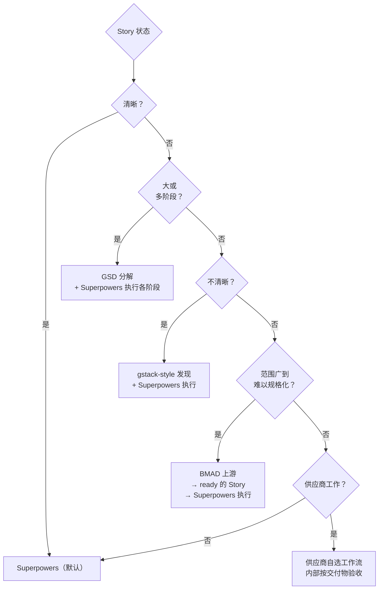

# 团队级 AI SDLC

英文版：[../../practice/01-team-ai-sdlc.md](../../practice/01-team-ai-sdlc.md)

## 目的

本篇说明 [四层执行栈](../knowledge/03-执行栈.md) 如何接入团队真实的 SDLC 阶段，以及在每个阶段该用哪个 AI 辅助执行框架——Superpowers、GSD、gstack 还是 BMAD。本篇不引入新的层模型；它把已有的栈映射到真实交付的流向。

SDLC 指 Software Development Life Cycle：从想法和需求出发，经过设计、实现、测试、发布、运维到改进的完整生命周期。

如果还没读 [执行栈](../knowledge/03-执行栈.md)，请先读它——本篇假设你已经熟悉四层（SDD / Superpowers / Harness / CI/Review）和自底向上诊断方法。

## 栈映射到 SDLC

一个团队的 SDLC 大致是：需求 → 架构 → Story 拆分 → Story Ready → 开发 → 评审与合入 → 集成 → 发布 → 运维 → 反馈。执行栈不替代任何阶段；它规定 AI 在每个阶段怎么参与。

```text
SDLC 阶段           归属层                       落地的实践文档
──────────────      ─────────────────────────    ─────────────────────────────────
需求                SDD（1）                      02 工件地图 S0-S2
架构                SDD（1）                      02 工件地图 S1
Story 拆分          SDD（1）                      02 工件地图 S2
Story Ready         SDD（1）                      02 工件地图 S3、03 Tier 规则
开发                Superpowers（2）+ Harness（3）03 Tier 规则、04 开发者指南
评审与合入          CI/Review（4）                05 质量门禁（知识）、04 Step 6-8
集成                CI/Review（4）                02 工件地图 S6
发布                CI/Review（4）+ 横切          02 工件地图 S6、05 实施 Playbook
运维                横切                          10 指标（知识）
反馈                横切                          10 指标（知识）、06 路线图
```

运行模型（knowledge/04）、测试策略（knowledge/06）、工具链（knowledge/07）、指标（knowledge/10）是横切的——它们作用于每个阶段，而不是某一个阶段。

## Superpowers、GSD、gstack 各放哪

Story card ready 之后，Superpowers 是**内部默认**的开发者工作流（这是执行栈在第 2 层确立的）。GSD 和 gstack 是 Superpowers 不够用时的**专用工具**。BMAD 用于最模糊、最高风险的上游工作。

本节给出 GSD 和 gstack 的正式定义——它们在手册其他地方都不再额外解释——以及"什么时候用哪一个"的决策规则。

### Superpowers（默认）

是什么：为 Coding Agent 设计的可组合 skill 框架和软件开发方法论。Skill 包括 `brainstorming`、`writing-plans`、`test-driven-development`、`subagent-driven-development`、`requesting-code-review`、`receiving-code-review`、`systematic-debugging`、`verification-before-completion`。

最佳适配：Story card ready 之后的日常 Story 交付。已有仓库、有 Git/PR/测试的团队、混合资历的开发者。这是第 2 层的默认。

落地位置：[Superpowers 采用策略](03-superpowers采用策略.md) 给 Tier 规则；[开发者指南](04-开发者指南.md) 给日常八步流程。

参考：https://github.com/obra/superpowers

### GSD——Get Shit Done

是什么：一种上下文工程加规格驱动长任务执行系统。GSD 的贡献是**持久化项目状态**——需求、路线图、阶段上下文、任务状态保存在结构化文件里，让一个跨会话、跨阶段的 AI 工作流不会丢失自己在哪。独立任务可以用全新上下文执行，避免上下文腐烂。

最佳适配：一个 feature 大到一次 Story 级别会话装不下；多阶段工作；需要扛住上下文窗口重置的工作；或独立任务希望用全新 executor 上下文执行。

在本手册里怎么用：GSD-style 实践**包裹** Superpowers，不替代它。GSD 管阶段状态和分解；Superpowers 管一个阶段内的执行纪律。组合模式是"GSD 分解并保存状态 → Superpowers 执行每个阶段的任务"。

企业注意：长时运行的执行引擎不能绕过架构、安全、依赖或 Owner 评审。GSD-style 执行要走和默认工作一样的门禁。

参考：https://github.com/gsd-build/get-shit-done

### gstack——角色驱动的交付循环

是什么：一种角色驱动的交付工作流，给 AI 辅助工作加入虚拟产品、架构、QA、发布视角。它的循环包括产品框定、计划压力测试、工程评审、浏览器 QA、发布检查、复盘。

最佳适配：Story 实际上没 ready，需要产品澄清；Web 产品需要真实浏览器 QA；小团队想要轻量虚拟交付队伍；合入前评审和发布纪律不足。

在本手册里怎么用：gstack-style **实践** 对放在 Superpowers 之前（让 Story Ready）或者 CI/Review 旁边（浏览器 QA、发布清单）有用。角色 persona 不替代真实 owner、安全评审或 CI/CD。把 gstack 命令当评审辅助，不当审批权威。

参考：https://gstack.lol/

### BMAD——上游升级

是什么：Breakthrough Method of Agile AI-driven Development。一种 AI 辅助敏捷框架，有更强的产品、架构、评审角色。

最佳适配：Story 模糊、跨域或风险高到 gstack-style 发现都不够。在本手册中，BMAD **不**是默认开发者工作流；它是 Story card 交给开发之前——当范围广到难以规格化时——考虑的上游升级。

参考：https://bmad.fr/en/bmad-method

### 决策规则



## 工具对比

| 框架 | 抽象层级 | 解决的核心问题 | 最佳适配 | 企业角色 |
| --- | --- | --- | --- | --- |
| Superpowers | AI 编码 + 工作流 skill | 用工程纪律执行已 ready 的工作 | 日常 Story 交付 | 内部 Tier B/C 默认 |
| GSD | 上下文工程 + 长任务执行 | 避免多阶段 AI 工作中的上下文腐烂 | 大 feature、多阶段 | 走和默认工作一样的门禁 |
| gstack | 角色驱动的虚拟交付循环 | 加入产品、架构、QA、发布压力 | Web 应用、早期团队、发现不足 | Superpowers 之前和 CI/Review 旁边选择性使用 |
| BMAD | 敏捷 AI 驱动的发现与计划 | 让模糊宽广的工作变得可规格化 | 跨域或研究型工作 | 仅作 Story 前的上游升级 |

## 默认团队工作流

这是框架选定之后的日常流程。每一步在其他实践文档里有更详细的展开。


## 按 Story 类型的采用策略

### 日常 Story 开发

默认 Superpowers，按 [Tier A/B/C](03-superpowers采用策略.md) 加权。完整日常流程见 [开发者指南](04-开发者指南.md)。

### 复杂或多阶段 Story

用 GSD-style 阶段状态加 Superpowers。GSD 管：长上下文、需求和路线图状态、阶段计划、任务状态、全新 executor 上下文。Superpowers 管：TDD、任务实现、评审、分支收尾。

### 不清晰的 Story

开发前用 gstack-style 发现：产品澄清、设计评审、架构和测试评审。然后回到 Superpowers 实施。

### 跨域或研究型 Story

把 BMAD 作为上游升级，产出 ready 的 Story。不要让 BMAD-style 发现绕过 Owner 评审或质量门禁。

## 每篇实践文档什么时候用

| 文档 | 什么时候读 |
| --- | --- |
| [02 AI 上下文工件地图](02-ai上下文工件地图.md) | 任何时候需要知道某阶段或某 Tier 要哪些工件。正典参考。 |
| [03 Superpowers 采用策略](03-superpowers采用策略.md) | 设定 Tier 规则；明确哪些 Superpowers skill 在哪个 Tier 必需。 |
| [04 开发者指南](04-开发者指南.md) | 日常 Story 执行——八步流程。 |
| [05 实施 Playbook](05-实施playbook.md) | Week 0、Kickoff、RACI、仓库设置、供应商评审节奏。 |
| [06 优先级与路线图](06-优先级与路线图.md) | 决定先采用什么；规划 P0/P1/P2 工作。 |
| [07 推广与验收](07-推广与验收.md) | 验证推广是否真的产生了你想要的行为变化。 |

## 参考资料

- [Superpowers——subagent-driven-development skill](https://github.com/obra/superpowers/blob/main/skills/subagent-driven-development/SKILL.md)
- [Superpowers 仓库](https://github.com/obra/superpowers)
- [GSD——Get Shit Done](https://github.com/gsd-build/get-shit-done)
- [gstack](https://gstack.lol/)
- [BMAD method](https://bmad.fr/en/bmad-method)

## 要点回顾

- 知识路径的四层执行栈在这里没有被重新发明；它直接映射到 SDLC 阶段。
- Superpowers 是第 2 层的默认；GSD 包裹它处理长工作；gstack 在上游和发布阶段辅助它；BMAD 是上游升级。
- 第 02 篇是工件参考的正典——其他文档关于"这个阶段我要什么"都指向那里。
- 默认团队工作流是一张图；每一步有更详细的归属文档。

## 下一篇

- [AI 上下文工件地图](02-ai上下文工件地图.md)——每个交付阶段必须产出什么工件的中心参考。
