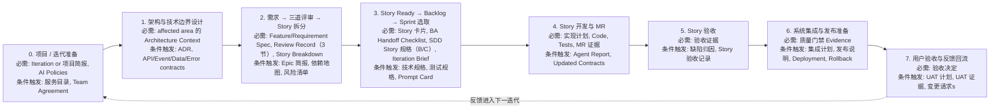

# AI 上下文工件地图

英文版：[../../practice/02-ai-context-artifact-map.md](../../practice/02-ai-context-artifact-map.md)

## 目的

AI 辅助交付不只需要好的 prompt。每个交付阶段都必须留下足够结构化的上下文，供下一阶段使用。否则 AI agent 会被迫猜业务规则、架构边界、测试期望、发布风险或验收标准。

本文回答两个实际问题：

1. 每个阶段要产出哪些工件，下一阶段才能安全使用 AI？
2. 哪些工件是必须的、条件触发的、可选的，避免流程过重而不可落地？

## 工件等级

| 等级 | 含义 | 何时使用 |
| --- | --- | --- |
| 必需（必需） | 阶段推进所必需的最低工件。 | 该阶段真实存在于交付流程中。 |
| 条件触发（条件触发） | 只有触发条件存在时才需要。 | 涉及架构、API、数据、安全、集成、发布、供应商或 UAT 影响。 |
| 可选（可选） | 对规模化、审计、培训或复杂协作有帮助，但不是每次都需要。 | 团队需要更多结构，或工作足够大。 |

实用规则：

- Tier A 使用最小可用集合。
- Tier B 使用 Story 级规格、测试、实现计划和证据。
- Tier C 使用完整适用集合，包括技术、安全、Owner、发布和回滚工件。

## 端到端阶段图

## 上下文包模型

| 上下文包 | 产出者 | 使用者 | 目的 |
| --- | --- | --- | --- |
| 项目上下文包 | 交付负责人、架构师、团队负责人、安全、QA | 架构设计、Story 拆分、AI 治理设置 | 给 AI 和人提供项目边界、交付规则、负责人hip 和政策约束。 |
| Architecture Context Package | 架构师、技术负责人、模块负责人 | Story 拆分、技术规格、实现计划 | 给 AI 提供结构边界、允许依赖、契约和技术约束。 |
| Requirement Breakdown Package | 产品负责人、BA、架构师、团队 | Story readiness 和计划 | 将业务意图转为可实现、有优先级、依赖明确的 Stories。 |
| Story 上下文包 | 产品负责人、BA、开发、QA、技术负责人 | AI 代码开发 | 给 AI 提供单个 Story 的完整有界上下文。 |
| Implementation Evidence Package | 开发、AI agent、Reviewer、CI | Story 验收和合入评审 | 说明改了什么、测试了什么、AI 做了什么、证据在哪里。 |
| Story Acceptance Package | QA、产品负责人、业务代表 | 发布计划、指标、下一迭代 | 确认 Story 行为已被接受，并捕获返工和经验。 |
| Release Readiness Package | 技术负责人、QA、DevOps、安全、Release Owner | 系统集成、部署、UAT | 证明集成后的工作可发布、可恢复。 |
| UAT 与反馈包 | 业务用户、产品负责人、QA、交付负责人 | 下一迭代计划和知识库 | 捕获真实用户验收、缺陷、变更请求和反馈。 |

## 阶段工件目录

### 0. 项目 / 迭代准备

目标：

- 建立交付边界、团队规则、AI 政策和 负责人hip baseline。

| 工件 | 等级 | 触发条件 / 说明 | 资产 |
| --- | --- | --- | --- |
| 项目简报 | 新项目 必需 | 启动新项目、产品线或重大 计划 时需要。 | [项目简报](../../../../templates/project-brief.md) |
| 迭代简报 | 治理型迭代 必需 | 当迭代范围会作为 AI 上下文时需要。 | [迭代简报](../../../../templates/iteration-brief.md) |
| 范围 / 非范围 | 必需 | 可放在 项目简报 或 迭代简报 中。 | [项目简报](../../../../templates/project-brief.md) |
| AI 工程宪章 | 必需 | 内部 AI 辅助交付前需要。 | [AI 工程宪章](../../../../ai/engineering-constitution.md) |
| AI 上下文政策 | 必需 | AI 使用项目或代码上下文前需要。 | [AI 上下文政策](../../../../ai/context-policy.md) |
| 允许工具政策 | 必需 | Agent 能运行工具或命令前需要。 | [允许工具](../../../../ai/allowed-tools.md) |
| 安全政策 | 必需 | 企业或公开仓库都需要。 | [安全政策](../../../../ai/security-policy.md) |
| 测试政策 | 必需 | 接受 AI 生成测试前需要。 | [测试政策](../../../../ai/testing-policy.md) |
| 服务目录 / 责任归属登记 | 条件触发 | 多服务、多团队或多 owner 时需要。 | [Backstage 目录模板](../../../../templates/backstage-catalog-info.yaml) |
| 团队工作约定 | 条件触发 | 新团队、混合团队、供应商参与或协作方式变化时需要。 | [团队工作约定](../../../../templates/team-working-agreement.md) |

最小 AI 交接：

- AI 能识别 范围、non-范围、批准上下文、禁止上下文、工具、负责人 和 验证预期。

### 1. 架构与技术边界设计

目标：

- 定义 AI 在 Story 级实现中必须遵守的架构边界。

| 工件 | 等级 | 触发条件 / 说明 | 资产 |
| --- | --- | --- | --- |
| 架构概览 | 新系统或重大领域 必需 | 小变更且模块已有充分文档时可不新增。 | [架构概览](../../../../templates/architecture-overview.md) |
| 架构约束 | 治理型团队 必需 | 可以轻量，但必须定义依赖、分层、数据和 API 规则。 | [架构约束](../../../../templates/architecture-constraints.md) |
| ADR | 条件触发 | 架构决策、重大 tradeoff、平台选择或不可逆决策时需要。 | [ADR](../../../../templates/adr.md) |
| 技术规格 | 条件触发 | Tier B/C 且有技术影响时需要。 | [技术规格](../../../../templates/technical-spec.md) |
| OpenAPI 契约 | 条件触发 | 同步服务 API 新增或变更时需要。 | [OpenAPI](../../../../templates/openapi.yaml) |
| 事件 Schema | 条件触发 | 异步事件新增或变更时需要。 | [事件 Schema](../../../../templates/event-schema.json) |
| 数据字典 | 条件触发 | 跨团队数据对象或字段新增、变更时需要。 | [数据字典](../../../../templates/data-dictionary.md) |
| 错误码登记表 | 条件触发 | 用户可见或跨服务错误语义变化时需要。 | [错误码登记表](../../../../templates/error-code-registry.md) |
| 权限模型 | 条件触发 | 认证、授权、敏感数据或审计行为变化时需要。 | [权限模型](../../../../templates/permission-model.md) |
| 可观测性计划 | 条件触发 | 新服务、关键流程或生产风险变更时需要。 | [可观测性计划](../../../../templates/observability-plan.md) |

最小 AI 交接：

- AI 能判断哪些模块、服务、数据存储、API、事件、权限和架构约束与下一个 Story 相关。

### 2. 需求 → 三道评审 → Story 拆分

目标：

- 把客户或业务提出的 Feature 量级业务单元（"需求 / Requirement"）通过三道门禁评审变成 ready 的 Stories，然后拆成足够小、足够清楚、可以 AI 辅助开发的 Stories。

子流程（BA 拥有；完整微流程见 [BA 指南](09-ba指南.md)）：

1. **需求接收**——捕获原始业务请求、分配 ID。
2. **需求分析**——BA 起草 [Feature Spec](../../../../templates/feature-spec.md)（在此流程中作为 **Requirement Spec** 使用）。
3. **需求评审**——确认*什么*：范围、成功标准、stakeholders。→ [Review Record](../../../../templates/requirement-review-record.md) §1。
4. **技术评审**——确认*怎么*：可行性、架构影响、风险。→ Review Record §2。
5. **测试评审**——确认*可测试性*：AC 质量、测试层级、UAT。→ Review Record §3。
6. **Story 拆分**——拆分 + 追溯表。

Requirement 在 Review Record 整体结果是 *Approved* 或 *Conditionally Approved* 之前**不能**进入 S3（Backlog）。

| 工件 | 等级 | 触发条件 / 说明 | 资产 |
| --- | --- | --- | --- |
| Feature Spec / Requirement Spec | 必需 | 本流程中作为 Requirement 级工件，始终需要。 | [Feature Spec](../../../../templates/feature-spec.md) |
| Requirement Review Record | 必需 | 三道门禁评审的合并证据。 | [Requirement Review Record](../../../../templates/requirement-review-record.md) |
| Story Breakdown | 必需 | 多个 Story 交给开发前需要。 | [Story Breakdown](../../../../templates/story-breakdown.md) |
| Story 包检查清单 | 必需 | 声明 Story ready 前需要（也见 S3）。 | [Story 包检查清单](../../../../templates/story-package-checklist.md) |
| Epic 简报 | 条件触发 | 大业务目标或多 Requirement 工作时需要。 | [Epic 简报](../../../../templates/epic-brief.md) |
| 依赖地图 | 条件触发 | Story、团队、服务、环境或供应商之间有依赖时需要。 | [依赖地图](../../../../templates/dependency-map.md) |
| 风险清单 | 条件触发 | Tier C、供应商、发布风险、数据、安全或重集成工作需要。 | [风险清单](../../../../templates/risk-list.md) |
| 验收策略 | 条件触发 | 验收跨 Story、integration、UAT 或 release 层级时需要。 | [验收策略](../../../../templates/acceptance-strategy.md) |

最小 AI 交接：

- AI 能理解 Story 与更大目标的关系、依赖、不可包含的范围，以及需要什么验收证据。

### 3. Story Ready → Backlog → Sprint 选取

目标：

- 提供 AI 辅助代码开发所需的完整有界上下文，把 ready 的 Story 放进 Backlog，并通过显式的团队和 Tier 签字选入 sprint。

子流程：

1. **Story Ready**——BA 为 S2 产出的每个 Story 完成 [BA Handoff Checklist](../../../../templates/ba-handoff-checklist.md) 和 SDD Story Spec（Tier B/C）。
2. **Backlog 入库**——AI 可用性自测通过的 Story 进 Backlog，带优先级和依赖标签。
3. **Sprint 选取**——Sprint Planning 选 Stories 进 [Iteration Brief](../../../../templates/iteration-brief.md)；Tier C 入选要 Delivery Owner 和 Module Owner 签字。

Handoff Checklist 不通过的 Story **不**进 Backlog。父 Requirement 的评审没 Approved 的 Story **不**进 Sprint。

| 工件 | 等级 | 触发条件 / 说明 | 资产 |
| --- | --- | --- | --- |
| Story 卡片 | 必需 | 每个 Story 都需要。 | [Story 卡片](../../../../templates/story-card.md) |
| BA Handoff Checklist | 必需 | 控制 Backlog 入库的门禁。AI 可用性自测必须通过。 | [BA Handoff Checklist](../../../../templates/ba-handoff-checklist.md) |
| SDD Story 规格 | Tier B/C 必需 | Tier A 可使用验收标准清晰的 lightweight issue。 | [SDD Story 规格](../../../../templates/sdd-story-spec.md) |
| AI 上下文边界 | 使用 AI 时 必需 | 可放在 Story 卡片、SDD Story 规格 或 Story 上下文包 中。 | [Story 上下文包](../../../../templates/story-context-package.md) |
| 模块负责人 | owned module 必需 | 可记录在 Story 卡片、SDD Spec 或 CODEOWNERS 中。 | [CODEOWNERS](../../../../templates/CODEOWNERS) |
| 工作流分级决策 | 必需 | Tier A/B/C 决定流程重量。 | [Superpowers Adoption](./03-superpowers采用策略.md) |
| Iteration Brief（Sprint 范围）| Sprint 选取阶段必需 | Sprint Planning 确认后是"本 sprint 含什么"的权威来源。 | [Iteration Brief](../../../../templates/iteration-brief.md) |
| Story 上下文包 | 条件触发 | 上下文分散在多个文档或 AI 工作为 Tier B/C 时需要。 | [Story 上下文包](../../../../templates/story-context-package.md) |
| 技术规格 | 条件触发 | 涉及技术设计、架构、API、数据、权限或集成影响时需要。 | [技术规格](../../../../templates/technical-spec.md) |
| 测试规格 | 条件触发 | Tier B/C 和非平凡行为需要；很小的 Tier A 变更可选。 | [测试规格](../../../../templates/test-spec.md) |
| Prompt Card | 条件触发 | 可复用内部 AI 任务或高风险 prompt 使用时需要。 | [Prompt Card](../../../../templates/prompt-card.md) |
| API / Event / Data / Error Artifacts | 条件触发 | 这些工件变化时需要。 | [OpenAPI](../../../../templates/openapi.yaml)、[事件 Schema](../../../../templates/event-schema.json)、[数据字典](../../../../templates/data-dictionary.md)、[错误码登记表](../../../../templates/error-code-registry.md) |

最小 AI 交接：

- AI 可以实现 Story，而不需要发明业务规则、字段、API、权限、错误码或测试期望。

### 4. Story 开发与 MR

目标：

- 将批准的 Story 上下文转为代码、测试、契约和可评审证据。

| 工件 | 等级 | 触发条件 / 说明 | 资产 |
| --- | --- | --- | --- |
| 实现计划 | Tier B/C 必需 | Tier A 可用 MR 中的短 checklist。 | [实现计划](../../../../templates/implementation-plan.md) |
| 更新后的代码 | 必需 | 实现工作必需。 | 仓库源代码 |
| 更新后的测试 | 行为变更 必需 | 行为变化时需要；纯文档变更不需要。 | [测试规格](../../../../templates/test-spec.md) |
| MR 证据 | 必需 | 合入评审必需。 | [AI-SDD Merge Request Template](../../../../.gitlab/merge_request_templates/ai-sdd.md) |
| 验证证据 | 必需 | 需要链接或总结本地/CI 证据。 | [验证脚本](../../../../ai-harness/scripts/run-verification.sh) |
| 更新后的契约 / 文档 | 条件触发 | API、event、data、error、deployment 或用户可见行为变化时需要。 | 相关模板 |
| Agent 执行报告 | 条件触发 | Tier B/C AI 辅助工作需要；小型 Tier A 可选。 | [Agent 执行报告](../../../../templates/agent-execution-report.md) |
| 评审发现 | 条件触发 | MR 工具不能充分保留 评审 feedback，或需要正式 评审 证据时需要。 | [评审发现](../../../../templates/review-findings.md) |

最小 AI 交接：

- Reviewer 或另一个 AI agent 能看清楚改了什么、为什么改、哪些测试证明它、哪些契约变化、还剩哪些风险。

### 5. Story 验收

目标：

- 确认 Story 行为已被接受，并为发布计划和未来 AI 上下文捕获证据。

| 工件 | 等级 | 触发条件 / 说明 | 资产 |
| --- | --- | --- | --- |
| 验收证据 | 必需 | Story 验收 前需要。 | [验收证据](../../../../templates/acceptance-evidence.md) |
| Test Evidence | 必需 | 可以是 CI report、test report、screenshot、log 或 manual verification record。 | [测试规格](../../../../templates/test-spec.md) |
| Story 验收记录 | 条件触发 | 受监管、供应商、高风险或业务签字 Story 需要。 | [Story 验收记录](../../../../templates/story-acceptance-record.md) |
| 缺陷归因 | 条件触发 | 出现 defect、rework、escaped issue 或重大 AI 修正时需要。 | [缺陷归因](../../../../templates/defect-attribution.md) |
| 经验教训 / Prompt 更新 | 可选 | AI 输出需要明显修正或发现新业务知识时有用。 | [知识库更新](../../../../templates/knowledge-base-update.md)、[Prompt Card](../../../../templates/prompt-card.md) |
| 周度复盘记录 | 可选 | 对指标、失败模式和治理复盘有用。 | [每周 AI-SDD 复盘](../../../../templates/weekly-ai-sdd-review.md) |

最小 AI 交接：

- 未来 AI 工作能知道 Story 是否已验收、由什么证据证明、哪些缺陷或修正应影响后续工作。

### 6. 系统集成与发布准备

目标：

- 安全地组合已验收 Stories，并为发布或用户验收做准备。

| 工件 | 等级 | 触发条件 / 说明 | 资产 |
| --- | --- | --- | --- |
| 质量门禁 Report | Release candidate 必需 | 发布或正式集成验收前需要。 | [质量门禁 Report](../../../../templates/quality-gate-report.md) |
| CI 门禁证据 | 必需 | 有 CI/CD 时需要。 | [CI 门禁政策](../../../../quality-gates/ci-gate-policy.md) |
| 集成计划 | 条件触发 | 多个变更、服务、团队、供应商或环境集成时需要。 | [集成计划](../../../../templates/integration-plan.md) |
| 集成 / 契约测试证据 | 条件触发 | 涉及跨服务、API 或 event 行为时需要。 | [质量门禁检查清单](../../../../quality-gates/checklist.md) |
| 发布说明 | 条件触发 | 变更对用户、运维或下游团队可见时需要。 | [发布说明](../../../../templates/release-notes.md) |
| 部署说明 | 条件触发 | 部署步骤、配置、环境或运维非平凡时需要。 | [部署说明](../../../../templates/deployment-notes.md) |
| 回滚计划 | 条件触发 | 生产影响变更需要。 | [回滚计划](../../../../templates/rollback-plan.md) |
| 迁移计划 | 条件触发 | 存在 schema 或数据迁移时需要。 | [迁移计划](../../../../templates/migration-plan.md) |
| 可观测性检查清单 | 条件触发 | 新服务、关键流程或生产风险变更需要。 | [可观测性检查清单](../../../../templates/observability-checklist.md) |
| 安全扫描证据 | 条件触发 | 安全门禁启用或变更影响生产时需要。 | [质量门禁检查清单](../../../../quality-gates/checklist.md) |

最小 AI 交接：

- AI 或 Reviewer 能理解哪些 Stories 被集成、跨系统风险是什么、如何部署、如何回滚，以及哪些证据证明 release readiness。

### 7. 用户验收与反馈回流

目标：

- 捕获业务用户验收结果，并将真实学习回流到下一迭代。

| 工件 | 等级 | 触发条件 / 说明 | 资产 |
| --- | --- | --- | --- |
| 验收决定 | UAT 或业务签字时 必需 | 可记录在 UAT 证据 或 发布验收记录 中。 | [发布验收记录](../../../../templates/release-acceptance-record.md) |
| UAT 计划 | 条件触发 | 进行正式 UAT 时需要。 | [UAT 计划](../../../../templates/uat-plan.md) |
| UAT 证据 | 条件触发 | 执行 UAT 时需要。 | [UAT 证据](../../../../templates/uat-evidence.md) |
| UAT 缺陷清单 | 条件触发 | UAT 发现缺陷时需要。 | [缺陷归因](../../../../templates/defect-attribution.md) |
| 变更请求清单 | 条件触发 | UAT 或用户提出范围变更时需要。 | [变更请求](../../../../templates/change-request.md) |
| 知识库更新 | 条件触发 | 发现新业务规则、支持说明、缺陷模式或 prompt lessons 时需要。 | [知识库更新](../../../../templates/knowledge-base-update.md) |
| 指标更新 | 可选 | 对治理复盘和持续改进有用。 | [指标](../knowledge/10-指标.md)、[每周 AI-SDD 复盘](../../../../templates/weekly-ai-sdd-review.md) |

最小 AI 交接：

- 下一迭代 AI 工作可以使用已验收用户反馈、已知缺陷、新变更请求和更新后的业务规则，而不是依赖会议记忆。

## 按工作类型的最小工件集合

### Tier A：轻量变更

适用于低风险、局部变更。

必需：

- Story 卡片 或 lightweight issue description。
- Acceptance Criteria。
- Focused verification evidence。
- 使用 AI 时 MR 包含 AI usage declaration。

条件触发：

- 使用 AI 时提供 AI 上下文边界。
- 行为变化时更新 test。
- 受影响时更新 documentation 或 contract。

通常跳过：

- 技术规格。
- 完整 测试规格。
- Agent 执行报告。
- Story 验收记录。

### Tier B：标准 Story

适用于普通业务功能、重要缺陷、API 变更、数据库变更或跨模块行为。

必需：

- Story 卡片。
- SDD Story 规格。
- AI 上下文边界。
- 实现计划。
- Test evidence。
- MR evidence。
- Verification evidence。
- Acceptance evidence。

条件触发：

- 行为非平凡时提供 测试规格。
- 有技术影响时提供 技术规格。
- AI 辅助时提供 Agent 执行报告。
- 合同或文档变化时更新相关工件。
- 出现返工或缺陷时提供 缺陷归因。

### Tier C：高风险变更

适用于核心、生产影响、架构、权限、数据、安全或供应商敏感工作。

必需：

- Story 卡片。
- SDD Story 规格。
- 技术规格。
- AI 上下文边界。
- 测试规格。
- 实现计划。
- AI 辅助时提供 Agent 执行报告。
- Owner Review evidence。
- Full quality gate evidence。
- Acceptance evidence。

条件触发：

- 涉及架构或重大 tradeoff 时提供 ADR。
- 相关时提供 API、event、data、permission 和 error-code artifacts。
- 有生产影响时提供 Rollback 或 recovery notes。
- 安全门禁启用时提供 Security scan evidence。
- 需要业务签字或审计时提供 Story 验收记录。

### Integration / Release

必需：

- 质量门禁 Report。
- 有 CI/CD 时提供 CI 门禁证据。

条件触发：

- 多个变更集成时提供 集成计划。
- 存在跨系统行为时提供 Integration 或 contract test evidence。
- 变更对用户、运维或下游团队可见时提供 发布说明。
- 部署非平凡时提供 部署说明。
- 有生产影响时提供 回滚计划。
- 有数据或 schema 变更时提供 迁移计划。
- 生产监控重要时提供 可观测性检查清单。

### UAT

必需：

- 需要 UAT 或业务签字时提供 验收决定。

条件触发：

- 正式 UAT 时提供 UAT 计划。
- 执行 UAT 时提供 UAT 证据。
- 发现缺陷时提供 缺陷归因。
- 提出范围变更时提供 变更请求。
- 业务知识变化时提供 知识库更新。

## 实用规则

在 AI agent 开始下一阶段前，先问：

1. Agent 是否知道目标？
2. Agent 是否知道 范围 和 non-范围？
3. Agent 是否知道架构和数据边界？
4. Agent 是否知道 验收标准？
5. Agent 是否知道 verification command 或 evidence requirement？
6. Agent 是否知道可使用哪些文件、API、事件和文档？
7. Agent 是否知道哪些风险需要 human 评审？

如果答案是否定的，上一阶段就还没有产出足够上下文。

## 要点回顾

- 本篇是"阶段 × 工件 × Tier × 模板"的正典参考——其他实践文档都指向它，不维护自己的表。
- 三个工件级别（Must-have / Conditional / Optional）让流程保持可用：Tier A 用最小够用集，Tier C 用全集中适用的。
- 八个上下文包命名了阶段间真实的交接；缺哪个包，AI Agent 就只能在哪里靠猜。
- 任何阶段开始前，七个 readiness 问题检验下一步 AI 辅助是否有足够上下文。

## 下一篇

- [Superpowers 采用策略](03-superpowers采用策略.md)——Tier A/B/C 规则决定一个给定 Story 适用工件地图的哪个子集。