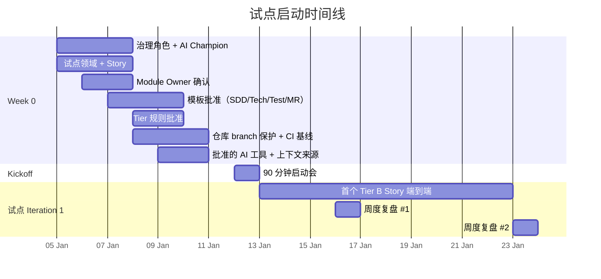
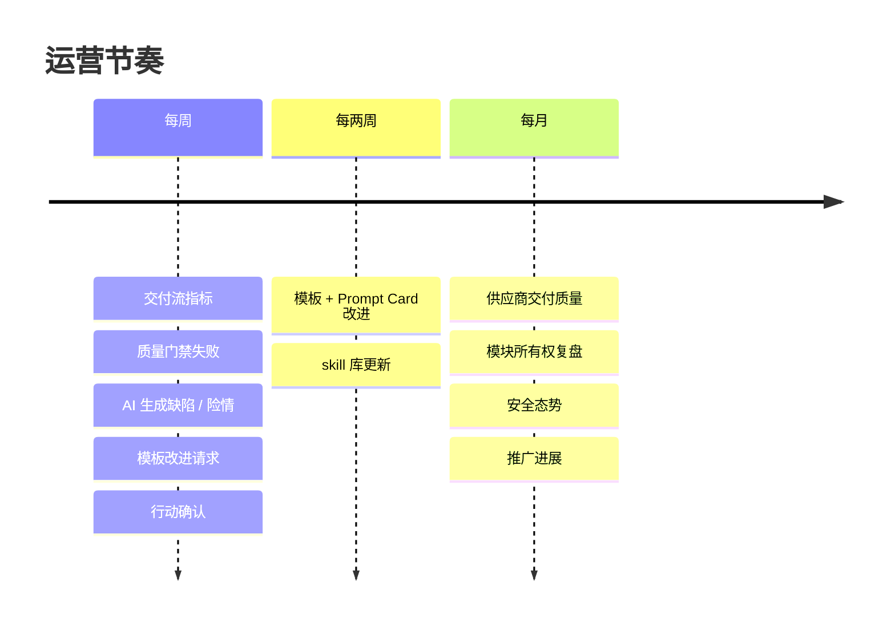

# 实施 Playbook

英文版：[../../practice/05-implementation-playbook.md](../../practice/05-implementation-playbook.md)

## Week 0 准备

试点开始前完成：

- 任命 AI-SDD Governance Committee。
- 每个参与内部团队任命一名 AI Champion。
- 识别试点领域和试点 Story。
- 确认试点模块 Owner。
- 批准初始 SDD、技术规格、测试规格、Prompt Card 和 MR 模板。
- 批准轻量、标准和高风险变更的 Superpowers 工作流 tiers。
- 配置仓库分支保护和 MR approval rules。
- 配置必需 CI/CD quality gates。
- 确认批准的 AI 工具和上下文来源。

## Kickoff Agenda

90 分钟试点 kickoff：

1. 交付负责人 说明目标和边界。
2. Architect 说明 SDD 和技术治理。
3. QA 负责人 说明测试证据和质量门禁。
4. 安全负责人 说明 AI 数据边界和审计规则。
5. AI Champion 演示一个从 spec 到 MR 的完整内部 Story。
6. 团队负责人 确认试点 Story 和 Owner。

## Pilot Story Package

每个试点 Story package 包含：

- SDD Story 规格。
- 当架构、API、数据、权限或集成受影响时提供 技术规格。
- 测试规格。
- 适用时提供 API contract 或 event schema。
- Prompt Card。
- MR template。
- Acceptance checklist。

供应商交付包包含批准的 SDD Spec、接口契约、测试证据、部署说明、回滚说明和验收清单；不要求 Prompt Card 或 Superpowers 记录。

## 每周 AI-SDD Review Agenda

1. 复盘交付流指标。
2. 复盘质量门禁失败。
3. 复盘 AI 生成缺陷或 near miss。
4. 适用时复盘供应商交付质量。
5. 复盘模板问题和改进请求。
6. 确认行动、Owner 和 due date。

## 供应商评审议程

每月供应商评审：

- 工件完整性。
- 验收通过率。
- 交付评审后的缺陷率和返工率。
- Owner 评审 findings。
- 质量门禁通过率。
- 部署说明、回滚说明和变更说明完整性。
- 下月改进行动。

## 最小仓库设置

每个应用仓库建议包含：

- `README.md`
- `docs/specs/`
- `docs/adrs/`
- `docs/api/`
- `docs/data-dictionary.md`
- `docs/error-code-registry.md`
- `.gitlab/merge_request_templates/ai-sdd.md`
- `CODEOWNERS`
- CI/CD pipeline definition

## RACI Matrix

列中包含 **BA**（Business Analyst）和 **PO**（Product Owner），让上游"需求 → 三道评审 → Story"流程的问责显式。新增的行覆盖 Requirement 级别活动。

| 活动 | Delivery Owner | PO | Architect | Tech Lead | QA Lead | Security Lead | BA | AI Champion | Module Owner | 供应商负责人 |
| --- | --- | --- | --- | --- | --- | --- | --- | --- | --- | --- |
| 批准治理政策 | A | C | R | C | C | C | C | C | C | C |
| 批准 SDD 模板 | A | C | R | C | C | C | R | R | C | C |
| 批准 Requirement（需求评审） | C | A | C | C | C | C | R | C | C | C |
| 批准 Requirement（技术评审） | C | C | C | A | C | C | R | C | R | C |
| 批准 Requirement（测试评审） | C | C | C | C | A | C | R | C | C | C |
| 批准 Story 拆分 + Backlog 入库 | C | C | C | C | C | C | A | C | C | C |
| 批准 Sprint 范围 | A | R | C | R | C | C | C | C | C | C |
| 批准 Story Spec | C | C | C | A | C | C | R | R | R | R |
| 批准架构决策 | C | C | A | R | C | C | C | C | R | C |
| 批准测试策略 | C | C | C | R | A | C | C | C | C | C |
| 批准安全例外 | A | C | C | C | C | A | C | C | C | C |
| 批准核心模块变更 | C | C | C | R | C | C | C | C | A | R |
| Story 验收（业务结果） | C | A | C | C | R | C | R | C | R | C |
| 批准发布就绪 | A | C | R | R | R | R | C | C | R | C |
| UAT 后关闭 Requirement | C | A | C | C | R | C | R | C | C | C |
| 复盘周度指标 | A | C | R | R | R | R | R | R | C | R |

说明：

- R：Responsible（负责执行）。
- A：Accountable（最终问责）。
- C：Consulted（被咨询）。

## 要点回顾

- Week 0 把抽象治理模型变成具名 owner、批准模板、配好的仓库——没它，日常工作流没东西可依靠。
- Kickoff 议程刻意只演示一个 Story 从规格到 MR——目标是共享心智模型，不是长篇讲座。
- 周度和月度节奏（AI-SDD 复盘、供应商评审）是把失败案例转化为流程改进的运营心跳。
- RACI 是为了解决"谁真正决定"——所有权分歧成为 [运行模型](../knowledge/04-运行模型.md) 的仲裁议题。

## 下一篇

- [优先级与路线图](06-优先级与路线图.md)——Playbook 运转起来后，路线图按 5 阶段排好 P0/P1/P2 工作。
