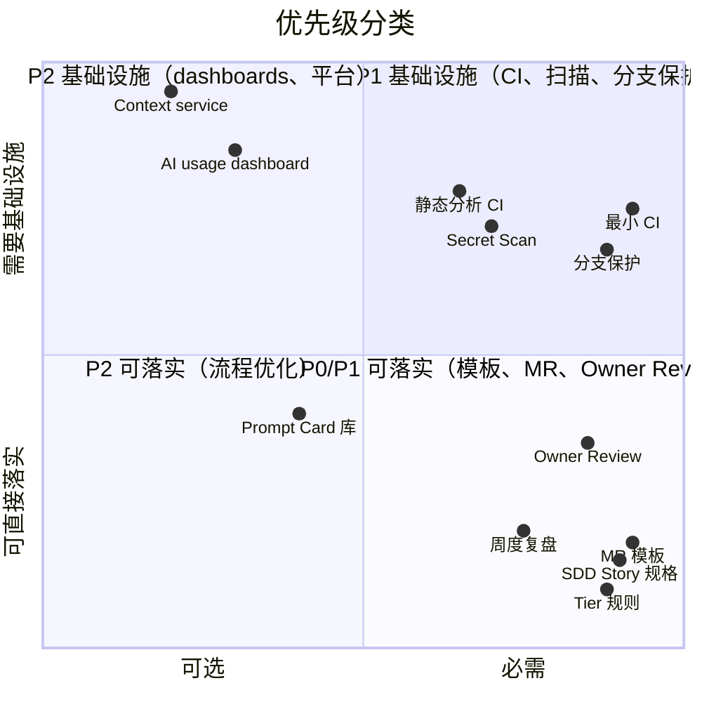
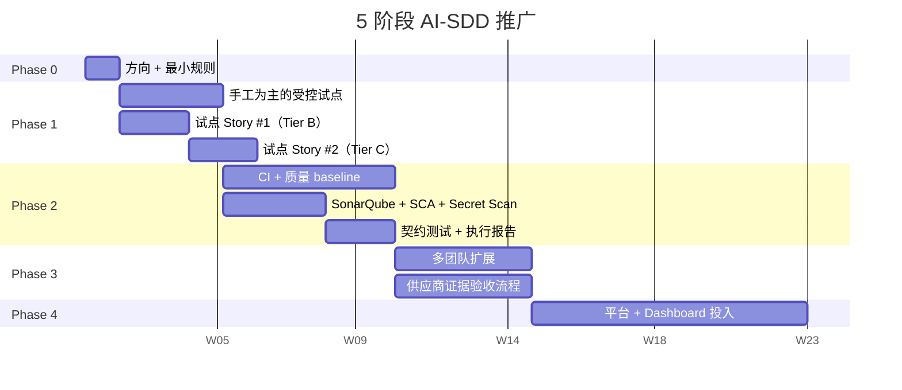

# 优先级与路线图

英文版：[../../practice/06-priorities-and-roadmap.md](../../practice/06-priorities-and-roadmap.md)

## 目的

本文将治理理念和实现工作分开，是 **AI-SDD 推广序列的正典**。[推广与验收](07-推广与验收.md) 提到阶段时，验证的就是本文定义的阶段。

完整 AI-SDD 治理模型包含流程规则、开发者工作流、模板、质量门禁、CI/CD、hooks、dashboards 和平台能力。它们不应被当作一次性全量包。

实际推广需要区分：

- 必需 和 可选增强。
- 可直接落实的流程变化和基础设施工作。
- 立即可执行规则和中期平台能力。

## 如何阅读本篇

本篇长，因为它既装决策模型也装运营 backlog。为了保持可用，分两部分：

- **学习（"指导方向"到"实用排序规则"各节）**——模型：怎么思考优先级、P0/P1/P2 分类、决定先做什么的规则。首读按顺序读。
- **参考（标记为"参考："的节）**——运营 backlog、5 阶段路线图、决策表、基础设施工作清单。首读时扫一眼，推广时按需查阅。

如果只读一节，读 **Priority Levels** 加 **实用排序规则**——它们回答"先做什么？"。

## 指导方向

第一目标不是建设完美 AI 工程平台，而是让 AI 辅助交付受控到足以在不丢失追溯、质量和责任的情况下被团队使用。

推荐方向：

1. 从清晰 工作流 和 artifact discipline 开始。
2. 通过 MR 和 评审 evidence 让开发行为可观察。
3. 在建设平台自动化前，先增加轻量 scripts。
4. 手工标准稳定后，再把 quality gates 放进 CI/CD。
5. 底层数据可靠后，再建设 dashboards。

## 分类模型

### Directly Actionable

主要通过约定、模板、评审和团队纪律即可采用。

例子：

- SDD Story 规格 使用。
- Story 或 Spec 中的 AI 上下文边界。
- Superpowers 工作流 tiering。
- 开发人员检查清单。
- MR AI usage declaration。
- Owner Review rule。
- Manual quality checklist。
- Weekly 评审 cadence。

### Infrastructure Required

需要 CI/CD、仓库配置、hooks、scanners、integrations、dashboards 或自定义 scripts。

例子：

- Required CI pipeline stages。
- Branch protection。
- MR approval rules。
- SonarQube 质量门禁。
- SAST、SCA、Secret Scan。
- Pre-commit 或 pre-push hooks。
- Automated Story readiness checks。
- Automated execution report generation。
- Metrics dashboards。
- 开发者门户 和 服务目录。

## Priority Levels

### P0：受控试点 Must-Have

试点受控前必须具备：

- 一个批准的试点领域和试点 Story 集。
- 明确治理负责人、技术负责人、QA、Security、AI Champion。
- 试点模块有 模块负责人。
- Tier B/C 要求 SDD Story 规格。
- 明确 Tier A/B/C 分类规则。
- 明确允许和禁止 AI context。
- 内部 Tier B/C 使用 Superpowers 工作流。
- MR template 包含 AI usage、test evidence、risk、rollback 和 评审。
- 核心模块变更需要 Owner Review。
- 每个试点仓库记录 build 和 unit test command。
- 最小 CI pipeline 执行 build 和 unit tests。
- main branch 具备 branch protection。

P0 完成规则：

- 一个 Tier B 试点 Story 可以从 approved spec 进入 MR。
- MR 包含必需证据。
- Build 和 unit tests 在 CI 中运行。
- Human 评审 和 Owner Review 规则可见且可执行。

### P1：团队采用 Should-Have

用于多团队扩展：

- 技术规格、测试规格、ADR、Prompt Card、OpenAPI、事件 Schema、数据字典、Error Code templates。
- Lightweight Story readiness script。
- Lightweight verification script。
- Agent execution report。
- CI 中的 static analysis。
- 接口变更的 contract tests。
- CI 中的 Secret Scan。
- SCA dependency scan。
- 按 owner 或 code path 的 MR approval rules。
- AI Champion onboarding guide 和 examples。
- Weekly AI-SDD quality 评审。

P1 完成规则：

- 多个内部团队能运行相同 Tier B 工作流。
- 缺失 Story 信息能在实现前或 MR 评审 中被发现。
- 常见质量和安全检查一致运行。
- 周度复盘产生可跟踪行动。

### P2：Nice-To-Have 或规模化能力

基础流程和 CI baseline 稳定后再投入：

- AI usage dashboard。
- Quality and consistency dashboard。
- Backstage 服务目录。
- Context service。
- Tool gateway 和 permission service。
- AI run trace store。
- Automated supplier scorecard。
- AI output evaluation suite。

P2 完成规则：

- 组织有足够稳定流程数据支撑 dashboard 或平台投入。
- 团队不再争论基础 工作流。

## 实用排序规则

存在优先级分歧时按此规则裁决：

1. 能防止不清楚或不安全 AI 执行的，优先做。
2. 能防止坏代码合入的，尽快放进 CI/CD。
3. 只改善 reporting 的，等数据可靠后再做。
4. 需要平台工程的，等手工流程证明重复价值后再做。
5. 只增加流程语言但不改变行为的，简化或删除。

---

## 参考：运营 Backlog 和路线图

下面都是参考材料——backlog、阶段计划、决策表。意图是在真实推广时查阅，不是首读时背下来。

## 参考：可以立即落实

流程和方法：

- 每个 Story 使用 Tier A/B/C 分类。
- Tier B/C 要求 SDD Story 规格。
- Tier B/C specs 要求 AI 上下文边界。
- 架构、API、数据、权限或生产风险涉及时要求 技术规格 或 ADR。
- 非平凡行为要求 测试规格。
- 内部 Tier B/C 使用 Superpowers 工作流。
- Tier A 使用 轻量工作流。

评审和证据：

- 使用 AI-SDD MR template。
- 使用 AI 时声明 AI usage。
- MR 中提供 test evidence。
- 生产影响工作提供 risk 和 rollback notes。
- 核心模块要求 模块负责人 approval。
- 使用 weekly 评审 template 进行 AI-SDD 评审。

团队启用：

- 任命 AI Champions。
- 创建 example Story packages。
- 新员工、毕业生和承包商前两个迭代与 AI Champion 配对。
- 维护少量批准 Prompt Cards。
- 记录 AI failure cases 和 common corrections。

## 参考：需要额外建设

仓库和 Git 控制：

- Branch protection。
- CODEOWNERS。
- Required MR approvals。
- 每个应用仓库添加 MR template。
- 适用时添加 formatting、linting 和 secret checks 的 pre-commit hooks。
- Pre-push hooks 只放快速检查，慢验证放 CI。

CI/CD Pipeline：

- Build stage。
- Unit test stage。
- Integration 或 contract test stage。
- Static analysis stage。
- SonarQube 质量门禁。
- SAST。
- SCA。
- Secret Scan。
- Database migration validation。
- 发布 test reports 和 scan reports 为 pipeline artifacts。

Harness Automation：

- 按实际 Story 文件位置和字段适配 `check-story-ready.sh`。
- 按技术栈适配 `run-verification.sh`。
- 自动或半自动生成 execution reports。
- 将 reports 附到 MR。
- 增加 weekly 评审 failure categories。

Data And Metrics：

- 定义 Story IDs、Spec links、MR links、AI usage、test results 和 评审 outcomes 的 source of truth。
- 数据一致后再建设 dashboards。
- 投入自动化前先做 weekly manual 评审。

## 参考：推荐路线图

Phase 0：Direction And Minimum Rules，1 周。

- 选择试点领域和内部团队。
- 明确治理角色、AI Champion 和 模块负责人s。
- 批准 Tier A/B/C、SDD Story 规格、MR template、AI context/security boundaries。
- 定义每个试点仓库最小验证命令。

Phase 1：Manual-First Controlled Pilot，2 到 4 周。

- Tier B/C 试点 Story 使用 SDD Story 规格。
- 内部 Tier B/C 使用 Superpowers 工作流。
- 所有试点变更使用 MR template。
- 核心模块要求 Owner Review。
- 本地运行 build 和 unit tests，并在 MR 记录证据。
- 每周 AI-SDD 评审。
- 同时建设最小 CI、branch protection 和试点 CODEOWNERS。

Phase 2：CI And Quality Baseline，4 到 8 周。

- CI 要求 build 和 unit tests。
- CI 中加入 static analysis 和 Secret Scan。
- Protected branches 执行 MR approvals。
- 适配 Story readiness 和 verification scripts。
- MR 附测试证据。
- 尽量加入 SonarQube、SCA、contract tests 和 execution reports。

Phase 3：Multi-Team Expansion，8 到 12 周。

- 所有内部团队使用相同 Tier model。
- 所有内部团队使用约定 SDD 和 MR templates。
- 核心模块有 CODEOWNERS。
- 供应商验收使用相同交付物和证据清单。
- 周度复盘包含 quality gate failures、AI failures 和 supplier quality。

Phase 4：Platform And Dashboard Investment。

- 在流程和 CI baseline 稳定后投入 服务目录、dashboards、context service、tool gateway、trace store 和 evaluation capabilities。

## 要点回顾

- 本篇是 AI-SDD 推广序列的正典；[推广与验收](07-推广与验收.md) 验证的就是本篇定义的阶段。
- P0/P1/P2 的分层把"受控试点必需"和"规模化与平台投入"分开——不要混为一谈。
- 实用排序规则是团队对"先做什么"有分歧时的裁决依据。
- 5 阶段推荐路线图（Phase 0-4）是参考材料——推广规划时查阅，不要在首读时背下来。

## 下一篇

- [推广与验收](07-推广与验收.md)——验证本篇规划的推广是否真的产生了你想要的行为变化的验收场景。

