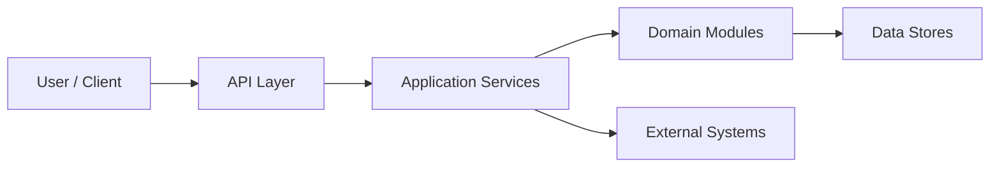

# Architecture Overview

## Metadata

- System / Product:
- Owner:
- Architect:
- Version:
- Status: Draft | Approved | Superseded
- Last Updated:

## Purpose

Describe what this architecture supports and the main constraints it must satisfy.

## System Context

- Users:
- Internal systems:
- External systems:
- Data domains:
- Integration channels:

## Architecture Diagram

## Module Responsibilities

| Module / Service | Responsibility | Owner | Key Dependencies |
| --- | --- | --- | --- |
| | | | |

## Data Flow

| Flow | Source | Target | Data | Notes |
| --- | --- | --- | --- | --- |
| | | | | |

## Integration Points

| Integration | Protocol | Contract | Owner | Reliability Notes |
| --- | --- | --- | --- | --- |
| | | | | |

## Key Architecture Decisions

| Decision | ADR | Status |
| --- | --- | --- |
| | | |

## Quality Attributes

- Performance:
- Availability:
- Scalability:
- Security:
- Observability:
- Compatibility:
- Maintainability:

## AI Context Notes

Allowed architecture context:

- 

Do not let AI infer:

- Business rules not documented.
- Data ownership not documented.
- Cross-service contracts not documented.
- Permission rules not documented.

