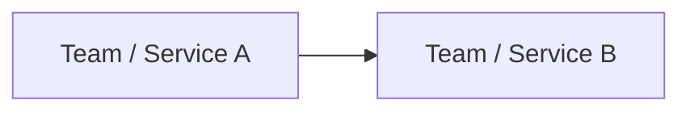

# Dependency Map

## Metadata

- Scope: Project | Epic | Feature | Release | Iteration
- Scope ID:
- Owner:
- Version:
- Status: Draft | Approved | Updated

## Dependency Diagram

## Dependencies

| ID | Dependency | Type | Provider | Consumer | Required By | Risk | Status |
| --- | --- | --- | --- | --- | --- | --- | --- |
| DEP-001 | | API | | | | | |

## Dependency Types

- API.
- Event.
- Data.
- Environment.
- Infrastructure.
- Security.
- Team availability.
- Supplier delivery.

## Critical Path

- 

## Risks And Mitigations

| Dependency ID | Risk | Mitigation | Owner |
| --- | --- | --- | --- |
| | | | |

## Review Cadence

- Review owner:
- Review frequency:
- Escalation path:

