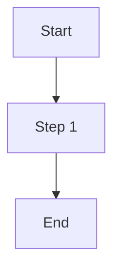

# Feature Spec

## Metadata

- Feature ID:
- Feature Name:
- Related Epic:
- Owner:
- Team:
- Status: Draft | Ready For Review | Approved | Implemented | Accepted

## Feature Goal

Describe the capability and user or business value.

## Users And Use Cases

| User / Role | Use Case | Expected Outcome |
| --- | --- | --- |
| | | |

## Functional Scope

In scope:

- 

Out of scope:

- 

## Business Rules

| Rule ID | Rule | Source / Owner |
| --- | --- | --- |
| | | |

## User Flows

## Data And Interface Impact

- Data objects:
- APIs:
- Events:
- External integrations:
- Error codes:

## Non-Functional Requirements

- Permission:
- Audit:
- Performance:
- Compatibility:
- Security:
- Observability:

## Story Breakdown

| Story ID | Story Name | Priority | Dependencies | Notes |
| --- | --- | --- | --- | --- |
| | | | | |

## Acceptance Strategy

- Automated acceptance:
- Manual acceptance:
- UAT required: Yes | No
- Integration testing required: Yes | No

