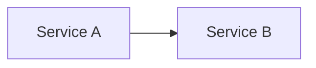

# Integration Plan

## Metadata

- Release / Iteration:
- Owner:
- QA Owner:
- Environment:
- Status: Draft | Approved | In Progress | Complete

## Integration Scope

| Story / Feature | Module / Service | Owner | Included |
| --- | --- | --- | --- |
| | | | Yes / No |

## Integration Diagram

## Dependencies

| Dependency | Provider | Consumer | Status | Risk |
| --- | --- | --- | --- | --- |
| | | | | |

## Integration Sequence

| Step | Action | Owner | Expected Result |
| --- | --- | --- | --- |
| 1 | | | |

## Test Plan

- Contract tests:
- Integration tests:
- E2E tests:
- Manual checks:

## Entry Criteria

- [ ] Stories accepted.
- [ ] Required contracts updated.
- [ ] Test environment ready.
- [ ] Test data ready.
- [ ] Deployment package ready.

## Exit Criteria

- [ ] Integration tests pass.
- [ ] Contract compatibility confirmed.
- [ ] Critical defects resolved.
- [ ] Release readiness evidence attached.

## Risks And Rollback

| Risk | Mitigation | Rollback |
| --- | --- | --- |
| | | |

